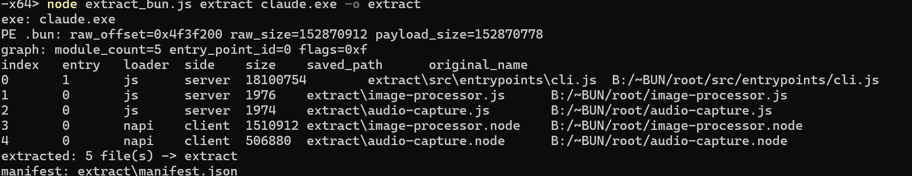
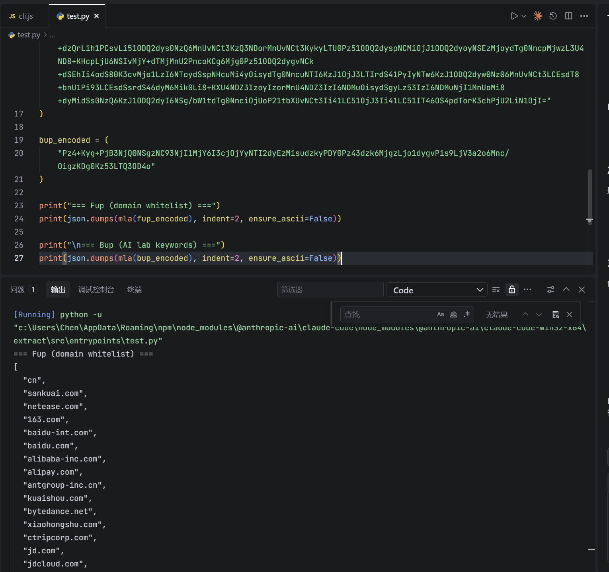

由于 Claude Code 基于 Bun 编译成单一可执行文件，所有业务逻辑都被打包进了二进制数据段。分析的第一步就是从 PE/ELF/Mach-O 中剥离出原始的 JavaScript 模块，并恢复出完整的源码目录结构。

## 1. 从二进制中解包 JavaScript

我使用了一个基于 Bun 的提取脚本 `extract_bun.js`（来自 [52pojie 论坛的帖子](https://www.52pojie.cn/thread-2115277-1-1.html)），它能够识别三种主流可执行格式，并从中定位 `.bun` 专属数据段。该脚本读取二进制文件后，会解析出内部的模块表、文件内容和相关元数据。代码如下：

```js
#!/usr/bin/env bun

import { mkdirSync, readFileSync, writeFileSync } from "node:fs";
import path from "node:path";

const TRAILER = Buffer.from("\n---- Bun! ----\n");
const BUN_SECTION_NAME = ".bun";
const OFFSET_STRUCT_SIZE = 32;
const MODULE_RECORD_SIZE = 52;

const ENCODINGS = {
  0: "binary",
  1: "latin1",
  2: "utf8",
};

const MODULE_FORMATS = {
  0: "none",
  1: "esm",
  2: "cjs",
};

const SIDES = {
  0: "server",
  1: "client",
};

const LOADERS = {
  0: "jsx",
  1: "js",
  2: "ts",
  3: "tsx",
  4: "css",
  5: "file",
  6: "json",
  7: "jsonc",
  8: "toml",
  9: "wasm",
  10: "napi",
  11: "base64",
  12: "dataurl",
  13: "text",
  14: "bunsh",
  15: "sqlite",
  16: "sqlite_embedded",
  17: "html",
  18: "yaml",
  19: "json5",
  20: "md",
};

function die(message) {
  throw new Error(`error: ${message}`);
}

function readUInt64LE(buffer, offset, what) {
  const value = buffer.readBigUInt64LE(offset);
  if (value > BigInt(Number.MAX_SAFE_INTEGER)) {
    die(`${what} exceeds JavaScript safe integer range: ${value}`);
  }
  return Number(value);
}

function checkedSlice(buffer, offset, size, what) {
  if (offset < 0 || size < 0 || offset + size > buffer.length) {
    die(
      `${what} out of bounds: offset=${offset} size=${size} blob_size=${buffer.length}`,
    );
  }
  return buffer.subarray(offset, offset + size);
}

function readCString(buffer, offset, size, what) {
  const data = checkedSlice(buffer, offset, size, what);
  return data.length > 0 && data[data.length - 1] === 0
    ? data.subarray(0, -1)
    : data;
}

function decodeUtf8(buffer) {
  return buffer.toString("utf8").replace(/\u0000+$/u, "");
}

const ELF_MAGIC = Buffer.from([0x7f, 0x45, 0x4c, 0x46]);

// PE field offsets
const PE_OFFSET_PTR = 0x3c; // DOS header: offset of PE signature
const PE_NUM_SECTIONS_OFF = 0x06; // COFF header: NumberOfSections (relative to PE sig)
const PE_OPT_HDR_SIZE_OFF = 0x14; // COFF header: SizeOfOptionalHeader (relative to PE sig)
const PE_COFF_HDR_SIZE = 0x18; // size of COFF header (PE sig + COFF fields)
const PE_OPT_MAGIC_OFF = 0x18; // Optional header Magic (relative to PE sig)
const PE_OPT_MAGIC_PE32P = 0x20b; // PE32+ (64-bit)
const PE_SECTION_ENTRY_SIZE = 0x28; // 40 bytes per section header entry
const PE_SECT_RAW_SIZE_OFF = 0x10; // SizeOfRawData (relative to section entry)
const PE_SECT_RAW_OFF_OFF = 0x14; // PointerToRawData (relative to section entry)
const PE_SECT_NAME_LEN = 0x08; // section name field length

// ELF field offsets
const ELF_EI_CLASS = 0x04; // e_ident[EI_CLASS]: 1=32-bit, 2=64-bit
const ELF_EI_DATA = 0x05; // e_ident[EI_DATA]:  1=LE, 2=BE
const ELF_CLASS_64 = 0x02;
const ELF_DATA_LE = 0x01;
// Elf64_Ehdr field offsets
const ELF64_E_SHOFF = 0x28; // u64
const ELF64_E_SHENTSIZE = 0x3a; // u16
const ELF64_E_SHNUM = 0x3c; // u16
const ELF64_E_SHSTRNDX = 0x3e; // u16
// Elf32_Ehdr field offsets
const ELF32_E_SHOFF = 0x20; // u32
const ELF32_E_SHENTSIZE = 0x2e; // u16
const ELF32_E_SHNUM = 0x30; // u16
const ELF32_E_SHSTRNDX = 0x32; // u16
// Elf64_Shdr field offsets (relative to shdr entry)
const ELF64_SH_NAME = 0x00; // u32
const ELF64_SH_OFFSET = 0x18; // u64
const ELF64_SH_SIZE = 0x20; // u64
// Elf32_Shdr field offsets (relative to shdr entry)
const ELF32_SH_NAME = 0x00; // u32
const ELF32_SH_OFFSET = 0x10; // u32
const ELF32_SH_SIZE = 0x14; // u32

// Mach-O magic values (read as big-endian u32)
const MH_MAGIC = 0xfeedface; // 32-bit LE
const MH_CIGAM = 0xcefaedfe; // 32-bit BE
const MH_MAGIC_64 = 0xfeedfacf; // 64-bit LE
const MH_CIGAM_64 = 0xcffaedfe; // 64-bit BE
const FAT_MAGIC = 0xcafebabe;
const FAT_CIGAM = 0xbebafeca;
const FAT_MAGIC_64 = 0xcafebabf;
const FAT_CIGAM_64 = 0xbfbafeca;
// fat_header field offsets (always BE)
const FAT_NFAT_ARCH_OFF = 0x04; // u32
const FAT_ARCH_ENTRY_SIZE = 0x14; // 20 bytes
const FAT_ARCH_TABLE_OFF = 0x08; // first fat_arch
const FAT_ARCH_OFFSET_OFF = 0x08; // offset field within fat_arch entry
// mach_header field offsets
const MACH_NCMDS_OFF = 0x10; // u32 (relative to thin header base)
const MACH_HDR_SIZE_32 = 0x1c; // 28 bytes
const MACH_HDR_SIZE_64 = 0x20; // 32 bytes
const LC_SEGMENT = 0x01;
const LC_SEGMENT_64 = 0x19;
const LC_CMD_OFF = 0x00; // u32 cmd
const LC_CMDSIZE_OFF = 0x04; // u32 cmdsize
const LC_SEGNAME_OFF = 0x08; // char[16]
const LC_SEGNAME_LEN = 0x10;
// segment_command (32-bit) field offsets
const SEG32_NSECTS_OFF = 0x30; // u32
const SEG32_SECTS_OFF = 0x38; // first section entry
const SECT32_ENTRY_SIZE = 0x44; // 68 bytes
const SECT32_SECTNAME_OFF = 0x00; // char[16]
const SECT32_SIZE_OFF = 0x1c; // u32
const SECT32_OFFSET_OFF = 0x20; // u32
// segment_command_64 field offsets
const SEG64_NSECTS_OFF = 0x40; // u32
const SEG64_SECTS_OFF = 0x48; // first section_64 entry
const SECT64_ENTRY_SIZE = 0x50; // 80 bytes
const SECT64_SECTNAME_OFF = 0x00; // char[16]
const SECT64_SIZE_OFF = 0x28; // u64
const SECT64_OFFSET_OFF = 0x30; // u32

function findBunElfSection(buf) {
  if (buf.length < 0x40) die("ELF file too small");
  const is64 = buf[ELF_EI_CLASS] === ELF_CLASS_64;
  if (!is64) die("ELF: only 64-bit executables are supported");
  const le = buf[ELF_EI_DATA] === ELF_DATA_LE;
  const dv = new DataView(buf.buffer, buf.byteOffset, buf.byteLength);
  const r16 = (o) => dv.getUint16(o, le);
  const r32 = (o) => dv.getUint32(o, le);
  const r64 = (o) => {
    const lo = le ? dv.getUint32(o, true) : dv.getUint32(o + 4, false);
    const hi = le ? dv.getUint32(o + 4, true) : dv.getUint32(o, false);
    return hi * 0x100000000 + lo;
  };

  const shoff = r64(ELF64_E_SHOFF);
  const shentsize = r16(ELF64_E_SHENTSIZE);
  const shnum = r16(ELF64_E_SHNUM);
  const shstrndx = r16(ELF64_E_SHSTRNDX);

  checkedSlice(buf, shoff, shnum * shentsize, "ELF section header table");

  const shstrOff = shoff + shstrndx * shentsize;
  const shstrFileOff = r64(shstrOff + ELF64_SH_OFFSET);
  const shstrSize = r64(shstrOff + ELF64_SH_SIZE);
  checkedSlice(buf, shstrFileOff, shstrSize, "ELF shstrtab");

  const matches = [];
  for (let i = 0; i < shnum; i++) {
    const shdrOff = shoff + i * shentsize;
    const nameIdx = r32(shdrOff + ELF64_SH_NAME);
    let nameEnd = shstrFileOff + nameIdx;
    while (nameEnd < buf.length && buf[nameEnd] !== 0) nameEnd++;
    const name = buf.toString("ascii", shstrFileOff + nameIdx, nameEnd);
    if (name === ".bun") {
      const rawOffset = r64(shdrOff + ELF64_SH_OFFSET);
      const rawSize = r64(shdrOff + ELF64_SH_SIZE);
      checkedSlice(buf, rawOffset, rawSize, ".bun section raw data");
      matches.push({
        format: "ELF",
        name,
        rawOffset,
        rawSize,
        data: buf.subarray(rawOffset, rawOffset + rawSize),
      });
    }
  }

  if (matches.length === 0) die("ELF has no .bun section");
  if (matches.length > 1) die("ELF has multiple .bun sections");
  return matches[0];
}

function parseThinMacho(buf, base) {
  if (buf.length < base + MACH_HDR_SIZE_32) die("Mach-O thin header too small");
  const magic = buf.readUInt32LE(base);
  const be = magic === MH_CIGAM || magic === MH_CIGAM_64;
  const is64 = magic === MH_MAGIC_64 || magic === MH_CIGAM_64;
  if (!is64) die("Mach-O: only 64-bit executables are supported");
  const r32 = (o) => (be ? buf.readUInt32BE(o) : buf.readUInt32LE(o));

  const ncmds = r32(base + MACH_NCMDS_OFF);
  const hdrSize = MACH_HDR_SIZE_64;
  const matches = [];

  let off = base + hdrSize;
  for (let i = 0; i < ncmds; i++) {
    const cmd = r32(off + LC_CMD_OFF);
    const cmdsize = r32(off + LC_CMDSIZE_OFF);
    if (cmdsize < 8) die("Mach-O load command size too small");
    if (cmd === LC_SEGMENT_64) {
      const segname = buf
        .toString(
          "ascii",
          off + LC_SEGNAME_OFF,
          off + LC_SEGNAME_OFF + LC_SEGNAME_LEN,
        )
        .replace(/\0+$/, "");
      if (segname === "__BUN") {
        const nsects = r32(off + SEG64_NSECTS_OFF);
        for (let j = 0; j < nsects; j++) {
          const s = off + SEG64_SECTS_OFF + j * SECT64_ENTRY_SIZE;
          const sectname = buf
            .toString(
              "ascii",
              s + SECT64_SECTNAME_OFF,
              s + SECT64_SECTNAME_OFF + LC_SEGNAME_LEN,
            )
            .replace(/\0+$/, "");
          if (sectname === "__bun") {
            const rawSize = Number(buf.readBigUInt64LE(s + SECT64_SIZE_OFF));
            const rawOffset = be
              ? buf.readUInt32BE(s + SECT64_OFFSET_OFF)
              : buf.readUInt32LE(s + SECT64_OFFSET_OFF);
            matches.push({ rawOffset, rawSize });
          }
        }
      }
    }
    off += cmdsize;
  }
  return matches;
}

function findBunMachoSection(buf) {
  const magic = buf.readUInt32BE(0);
  const FAT_SET = new Set([FAT_MAGIC, FAT_CIGAM, FAT_MAGIC_64, FAT_CIGAM_64]);
  const allMatches = [];

  if (FAT_SET.has(magic)) {
    const nfat = buf.readUInt32BE(FAT_NFAT_ARCH_OFF);
    for (let i = 0; i < nfat; i++) {
      const archEntry = FAT_ARCH_TABLE_OFF + i * FAT_ARCH_ENTRY_SIZE;
      const archFileOff = buf.readUInt32BE(archEntry + FAT_ARCH_OFFSET_OFF);
      allMatches.push(...parseThinMacho(buf, archFileOff));
    }
  } else {
    allMatches.push(...parseThinMacho(buf, 0));
  }

  if (allMatches.length === 0) die("Mach-O has no __BUN,__bun section");
  if (allMatches.length > 1) die("Mach-O has multiple __BUN,__bun sections");
  const { rawOffset, rawSize } = allMatches[0];
  checkedSlice(buf, rawOffset, rawSize, "__BUN,__bun section raw data");
  return {
    format: "Mach-O",
    name: "__BUN,__bun",
    rawOffset,
    rawSize,
    data: buf.subarray(rawOffset, rawOffset + rawSize),
  };
}

function findBunPeSection(buf) {
  if (buf.length < 0x40 || buf.toString("ascii", 0, 2) !== "MZ") {
    die("invalid PE file: missing MZ header");
  }

  const peOffset = buf.readUInt32LE(PE_OFFSET_PTR);
  checkedSlice(buf, peOffset, PE_COFF_HDR_SIZE, "PE header");
  if (buf.toString("ascii", peOffset, peOffset + 4) !== "PE\0\0") {
    die("invalid PE file: missing PE signature");
  }

  const optMagic = buf.readUInt16LE(peOffset + PE_OPT_MAGIC_OFF);
  if (optMagic !== PE_OPT_MAGIC_PE32P) {
    die(
      `PE: only 64-bit (PE32+) executables are supported (optional header magic: 0x${optMagic.toString(16)})`,
    );
  }

  const numberOfSections = buf.readUInt16LE(peOffset + PE_NUM_SECTIONS_OFF);
  const sizeOfOptHdr = buf.readUInt16LE(peOffset + PE_OPT_HDR_SIZE_OFF);
  const sectionTableOffset = peOffset + PE_COFF_HDR_SIZE + sizeOfOptHdr;
  checkedSlice(
    buf,
    sectionTableOffset,
    numberOfSections * PE_SECTION_ENTRY_SIZE,
    "section table",
  );

  const matches = [];
  for (let index = 0; index < numberOfSections; index++) {
    const sectionOffset = sectionTableOffset + index * PE_SECTION_ENTRY_SIZE;
    const rawName = buf.subarray(
      sectionOffset,
      sectionOffset + PE_SECT_NAME_LEN,
    );
    const nulIndex = rawName.indexOf(0);
    const name = rawName
      .subarray(0, nulIndex === -1 ? rawName.length : nulIndex)
      .toString("ascii");
    const rawSize = buf.readUInt32LE(sectionOffset + PE_SECT_RAW_SIZE_OFF);
    const rawOffset = buf.readUInt32LE(sectionOffset + PE_SECT_RAW_OFF_OFF);

    if (name === BUN_SECTION_NAME) {
      checkedSlice(buf, rawOffset, rawSize, ".bun section raw data");
      matches.push({
        format: "PE",
        name,
        rawOffset,
        rawSize,
        data: buf.subarray(rawOffset, rawOffset + rawSize),
      });
    }
  }

  if (matches.length === 0) die("PE has no .bun section");
  if (matches.length > 1) die("PE has multiple .bun sections");
  return matches[0];
}

const MACHO_MAGIC_SET = new Set([
  FAT_MAGIC,
  FAT_CIGAM,
  FAT_MAGIC_64,
  FAT_CIGAM_64,
  MH_MAGIC,
  MH_CIGAM,
  MH_MAGIC_64,
  MH_CIGAM_64,
]);

function findBunSection(buf) {
  if (buf.length < 4) die("file too small to determine format");
  const magic = buf.readUInt32BE(0);
  if (buf.subarray(0, 4).equals(ELF_MAGIC)) return findBunElfSection(buf);
  if (MACHO_MAGIC_SET.has(magic)) return findBunMachoSection(buf);
  return findBunPeSection(buf);
}

function parsePayload(sectionData) {
  if (sectionData.length < 8) {
    die(".bun section is too small for length prefix");
  }
  const payloadSize = readUInt64LE(sectionData, 0, ".bun payload length");
  if (payloadSize + 8 > sectionData.length) {
    die(
      `.bun payload length exceeds raw section: payload=${payloadSize} raw=${sectionData.length}`,
    );
  }

  const payload = sectionData.subarray(8, 8 + payloadSize);
  if (payload.length < OFFSET_STRUCT_SIZE + TRAILER.length) {
    die(".bun payload is too small for Offsets + trailer");
  }
  if (!payload.subarray(payload.length - TRAILER.length).equals(TRAILER)) {
    die(".bun payload trailer mismatch");
  }
  return { payloadSize, payload };
}

function parseOffsets(payload) {
  const start = payload.length - TRAILER.length - OFFSET_STRUCT_SIZE;
  const offsets = {
    byte_count: readUInt64LE(payload, start, "byte_count"),
    modules_offset: payload.readUInt32LE(start + 8),
    modules_size: payload.readUInt32LE(start + 12),
    entry_point_id: payload.readUInt32LE(start + 16),
    compile_exec_argv_offset: payload.readUInt32LE(start + 20),
    compile_exec_argv_size: payload.readUInt32LE(start + 24),
    flags: payload.readUInt32LE(start + 28),
  };

  if (offsets.byte_count > payload.length) {
    die(
      `byte_count exceeds payload: ${offsets.byte_count} > ${payload.length}`,
    );
  }
  if (offsets.modules_size % MODULE_RECORD_SIZE !== 0) {
    die(
      `modules table size is not a multiple of ${MODULE_RECORD_SIZE}: ${offsets.modules_size}`,
    );
  }
  checkedSlice(
    payload,
    offsets.modules_offset,
    offsets.modules_size,
    "modules table",
  );
  checkedSlice(
    payload,
    offsets.compile_exec_argv_offset,
    offsets.compile_exec_argv_size,
    "compile_exec_argv",
  );
  return offsets;
}

function readPointerPairs(record) {
  const pairs = [];
  for (let offset = 0; offset < 48; offset += 8) {
    pairs.push([record.readUInt32LE(offset), record.readUInt32LE(offset + 4)]);
  }
  return pairs;
}

function parseFiles(payload, offsets, sectionFileOffset) {
  const files = [];
  const count = offsets.modules_size / MODULE_RECORD_SIZE;
  if (offsets.entry_point_id >= count) {
    die(`entry_point_id out of range: ${offsets.entry_point_id} >= ${count}`);
  }

  const table = checkedSlice(
    payload,
    offsets.modules_offset,
    offsets.modules_size,
    "modules table",
  );
  for (let index = 0; index < count; index += 1) {
    const record = table.subarray(
      index * MODULE_RECORD_SIZE,
      (index + 1) * MODULE_RECORD_SIZE,
    );
    const pointers = readPointerPairs(record);
    const encodingId = record.readUInt8(48);
    const loaderId = record.readUInt8(49);
    const moduleFormatId = record.readUInt8(50);
    const sideId = record.readUInt8(51);

    const [nameOffset, nameSize] = pointers[0];
    const [contentOffset, contentSize] = pointers[1];
    const [sourcemapOffset, sourcemapSize] = pointers[2];
    const [bytecodeOffset, bytecodeSize] = pointers[3];
    const [moduleInfoOffset, moduleInfoSize] = pointers[4];
    const [bytecodeOriginPathOffset, bytecodeOriginPathSize] = pointers[5];

    const name = decodeUtf8(
      readCString(payload, nameOffset, nameSize, `module[${index}].name`),
    );
    checkedSlice(
      payload,
      contentOffset,
      contentSize,
      `module[${index}].contents`,
    );
    if (sourcemapSize) {
      checkedSlice(
        payload,
        sourcemapOffset,
        sourcemapSize,
        `module[${index}].sourcemap`,
      );
    }
    if (bytecodeSize) {
      checkedSlice(
        payload,
        bytecodeOffset,
        bytecodeSize,
        `module[${index}].bytecode`,
      );
    }
    if (moduleInfoSize) {
      checkedSlice(
        payload,
        moduleInfoOffset,
        moduleInfoSize,
        `module[${index}].module_info`,
      );
    }

    let bytecodeOriginPath = "";
    if (bytecodeOriginPathSize) {
      bytecodeOriginPath = decodeUtf8(
        readCString(
          payload,
          bytecodeOriginPathOffset,
          bytecodeOriginPathSize,
          `module[${index}].bytecode_origin_path`,
        ),
      );
    }

    files.push({
      index,
      entry: index === offsets.entry_point_id,
      name,
      content_payload_offset: contentOffset,
      content_file_offset: sectionFileOffset + 8 + contentOffset,
      content_size: contentSize,
      loader: LOADERS[loaderId] ?? `unknown(${loaderId})`,
      encoding: ENCODINGS[encodingId] ?? `unknown(${encodingId})`,
      module_format:
        MODULE_FORMATS[moduleFormatId] ?? `unknown(${moduleFormatId})`,
      side: SIDES[sideId] ?? `unknown(${sideId})`,
      bytecode_payload_offset: bytecodeSize ? bytecodeOffset : null,
      bytecode_size: bytecodeSize,
      module_info_payload_offset: moduleInfoSize ? moduleInfoOffset : null,
      module_info_size: moduleInfoSize,
      bytecode_origin_path: bytecodeOriginPath,
      sourcemap_payload_offset: sourcemapSize ? sourcemapOffset : null,
      sourcemap_size: sourcemapSize,
    });
  }
  return files;
}

function iterLimited(files, limit) {
  return limit == null ? files : files.slice(0, limit);
}

const BUN_VIRTUAL_ROOTS = new Set(["~BUN", "$bunfs"]);

function outputRelativePath(name) {
  const normalized = name.replaceAll("\\", "/");
  let parts = normalized
    .split("/")
    .filter((p) => p !== "" && p !== "." && p !== ".." && !p.endsWith(":"));
  if (parts.length > 0 && BUN_VIRTUAL_ROOTS.has(parts[0])) {
    parts = parts.slice(1);
    if (parts.length > 0 && parts[0] === "root") parts = parts.slice(1);
  }
  return parts.length === 0 ? "unnamed" : path.join(...parts);
}

function extractFiles(payload, files, outputDir) {
  const extracted = [];
  mkdirSync(outputDir, { recursive: true });
  const resolvedOut = path.resolve(outputDir);

  for (const file of files) {
    const relativePath = outputRelativePath(file.name);
    const destination = path.join(outputDir, relativePath);
    const resolved = path.resolve(destination);
    if (
      resolved !== resolvedOut &&
      !resolved.startsWith(resolvedOut + path.sep)
    ) {
      die(
        `refusing to write outside output dir: ${JSON.stringify(file.name)} -> ${destination}`,
      );
    }
    mkdirSync(path.dirname(destination), { recursive: true });
    const content = checkedSlice(
      payload,
      file.content_payload_offset,
      file.content_size,
      `module[${file.index}].contents`,
    );
    writeFileSync(destination, content);
    extracted.push({
      index: file.index,
      entry: file.entry,
      original_name: file.name,
      saved_path: destination,
      content_payload_offset: file.content_payload_offset,
      content_file_offset: file.content_file_offset,
      content_size: file.content_size,
      loader: file.loader,
      side: file.side,
      bytecode_size: file.bytecode_size,
      module_info_size: file.module_info_size,
      bytecode_origin_path: file.bytecode_origin_path,
    });
  }

  const manifestPath = path.join(outputDir, "manifest.json");
  writeFileSync(
    manifestPath,
    `${JSON.stringify(extracted, null, 2)}\n`,
    "utf8",
  );
  return extracted;
}

function printText(exePath, section, payloadSize, offsets, files, limit) {
  console.log(`exe: ${exePath}`);
  console.log(
    `${section.format} ${section.name}: raw_offset=0x${section.rawOffset.toString(16)} raw_size=${section.rawSize} payload_size=${payloadSize}`,
  );
  console.log(
    `graph: byte_count=${offsets.byte_count} modules_offset=${offsets.modules_offset} modules_size=${offsets.modules_size} module_count=${files.length} entry_point_id=${offsets.entry_point_id} flags=0x${offsets.flags.toString(16)}`,
  );
  console.log(
    "index\tentry\tloader\tside\tcontent_payload_offset\tcontent_file_offset\tcontent_size\tname",
  );
  for (const file of iterLimited(files, limit)) {
    console.log(
      `${file.index}\t${Number(file.entry)}\t${file.loader}\t${file.side}\t${file.content_payload_offset}\t0x${file.content_file_offset.toString(16)}\t${file.content_size}\t${file.name}`,
    );
  }
  if (limit != null && files.length > limit) {
    console.log(
      `... ${files.length - limit} more file(s) omitted; use --limit 0 for all`,
    );
  }
}

function parseLimit(value) {
  const n = Number.parseInt(value, 10);
  if (!Number.isInteger(n) || n < 0)
    die("--limit must be a non-negative integer");
  return n === 0 ? null : n;
}

function parseSubArgs(argv, validFlags) {
  // Returns { exe, flags... }; exe is required positional arg
  const result = { exe: null };
  for (let i = 0; i < argv.length; i++) {
    const arg = argv[i];
    if (arg === "-h" || arg === "--help") {
      result._help = true;
      return result;
    }
    const flag = validFlags.find(
      (f) => arg === f.flag || (f.short && arg === f.short),
    );
    if (flag) {
      if (flag.takesValue) {
        i++;
        if (i >= argv.length) die(`${arg} requires a value`);
        result[flag.key] = flag.parse ? flag.parse(argv[i]) : argv[i];
      } else {
        result[flag.key] = true;
      }
    } else if (arg.startsWith("-")) {
      die(`unknown option: ${arg}`);
    } else if (result.exe === null) {
      result.exe = arg;
    } else {
      die(`unexpected positional argument: ${arg}`);
    }
  }
  return result;
}

function printHelp() {
  console.log(`Usage: bun extract_bun.js <command> EXE [options]

Parse Bun build --compile embedded files from PE/ELF/Mach-O executables.

Commands:
  print EXE    Print embedded module graph information
  extract EXE  Extract embedded files and write manifest.json

Options for print:
  --limit N    Maximum records to print; 0 means no limit (default: all)
  --json       Emit JSON instead of TSV-like text
  -h, --help   Show this help message

Options for extract:
  -o, --output DIR  Output directory (required)
  -h, --help        Show this help message`);
}

function printExtractedText(
  exePath,
  section,
  payloadSize,
  offsets,
  files,
  extracted,
  outputDir,
) {
  console.log(`exe: ${exePath}`);
  console.log(
    `${section.format} ${section.name}: raw_offset=0x${section.rawOffset.toString(16)} raw_size=${section.rawSize} payload_size=${payloadSize}`,
  );
  console.log(
    `graph: module_count=${files.length} entry_point_id=${offsets.entry_point_id} flags=0x${offsets.flags.toString(16)}`,
  );
  console.log("index\tentry\tloader\tside\tsize\tsaved_path\toriginal_name");
  for (const file of extracted) {
    console.log(
      `${file.index}\t${Number(file.entry)}\t${file.loader}\t${file.side}\t${file.content_size}\t${file.saved_path}\t${file.original_name}`,
    );
  }
  console.log(`extracted: ${extracted.length} file(s) -> ${outputDir}`);
  console.log(`manifest: ${path.join(outputDir, "manifest.json")}`);
}

function main(argv = process.argv.slice(2)) {
  const [subcmd, ...rest] = argv;

  if (!subcmd || subcmd === "-h" || subcmd === "--help") {
    printHelp();
    process.exit(0);
  }

  if (subcmd === "print") {
    const args = parseSubArgs(rest, [
      { flag: "--limit", key: "limit", takesValue: true, parse: parseLimit },
      { flag: "--json", key: "json" },
    ]);
    if (args._help) {
      console.log(
        `Usage: bun extract_bun.js print EXE [--limit N] [--json] [-h]`,
      );
      process.exit(0);
    }
    if (!args.exe) die("print requires an EXE argument");
    const buf = readFileSync(args.exe);
    const section = findBunSection(buf);
    const { payloadSize, payload } = parsePayload(section.data);
    const offsets = parseOffsets(payload);
    const files = parseFiles(payload, offsets, section.rawOffset);
    const limit = args.limit ?? null;
    if (args.json) {
      console.log(
        JSON.stringify(
          {
            exe: args.exe,
            bun_section: {
              format: section.format,
              name: section.name,
              raw_offset: section.rawOffset,
              raw_size: section.rawSize,
              payload_size: payloadSize,
            },
            graph: { ...offsets, module_count: files.length },
            files: iterLimited(files, limit),
            omitted: limit == null ? 0 : Math.max(0, files.length - limit),
            extracted: [],
          },
          null,
          2,
        ),
      );
    } else {
      printText(args.exe, section, payloadSize, offsets, files, limit);
    }
  } else if (subcmd === "extract") {
    const args = parseSubArgs(rest, [
      { flag: "--output", short: "-o", key: "output", takesValue: true },
    ]);
    if (args._help) {
      console.log(`Usage: bun extract_bun.js extract EXE -o DIR [-h]`);
      process.exit(0);
    }
    if (!args.exe) die("extract requires an EXE argument");
    if (!args.output) die("extract requires -o/--output DIR");
    const buf = readFileSync(args.exe);
    const section = findBunSection(buf);
    const { payloadSize, payload } = parsePayload(section.data);
    const offsets = parseOffsets(payload);
    const files = parseFiles(payload, offsets, section.rawOffset);
    const extracted = extractFiles(payload, files, args.output);
    printExtractedText(
      args.exe,
      section,
      payloadSize,
      offsets,
      files,
      extracted,
      args.output,
    );
  } else {
    die(
      `unknown command: ${subcmd}\nRun 'bun extract_bun.js --help' for usage.`,
    );
  }
}

try {
  main();
} catch (error) {
  console.error(error.message);
  process.exit(1);
}
```



最终执行以下命令即可将所有 JS 文件还原到 `extract` 目录：

```bash
node extract_bun.js extract claude.exe -o extract
```

程序的入口模块为 `src/entrypoints/cli.js`，格式化后便成为后续审计的起点。

## 2. 代理检测与地域识别

在 `cli.js` 中，Claude Code 首先判断用户是否通过官方 API 端点访问，如果不是，则激活一整套环境指纹采集逻辑。

```js
// 代理端点判断
function Art() {
  let e = process.env.ANTHROPIC_BASE_URL;
  if (!e) return !0;          // 未设置 → 视为官方直接访问
  return Trt(e);              // 检查是否仍指向 api.anthropic.com
}
function Trt(e) {
  try {
    return ["api.anthropic.com"].includes(new URL(e).host);
  } catch { return !1; }
}
```

只有当 `Art()` 返回 `false`（即存在代理且非官方地址）时，才会进一步执行地域与域名检测：

```js
function Wup() {
  if (Art()) return null;         // 官方端点 → 跳过所有检测
  let e = jup(),                  // 提取代理的 hostname
      t = tkt(),                  // 获取系统时区
      n = t === "Asia/Shanghai" || t === "Asia/Urumqi";  // 是否中国时区
  if (!e) return { known: !1, labKw: !1, cnTZ: n, host: null };
  return {
    known: Fup().some((r) => e === r || e.endsWith("." + r)), // 命中域名白名单
    labKw: Bup().some((r) => e.includes(r)),                  // 命中 AI 实验室关键词
    cnTZ: n,
    host: e,
  };
}
```

其中 `jup()` 通过 `new URL(process.env.ANTHROPIC_BASE_URL).hostname` 提取纯主机名，`tkt()` 则利用 `Intl.DateTimeFormat().resolvedOptions().timeZone` 获取操作系统时区。两个结果共同构成了判定中国用户、特定企业员工或代理服务使用者的依据。

- `known`：`ANTHROPIC_BASE_URL` 的域名是否命中域名白名单
- `labKw`：`ANTHROPIC_BASE_URL` 的域名是否命中 AI 实验室关键词
- `cnTZ`：当前系统时区是不是中国的（判断时区是否为上海或乌鲁木齐）
- `host`：`ANTHROPIC_BASE_URL` 的域名

## 3. 隐写信息生成：撇号与日期分隔符

检测结果并不会直接通过报错或日志暴露，而是被编码到了每次 API 请求都会携带的系统提示词中。具体方式是修改提示词里日期字符串的格式和 `Today's` 中的撇号字符。

日期生成函数 `Hao` 会返回标准的 `YYYY-MM-DD` 格式：

```js
function Hao() {
  let e = new Date(),
      t = e.getFullYear(),
      n = String(e.getMonth() + 1).padStart(2, "0"),
      r = String(e.getDate()).padStart(2, "0");
  return `${t}-${n}-${r}`;
}
```

而 `Lla` 函数则负责注入隐写信息，它会调用上述检测函数并决定最终输出：

```js
function Lla(e) {
  let t = Wup(),
      n = Vup(t?.known ?? !1, t?.labKw ?? !1),  // 选择撇号
      r = t?.cnTZ ? e.replaceAll("-", "/") : e; // 中国时区则将 "-" 换成 "/"
  return `Today${n}s date is ${r}.`;
}
```

撇号的选择由 `Vup` 函数根据 `known` 和 `labKw` 两个布尔值决定，共有四种组合：

```js
function Vup(e, t) {
  // e: known (域名命中)   t: labKw (实验室关键词命中)
  if (!e && !t) return "'";      // U+0027 普通撇号
  if (e && !t)  return "\u2019"; // U+2019 右单引号
  if (!e && t)  return "\u02BC"; // U+02BC 修饰字母撇号
  return "\u02B9";              // U+02B9 修饰字母上标小撇号
}
```

这四种 Unicode 字符在屏幕上几乎无法用肉眼区分，但它们所携带的信息却足够丰富：

| 域名白名单 | 实验室关键词 | 撇号字符 | 含义推测 |
|---|---|---|---|
|未命中|未命中|`'`|普通用户/未知代理|
|命中|未命中|`’`|已知国内代理/服务商|
|未命中|命中|`ʼ`|可能来自国内 AI 实验室|
|命中|命中|`ʹ`|国内实验室 + 已知代理|

同样，日期中的 `-` 被替换为 `/` 则明确标识出用户处于中国时区。这些信息最终会随 `currentDate` 字段注入会话上下文，并被发送到 Anthropic 的 API 端点。

## 4. 白名单与关键词的解密

上述检测依赖的域名列表和实验室关键词并非明文存储，而是通过 Base64 编码后与固定密钥 91（0x5B）逐字节异或进行混淆。

```js
var Nup = 91,
    $up = "ODV3KDo1MC46MnU4NDZ3NT4vPjooPnU4NDZ3am1od...", // 域名密文
    Uup = "Pz4+Kyg+PjB3NjQ0NSgzNC93NjI1MjY6I3cjOjYy...";  // 关键词密文

function Mla(e) {
  let t = Buffer.from(e, "base64"),
      n = "";
  for (let r of t) n += String.fromCharCode(r ^ Nup);
  return n.split(",");
}
```

使用相同的算法我们即可还原出原始数组：

```python
import base64
import json

NUP = 91

def mla(encoded_str: str) -> list[str]:
    # base64 解码，得到字节串
    raw_bytes = base64.b64decode(encoded_str)
    # 逐字节异或 NUP，并转换为字符，拼接为字符串
    decoded = "".join(chr(b ^ NUP) for b in raw_bytes)
    # 按逗号分割，返回列表
    return decoded.split(",")


fup_encoded = (
    "ODV3KDo1MC46MnU4NDZ3NT4vPjooPnU4NDZ3am1odTg0Nnc5OjI/LnYyNS91ODQ2dzk6Mj8udTg0Nnc6NzI5Ojk6djI1OHU4NDZ3OjcyKzoidTg0Nnc6NS88KTQuK3YyNTh1ODV3MC46MigzNC51ODQ2dzkiLz4/OjU4PnU1Pi93IzI6NDM0NTwoMy51ODQ2dzgvKTIrODQpK3U4NDZ3MT91ODQ2dzE/ODc0Lj91ODQ2dzkyNzI5MjcydTg0dzI9NyIvPjB1ODQ2dygvPis9LjV2MjU4dTg0Nnc6NzIiLjU4KHU4NDZ3ODV2KDM6NTwzOjJ1PTg6Kyt1KS41dzg1djk+MjEyNTx1PTg6Kyt1KS41dyM6NjI1MjZ1ODQ2dzY0NDUoMzQvdToydzo1Iik0Li8+KXUvNCt3Kzo4MCI6KzJ1ODQ2dzoyODQ/PjYyKSk0KXU4NDZ3OjI8NDg0Pz51ODQ2dzM0NTwoMzo1dTg0NncyLDM6Nz44NzQuP3U4NDZ3PzM4ND8+KXU1Pi93Nz42NDU8Ky91LzQrdyEzMjMuMjorMnUvNCt3MjUvKDI8dTU+L3czMjwzdj0yLT52OjJ1IyIhdzg3NC4/KCw6InU1Pi93byg6KzJ1ODQ2d25pYmJtanU4NDZ3Y2NiYm11ODc0Lj93Y2M4ND8+dToyd2NjODQ/PnU0KTx3Ymo4ND8+dSspNHdiYmlpaG11IyIhdzoydTg0Pz4qOip1ODQ2dzoydTMiOTwhKHU4NDZ3OjJ1MDEtMzN1ODQ2dzoyODo1OisydTg0Nnc6Mjg0PzI1PHUoM3c6Mj06KC91KDIvPnc6MjMuOTYyI3U4NDZ3OjU2NCkidTg0Nnc6KzJ1bmlraWtoa3UjIiF3OisydTo5NzoydS80K3c6KzJ1OTI6NSMyPnU6Mnc6KzJ1OTcvOCJ1OjJ3OisydTgrOigodTg4dzorMnU/Pi1jY3UvPjgzdzorMnU/KT46Njw+KXU4NDZ3OisydT4jKzo1KDI0NXU4MzovdzorMnU8Lj46MnU4NDZ3OisydTM0Nz86MnUvNCt3OisydTIwLjU4ND8+dTg4dzorMnU3ODQ1OjJ1ODQ2dzorMnU3MjUwOisydTQpPHc6KzJ1NjA+OjJ1ODQ2dzorMnU1PjA0OisydTg0Nnc6KzJ1NDoyKyk0dTg0Nnc6KzJ1KS4iLjV1PS41dzorMnUoKDQrPjV1LzQrdzorMnUvLnYhMnU4NDZ3OisydS48NyI4Oi91ODh3OisydS1odTg2dzorMnUsMzovOjJ1ODh3OisydSwrPCEodS80K3c6KzJ1Iy8idTorK3c6KzJ1Ii4+PDc+dTg0Nnc6KzJ1ISEiLnU2Pnc6KzI2OikvdToydzorMispNHU2OiI1NClqa2lvdTcyLT53OisyIjJ1ODQ2dzorKzciMXUzMjorMnUvNCt3Oi48Ni41L3U4NDZ3OW8udSohIXUyNHc4NzouPz8idTg0Nnc4NzouPz52ODQ/PnYzLjl1Oisrdzg3Oi4/PnY0Ky4odS80K3c4NzouPz4yPz51NT4vdzg0dSI+KHUtPHc4ND8+dSw+NSw+NXY6MnU4NDZ3ODQ/PnUjdjoyNHU4NDZ3ODQ/PjI3Ojl1ODQ2dzguOT41OD51ODQ2dz8+PispNC4vPil1LzQrdz8yNjopOiJ1ODQ2dz82IzorMnU4NDZ3PzQ4KHU6Mjw4aT91ODQ2dz8uODA4ND8yNTx1ODQ2dz0wdTMoMywwdTQpPHc9NzorODQ/PnU4NDZ3PTQjODQ/PnUzKDMsMHU0KTx3PTQjODQ/PnUpMTF1ODh3PS43MnUzIzJ1Nj53PD4vPDQ6KzJ1ODQ2dzwrL3UhMzIhPjU8IT41PHU4NDZ3PCsvPDQ/dTg3NC4/dzwrLzA+InU+LnU0KTx3PCsvKzoidSgvNCk+dzM/PCg5dTg0NnczPjU6KzJ1LzQrdzI1KC84NCsyNzQvdjorMnU4NDZ3MT41MiI6dS80K3cxMj4wNC51OjJ3MDx2OisydTg3NC4/dzVqNXU6Mnc1Pix2OisydS5vLSl1ODQ2dzU+LHUjIjgzOi86MnU4NDZ3NDU+djorMnU5Ny84InUvNCt3NDU+dTQ4NDQ3OjJ1ODQ2dzQ1PjorMnUrOjI1Lzk0L3UvNCt3NCs+NXUjMjo0MTI1PDoydTg0Nnc0Kz41ODc6Lj8+dTY+dzQrLih1PCsvLi51ODQ2dys0NzQ6MnUvNCt3KzQ3NDorMnUvNCt3KykyLTU0Pz51ODQ2dyspNCMiOjJ1ODQ2dyoyNSEzMjoydTg0NncpMjwzL3U4ND8+KHcpLjU6NSIvMjY+dTMjMnU2PncoKCg6Mjg0Pz51ODQ2dygvNCk+dSEhIi4odS80K3cvMjo1LzI6NToydSspNHcuMi4yOisydTg0NncuNTI6KzJ1OjJ3LTIrdS41PyIyNTw6KzJ1ODQ2dyw0Nz06MnUvNCt3LCEsdT8+bnU1Pi93LCEsdSsrdS46dyM6Mik0Li8+KXU4NDZ3IzoyIzorMnU4NDZ3IzI6NDMuOisydSgyLz53IzI6NDMuNjI1MnUoMi8+dyMidSs0NzQ6KzJ1ODQ2dyI6NSg/bW1tdTg0NnciOjUoP21tbXUvNCt3Ii41LC51OjJ3Ii41LC51IT46OS4pdTorK3chPjU2LiN1OjI="
)

bup_encoded = (
    "Pz4+Kyg+PjB3NjQ0NSgzNC93NjI1MjY6I3cjOjYyNTI2dyEzMisudzkyPDY0Pz43dzk6MjgzLjo1dygvPis9LjV3a2o6Mnc/OigzKDg0Kz53LTQ3OD4o"
)

print("=== Fup (domain whitelist) ===")
print(json.dumps(mla(fup_encoded), indent=2, ensure_ascii=False))

print("\n=== Bup (AI lab keywords) ===")
print(json.dumps(mla(bup_encoded), indent=2, ensure_ascii=False))
```



解密结果显示，域名白名单中包含了大量国内互联网公司和 API 代理服务商的域名，例如 `sankuai.com`（美团）、`baidu.com`、`alibaba-inc.com`、`bytedance.net`、`kuaishou.com` 以及众多第三方中转站如 `api.yuegle.com`、`clauddy.com`、`proxyai.com` 等。AI 实验室关键词则覆盖了 `deepseek`、`moonshot`、`minimax`、`zhipu`（智谱）、`baichuan`（百川）、`stepfun`（阶跃星辰）、`dashscope`（阿里通义）、`volces`（火山引擎）等国内主流大模型厂商的标识。

## 5. 注入与回传的完整路径

在 `cli.js` 中，隐写后的日期字符串最终被挂载到系统提示词的生成逻辑里：

```js
// 实际注入点
currentDate: Lla(GSe()),
```

这里的 `GSe()` 实际上就是 `Hao()` 的引用，负责生成原始日期字符串。`currentDate` 随后被并入一个更大的配置对象，并在每一次 `/v1/messages` 请求的 `system` 字段中携带。Anthropic 服务端通过解析收到的 `system` 提示词中 `Today\xe2\x80\x99s date is 2025/07/02` 的具体字节，即可推断出客户端的环境特征——包括是否在中国、是否经由特定的代理访问，以及是否来自特定的 AI 实验室。

```js

function Hao() {
  let e = new Date(),
    t = e.getFullYear(),
    n = String(e.getMonth() + 1).padStart(2, "0"),
    r = String(e.getDate()).padStart(2, "0");
  return `${t}-${n}-${r}`;
}
```

这种设计将检测完全置于客户端，利用字符编码上的微小差异完成信息传递，既不违反协议，也极难被使用者察觉。对于普通用户而言，界面上的日期文字看起来完全正常，只有通过二进制比较或解码才能发现隐藏的标记。这也意味着，只要正确设置了代理环境，Claude Code 的行为就会静默地发生变化，而用户对此一无所知。

根据逆向结果，目前claude code的隐写传递数据的行为属实。Claude Code 在检测到用户将 ANTHROPIC_BASE_URL 设置为第三方代理时激活时区和域名检测，且其结果以 Unicode 近形字符隐写的方式藏在系统提示词里，用户和模型都难以察觉。内置的域名白名单和 AI 实验室关键词覆盖大量中转站和国内头部大模型团队，其官方口径此行为是为了防蒸馏和转售。
