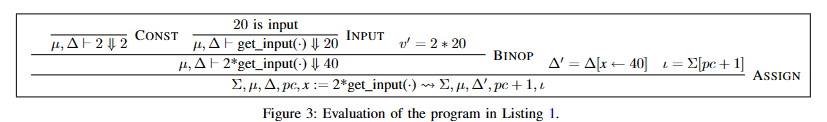
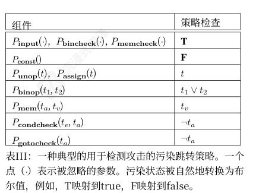
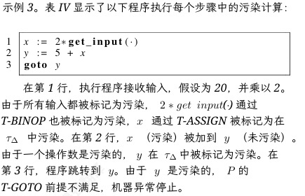

《All You Ever Wanted to Know About Dynamic Taint Analysis and Forward Symbolic Execution》（关于动态污点分析与正向符号执行的所有你想知道的信息）发表于 2010 年。这篇论文使用作者设计的中间语言，形式化地定义了动态污点分析（DTA）与正向符号执行（FSE），并分析了这两种技术的挑战与技术权衡。中间语言部分本文只做简单记录，重点整理论文中提到的概念定义。

**论文速览**：

- **要解决的问题**：DTA 与 FSE 虽然被广泛使用，但此前没有正式定义的算法，也没有人对这些技术的关键问题做过系统总结。
- **本文的方案**：精确地描述了 DTA 与 FSE 的算法，将其作为对通用语言运行时语义的扩展；并强调了在安全场景中使用这些技术时的重要实现选择、常见陷阱与注意事项。
- **效果**：将动态污点分析形式化，并展示如何用这套形式化来梳理和描述各类安全应用中常见的实现细节、注意事项与选择。
- **核心论点**：DTA 是 FSE 的一种不精确（Inexact）但高效的特例。
- **逻辑推导**：FSE 保存了完整的 AST（抽象语法树）约束；DTA 则将复杂的符号 AST"投影/降维"为简单的布尔值或标签集合。这种抽象牺牲了约束求解能力，但换取了数量级上的性能提升。

## 中间语言 Simpil

论文先设计了一种中间语言 Simpil。它只保留了最基础的语句：赋值 `:=`、断言 `assert`、无条件跳转 `jmp`、条件跳转 `cjmp`。在二进制分析领域，通常的做法是将复杂的机器码（如 x86）先提升（Lift）为这种精简 IR，然后再对 IR 进行污点传播或符号求解。

下面的公式是**小步操作语义（Small-step Operational Semantics）的推理规则模板（Inference Rule Template）**：

$$\frac{\text{computation}}{\langle \text{current state} \rangle, \text{stmt} \rightsquigarrow \langle \text{end state} \rangle, \text{stmt}'}$$

- **横线上方（Premise / 前提条件）**：
    - 表示对表达式求值或状态判定的**计算过程**；
    - 只有当上方的计算/判定成功且满足时，横线下方的状态转换才能发生。
- **横线下方（Conclusion / 结论与状态转移）**：
    - $\langle \text{current state} \rangle$：执行语句前的当前程序状态（论文中包含程序计数器 $pc$、寄存器/变量环境 $\Delta$、内存环境 $\mu$ 以及污点/符号约束等扩展状态）；
    - $\text{stmt}$：当前正在执行的 Simpil 语句；
    - $\rightsquigarrow$：状态转移符号（读作 "evaluates to" 或 "transitions to"）；
    - $\langle \text{end state} \rangle$：语句执行结束后的更新状态；
    - $\text{stmt}'$：即将执行的下一条语句（通常根据更新后的 $pc$ 从程序指令表中获取）。

规则采用**从下往上、从左往右**的阅读方式：当解释器/分析器遇到语句 $\text{stmt}$ 时，首先匹配对应的语义规则，然后在横线上方计算 Premise（比如求解 `x + y` 的数值，或计算污点的 OR 逻辑操作）；计算成功后，程序被推演到下一个状态 $\langle \text{end state} \rangle$，并准备执行 $\text{stmt}'$。

举例说明：

```text
x := 2 * getinput()
```

对应的推理规则如下（从上往下看）：



其中涉及的记号：

- **$\Sigma$（Statement Map / Code）**：程序指令表，$\Sigma[pc]$ 表示当前程序计数器 $pc$ 对应的指令。
- **$\mu$（Memory）**：内存映射，将内存地址映射到具体数值（例如 $\mu[v_1]$ 表示读取地址 $v_1$ 处的值）。
- **$\Delta$（Registers / Variables）**：变量/寄存器环境，将变量名映射到具体数值（例如 $\Delta[var]$ 表示变量的值）。
- **$pc$（Program Counter）**：当前指令地址。
- **$\Downarrow$**：表达式求值（Evaluation）符号，$\mu, \Delta \vdash e \Downarrow v$ 表示在当前内存 $\mu$ 和变量环境 $\Delta$ 下，表达式 $e$ 求值结果为 $v$。
- **$\rightsquigarrow$**：语句执行与状态转移（Transition）符号。

在 $\mu, \Delta \vdash e \Downarrow v$ 中：

- **读作**："在内存 $\mu$ 和变量环境 $\Delta$ 下，表达式 $e$ 可以求值为 $v$"（In environment $\mu, \Delta$, expression $e$ evaluates to $v$）。
- $\vdash$ 就像一道分割线，把"执行背景/状态（$\mu, \Delta$）"与"具体要对哪个表达式求值（$e \Downarrow v$）"区分开来。

## 动态污点分析

动态污点分析的目的在于追踪**污点源与汇聚点之间的信息流**。任何依赖污点源数据计算得到的程序值都被视为污点（记为 T），其他值则被视为未污点（记为 F）。污点策略 P 决定了污点如何在程序执行过程中流动、哪些操作会引入新的污点，以及如何对污点值进行检查。

污点分析的三元组 `<sources, sinks, sanitizers>`：

- **目的**：跟踪信息源（sources）和污点汇聚点（sinks）之间的信息流。
- **基本概念**：
    - **T**：任何依赖于从污点源派生的数据计算得到的程序值，都被认为是受污染的；
    - **F**：任何其他值都被认为是未受污染的；
    - **污点策略 P**：准确地确定程序执行时污点如何流动、哪些操作引入新污点，以及对受污点的值执行什么检查。
- **可能出现的错误（errors）**：
    - **过度污染（Over-tainting）**：可能将不是从污点源派生的值标记为污点；
    - **缺失污染（Under-tainting）**：可能遗漏从 sources 到 sinks 的信息流。

污点策略指定三个属性：

- **污点引入**：指定污点如何被引入系统。典型的约定是将所有变量、内存单元等初始化为未污染状态。
- **污点传播**：指定从有污点或无污点的操作数派生出的数据的污点状态。
- **污点检查**：污点状态值通常用于确定程序的运行时行为，例如攻击检测器可能会在跳转目标地址有污点时停止执行。

动态污点分析的典型应用是**攻击检测**。下图展示了一种典型的攻击检测策略——污染跳转策略：



下面通过一个例子来说明污染的计算过程：



## 前向符号执行

前向符号执行允许我们通过构建一个表示程序执行的逻辑公式，来同时推理程序在不同输入上的行为——因此，对程序行为的推理可以化归到逻辑领域。它的一大优势在于可以同时推理**多个输入**。

几个核心的概念：

- **"用符号替代具体的值"**：
    - **常规执行（Concrete Execution）**：变量里存的是确定的数字。比如 `x = 5`，执行 `x + 1` 结果就是 `6`。
    - **符号执行（Symbolic Execution）**：变量里存的是一个**代数符号**（比如 $\alpha$）。执行 `x + 1` 结果就是表达式 $\alpha + 1$——它不关注具体是多少，只记录**怎么算出来的**。
- **"构建表示程序执行的逻辑公式"**：
    - 当程序遇到分支（比如 `if (x > 10)`）时，符号执行不会只走某一条路，而是把这个条件收集起来，变成一个数学约束公式（Path Constraint，路径约束）。
    - 比如走 `true` 分支，就会记录约束：$\alpha > 10$；走 `false` 分支，记录约束：$\neg(\alpha > 10)$。这个逻辑公式代表了"能走到这条路径的所有可能条件集合"。
- **"对程序的不同输入进行推理"**：
    - 拿到这些逻辑公式后，符号执行会把公式交给 SMT 求解器（如 Z3）去解方程。
    - 求解器会告诉你：想要走到这个分支，$\alpha$ 必须取什么值（比如解出 $\alpha = 11$）。
- **"优势：一次推理多个输入"**：
    - 用常规方法测试，传 `x = 5` 只能测试 $x \le 10$ 的情况，传 `x = 12` 只能测试 $x > 10$ 的情况——你需要跑很多次、试很多个不同的具体数值。
    - 但符号执行传一个符号 $\alpha$，就能**一次性用逻辑公式把"所有可能的输入范围"全部表示出来**，通过推导公式一口气推断出程序所有可能走到的分支。

一个直观的理解：用一个代数符号，一次性把迷宫里所有能通往死胡同和出口的逻辑条件全部推算出来。

## 两种技术的挑战与机遇

### 动态污点分析（DTA）

**挑战（Challenges）**：

- **控制流依赖与隐式流（Implicit Flows / Control Dependency）**：跟踪控制流依赖会导致严重的"污点爆炸"（Over-tainting），使绝大多数内存都被无差别污染；但如果不跟踪控制流，又会导致漏报（Under-tainting），以及对"污点洗钱（Taint Laundering）"攻击失效。
- **数据结构与过污染/欠污染的权衡（Over- & Under-tainting Trade-offs）**：
    - **未清理语义（Sanitization Failure）**：类似 `xor eax, eax` 或查表操作（Look-up Tables）会让数据在逻辑上已不含敏感信息，但污点标签未被清理，造成过污染。
    - **无显式数据流的指针索引**：通过指针偏移计算或数组下标访问时，若未将索引位置的污点传导给输出，会导致污点丢失（欠污染）。
- **硬件与运行时开销（Performance Overhead）**：无论基于动态二进制插桩（DBI，如 Pin/Valgrind）还是硬件虚拟化，对每一条指令插桩并维护污点标记映射（Shadow Memory）都会带来显著的 CPU 和内存性能损耗。

**机遇（Opportunities）**：

- **高吞吐量的实时防御与检测**：由于只维护简单的标记/布尔值抽象，DTA 的执行速度远快于符号执行，非常适合应用于实时恶意软件分析、内存破坏漏洞（如 Overwrite ROI）防御与数据泄露监控。
- **与静态分析及符号执行的混合集成**：作为"前置筛选器"（Filtering/Scoping），DTA 可以迅速筛选出受用户输入影响的代码区域，将分析范围精简后再交给高开销的技术处理。

### 前向符号执行（FSE）

**挑战（Challenges）**：

- **路径爆炸（Path Explosion）**：程序中的条件分支、循环和递归会导致可达路径数量呈指数级增长，引擎极易在短时间内陷入"路径迷宫"。
- **符号指针与内存模型（Symbolic Pointers / Memory Modeling）**：当指针地址本身是符号化表达式（如 `Array[i]`，其中 `i` 为符号变量）时，其指向的内存映射会变为巨大或不确定的断言集合，极大地拉低求解器效率。
- **约束求解开销（Constraint Solving Bottlenecks）**：针对复杂的算术运算、密码学哈希或位运算，SMT 求解器（如 Z3、STP）解出可行解的判定代价极高，常常引发超时。
- **环境交互与系统调用（Environment & System Call Interactions）**：当程序遇到文件 I/O、网络 Socket 或操作系统内核交互时，符号状态很难穿越不可控的系统边界。

**机遇（Opportunities）**：

- **自动化漏洞利用生成（Automatic Exploit Generation, AEG）**：不同于 DTA 只能"被动发现漏洞"，FSE 能通过求解路径约束 $\pi$，直接生成可触及漏洞点并突破校验的真实 Payload / Input。
- **100% 验证与程序正确性证明**：在受限的代码路径内，只要求解器能证明约束无解（Unsatisfiable），就能在数学层面证明该路径绝对不存在特定漏洞。
- **混合执行（Concolic Execution）的工程突破**：将具体执行（Concrete）与符号执行结合，用具体值兜底解决符号指针与系统调用问题，极大拓展了符号执行在真实大型软件上的落地可能。
