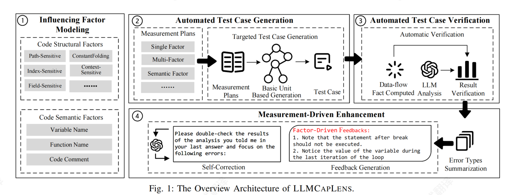
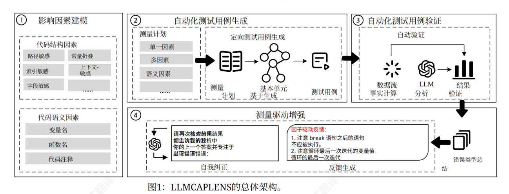
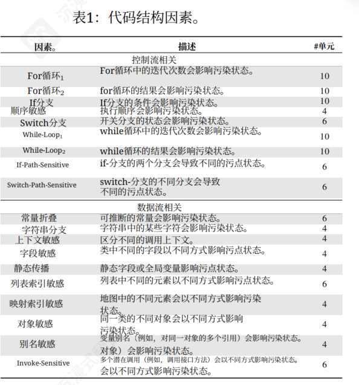
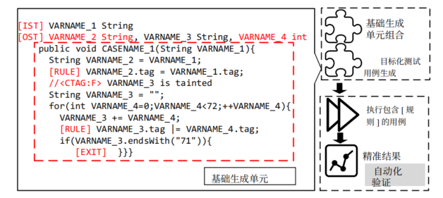
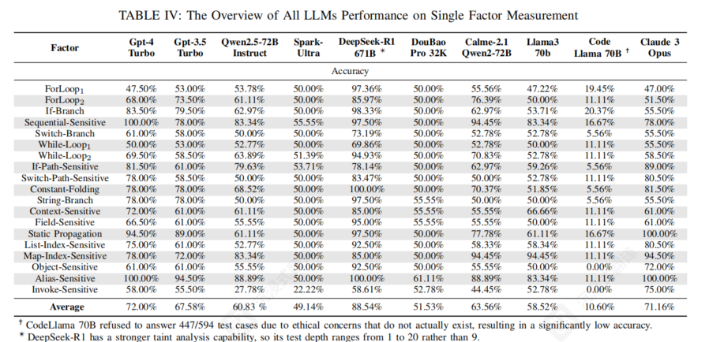
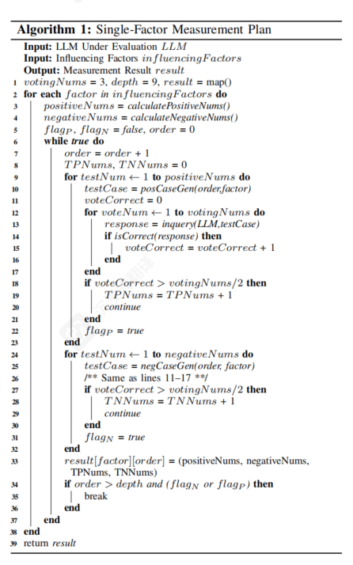
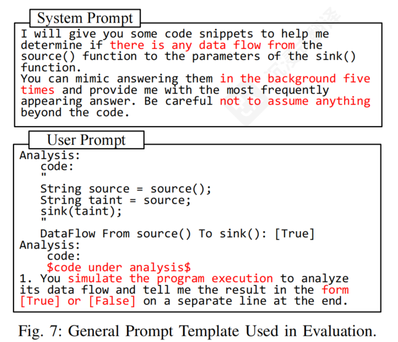

## 背景
论文：LLMCAPLENS：评估与提升大语言模型的静态污点分析能力
Exploring Static Taint Analysis in LLMs: A Dynamic Benchmarking Framework for Measurement and Enhancement

主题是评估与提升大语言模型（LLM）在静态污点分析（Static Taint Analysis）中的能力。

论文提出了一个名为 **LLMCAPLENS** 的动态 Benchmark 生成与能力增强框架，旨在：

1. **定量测量** 10 种主流 LLM 在不同代码结构和语义因子下的静态污点分析能力；
2. **揭示** LLM 进行污点分析时的固有局限性、偏见与错误根源；
3. **驱动增强** 通过测量总结出的模型专属错误特征，以无须训练（Training-free）的自我纠错（Self-Correction）机制显著提升 LLM 在污点分析及下游漏洞检测中的准确率。

论文遵循了经典的"发现问题 → 挑战分析 → 提出方案 → 实验测量 → 驱动增强与验证"的递进逻辑。

**LLMCAPLENS** 是一个用于系统性评估和提升大语言模型（LLM）静态污点分析能力的动态、可扩展框架。

## 整体架构



中文版：



整体有四个模块，下面分开来说：

### 影响因素建模

这里的影响因素指的是代码自身的各种特征对"大语言模型（LLM）执行 static taint analysis（静态污点分析）的准确性与判断"所产生的影响。

影响因素可以大体分为两类：代码结构因素和代码语义因素。其中代码结构因素进一步细分为控制流相关的类型和与数据流相关的类型。

代码结构因素是指影响 LLM 污点分析能力的句法元素，包括影响复杂性的因素以及影响敏感性的因素。这部分共有 19 个影响因素，比如循环、分支判断、别名或上下文敏感性等结构。

另一类是代码语义因素。一些研究表明，LLM 会试图理解和利用代码中的语义：变量名、函数名和注释通常包含丰富的语义信息，因此被选为衡量语义如何影响 LLM 污点分析能力的关键因素。



### 自动化测试用例生成

该组件将用户定义的测量计划作为输入，并根据这些计划动态生成基准测试，确保测试用例既正确又复杂。

论文提出了一种基于基本生成单元的自动化测试用例生成方式，该方法不仅生成测试用例，还帮助自动验证测试用例的结果。

论文没有直接让 LLM 随机生成代码（因为难以控制结构和质量），而是预先人工精细设计了 **190 个 Basic Units（基础生成单元）**。所谓的基础生成单元，它是一段模块化的代码模板，专门映射和体现某种特定的"影响因素"（例如一个包含 `If` 条件分支的代码块、一个包含数组索引的代码块等）。在生成时，就像搭积木一样，通过将多个 Basic Unit 进行顺序拼接（Sequence）或嵌套组合（Nesting），来自动化地生成一个完整的、包含复杂控制流与数据流的测试用例。

正确性分析：

为了保证多个 Basic Unit 组合后生成的代码**在语法上合法**、**变量/数据流在逻辑上可连贯**，论文为每个 Basic Unit 引入了多个元数据标签（Metadata）：

- **`[IST]` / `[OST]`（Input/Output Symbol Tables，输入/输出符号表）：** 记录单元所需的输入与产生的输出变量类型，保证拼接时变量作用域和类型匹配。
- **`[EXIT]`（控制流出口规则）：** 定义代码块的 Join Points，确保分支/循环结构嵌套时（如包含 `break`、`return`）不会破坏代码的语法与控制流正确性。
- **`<CTAG>`（注释标记）：** 指定在代码特定位置注入自然语言注释，用于测试模型对代码语义（Semantic Factor）的敏感度。
- **`[RULE]`（污点传播规则标记）：** 用于描述该单元内部具体的污点传播逻辑（例如：输入变量被污点标记时，哪些输出变量会被赋予污点标签）。这个标签是第三模块（Automated Test Case Verification）能够执行**轻量级动态污点分析**并自动标出 Ground Truth 的关键依据。



借助这些辅助信息，LLMCAPLENS 确保生成的测试用例的正确性：`[IST]`、`[OST]` 和 `[EXIT]` 确保语法有效性——`[IST]` 和 `[OST]` 通过记录变量类型来保证单元间正确的变量传播，只有类型相同或可以安全转换的变量才会通过赋值连接；`[EXIT]` 防止语法违规，例如不允许在循环条件中嵌套 if 语句；`[RULE]` 通过嵌入供后一阶段自动验证的污点传播规则来确保可验证性；`[CTAG]` 和占位符确保语义可编辑性，允许通过保留或删除注释、用语义丰富的标识符替换变量和函数名来注入不同的语义。

复杂性分析：

生成的测试用例的复杂性涉及三个因素：单元 x 的复杂性、使用的单元数量 y、组合操作的类型 z。

对于整个测试用例的生成过程，则可以分为两个阶段：代码结构生成阶段和代码语义生成阶段。

**阶段一：代码结构生成阶段（Code Structure Generation Phase）**

这一阶段的目标是把各种结构因素（Structural Factors）整合到测试代码中，主要包含以下步骤：

1. **追加单元与占位符替换（Appending Units & Replacing Placeholders）：** 从 Basic Generation Units 中追加单元，并替换其中的占位符。
2. **代码划分为主代码与支持代码：**
	- **主代码（Main Code）：** 即 `CASENAME_XX` 方法的方法体。
	- **支持代码（Support Code）：** 保证代码可执行的辅助定义。
3. **精准插入与 AST 层级对齐：**
	- **主代码：** 追加到前一个单元的 `[EXIT]` 标记处。
	- **支持代码：** 插入到对应的 AST（抽象语法树）层级中（例如：类定义部分需要对齐到测试用例的 Class Node）。

**阶段二：代码语义生成阶段（Code Semantic Generation Phase）**

结构生成完成后，再集中处理代码的语义特征（Semantic Factors）：

1. **注释处理（Handling Comments）：**
	- 根据 Basic Units 中打上的特定目的标记，选择性保留或移除注释。
	- 例如：保留 `<CTAG:T>` 表示正确/引导性注释，保留 `<CTAG:F>` 表示误导性注释。
2. **变量与函数重命名（Renaming Variables and Functions）：**
	- 将变量名和函数名替换为具有语义含义的名称（例如：`untaint_`、`propagateTaint_`）。
	- 将 `EXIT()` 根据上下文环境重命名（例如：重命名为 `sink()`）。

### 自动化测试用例验证

虽然之前的阶段提供了测试用例，但手动标记仍然非常耗时，特别是对于成千上万个复杂用例。

面对的问题是："在生成了数万个复杂测试用例后，如何在不靠人工标注、也不靠不可靠的传统分析工具的前提下，100% 准确且自动化地判定 Ground Truth（标注出污点到底有没有传到 Sink 点）？"

所以论文提出了一套轻量级的动态污点分析解决方案，这是整个验证环节的关键——**"用精确定量的短距离数据流事实（Short-range facts），推导复杂的长距离数据流事实（Long-range facts）"**。

短距离事实，就是写在 Basic Unit 里的语句级（Statement-level）规则——即 `[RULE]` 标签。

**可行性保障：**

1. 语句级的短距离规则在 Basic Unit 相互拼接组合时**保持不变**。
2. Basic Unit 数量有限，人工只需对这 190 个单元写一次 `[RULE]`，是一次性的极小工作量，但能保证**绝对精准**。
3. 采用**动态分析**来运行这些规则，彻底避开了静态分析常见的"路径爆炸"和准确率瓶颈。

**具体实现机制——自定义包装类（Wrapper Subclasses）：** 框架为基本数据类型实现了自定义包装类（例如用 `IntegerWrapper` 替换 `int`），这些类内部包含一个用于追踪污点状态的 `.tag` 字段。

- 在验证阶段，用这些包装类替换原始数据类型，并根据 `[RULE]` 运行代码。
- 代码运行结束后，系统直接检查 Sink 点参数及其字段中的 `.tag` 是否为 `true`。
- 也可以在 `[RULE]` 插入点打印 `.tag` 值来追踪污点传播轨迹。

![`[RULE]` 污点传播规则的实现实例](images/llmcaplens-taint-analysis/rule-implementation.png)

上图是 `[RULE]` 标签的实现实例。

**[case1]：嵌套语句（Nested statements）**

- **考察场景：** 循环与控制流中的污点传递（循环体内嵌套表达式与赋值）。
- **代码逻辑：**
	1. `VARNAME_1` 获取污点源 `source()`。
	2. 进入 `for` 循环，将 `VARNAME_1` 赋值给 `VARNAME_3`。
	3. 调用 `sink(VARNAME_3)` 执行汇聚点检查。
- **`[RULE]` 规则：** `VARNAME_3.tag = VARNAME_1.tag;`
	- 显式标记：在每次循环或迭代赋值时，将 `VARNAME_1` 的污点状态（`.tag`）直接同步给 `VARNAME_3`。

**[case2]：无源码函数（Functions without source code）**

- **考察场景：** 针对第三方库或内置 API（如 `String.substring`）等缺少内部源码的函数，如何追踪污点传播。
- **代码逻辑：** 截取 `VARNAME_2` 字符串的一部分赋给 `VARNAME_1`。
- **`[RULE]` 规则：** `if(VARNAME_3 < VARNAME_4) VARNAME_1.tag |= VARNAME_2.tag`
	- 动态分析引擎会判断参数合法性（起始索引小于结束索引）。若合法，截取操作成功，`VARNAME_2` 的污点标记就会传递（按位或）给目标变量 `VARNAME_1`。

**[case3]：Java 反射机制（Java reflection mechanism）**

- **考察场景：** 通过反射进行动态方法调用时的污点追踪（反射对传统静态分析非常困难）。
- **代码逻辑：** 通过 `Class.forName` 加载类，获取 `substring` 方法对象，并使用 `invoke` 动态执行方法，结果存入 `VARNAME_8`。
- **`[RULE]` 规则：** 内部逻辑通过匹配反射调用的类名（`java.lang.String`）和方法名（`substring`），在运行时解开反射的外壳。若参数成立，将被调用对象 `VARNAME_7` 的污点标记传递给返回值 `VARNAME_8`（`VARNAME_8.tag |= VARNAME_7.tag`）。

**[case4]：虚调用/多态（Virtual calls）**

- **考察场景：** 存在方法重写（Override）或动态绑定时的多态污点追踪。
- **代码逻辑：** 调用 `VARNAME_1.substring(...)` 并赋值给 `VARNAME_2`。
- **`[RULE]` 规则：** 利用 `getClass().getName()` 在运行时获取 `VARNAME_1` 的实际对象类型：
	- 如果运行时实际类型是原生的 `java.lang.String`，按标准 `substring` 规则传递污点。
	- 如果运行时是自定义扩展类（如 `org.example.myString`），则执行对应的自定义污点传播逻辑。

当测试用例被动态执行时，框架只需要根据这些注入的 `[RULE]` 来实时更新变量的 `.tag`，就能以极低的成本、100% 准确地判断出"污点最终有没有流向 Sink"，从而自动生成客观的标准答案（Ground Truth）。

### 测量驱动的增强模块

主要目的是如何利用评估结果来**提高大语言模型（LLM）在静态污点分析中的准确率**。

现有模型的"自我纠错"（Self-correction）机制大多依赖外部工具（如编译器）提供具体报错反馈，但这在静态污点分析任务中不可行。LLM 在遇到相似的代码"影响因素"（Influencing Factors）时，往往会犯相似的错误。

整个自我纠错与增强过程分为以下几步：

- **构建错误总结库（一次性工作）：** 人工分析模型的测量结果，归纳出不同影响因素下模型特有的犯错原因。安全专家对 200 个样本回答进行了分析，建立了 LLM 的错误总结表（Error Summarization）。
- **提取目标代码的结构因素：** 面对新的污点分析任务时，先用传统静态分析工具（如 Joern）提取出代码中包含的影响因素（如条件分支、循环等）。
- **匹配易错点并生成纠错提示词：** 结合提取出的因素和之前建立的错误总结库，预测 LLM 在这段代码中可能犯的错误，并生成针对性的提示词（例如提醒：_"注意判断 if 分支条件是否可满足"_）。
- **引导模型二次校验：** 将这些提示词拼接到自纠错模板中，引导 LLM 对其初始答案进行重新检查，最终输出更准确的结果。

**该方法的优势：**

- **无需重新训练（Training-free）：** 完全依赖 Prompt 工程，成本低。
- **针对特定模型（Model-specific）：** 能精准解决不同模型独特的推理短板。
- **摆脱外部工具依赖：** 避免了传统自纠错方法过度依赖外部验证工具反馈的弊端。

## 测量评估

先把结果放出来：



整体的测量方案分为三种：单因素、多因素和语义因素方案。

单因素测量方案主要测量 LLM 在单个因素上的污点分析能力。

多因素测量计划测量不同因素组合下 LLM 的性能，并重点关注某些组合是否显著影响性能。

语义因素测量计划通过修改生成的测试用例中的语义元素（即变量名、函数名和注释）来扩展单因素计划。具体来说，对于注释（例如，"varname111 已清理"），LLMCAPLENS 使用三种方案：正确注释、无注释和错误注释。对于变量和函数命名，方案包括指示污染的名称（例如，"taint"）、无意义的名称和非指示污染的名称（例如，"sanitized"）。



上图是单因素测量计划，也可以看下面伪代码：

```
输入：
  LLM                    : 待评估的大语言模型
  influencingFactors     : 评估的影响因素集合（如循环、条件分支、语义注释等）
输出：
  result                 : 测量结果映射字典（保存各因素及阶数下的测试数据）

初始化：
  votingNums = 3          // 多数投票机制次数（降低随机性）
  depth = 9               // 最大探索阶数/复杂度深度
  result = map()          // 初始化结果字典

过程：
1. foreach factor in influencingFactors do（遍历每个影响因素）：
2.     positiveNums = calculatePositiveNums()   // 计算当前因素对应的正例数量
3.     negativeNums = calculateNegativeNums()   // 计算当前因素对应的负例数量
4.     flagP = false, flagN = false             // 正/负例失败熔断标记
5.     order = 0                                // 当前代码复杂度阶数（从0开始）

6.     while true do（逐步递进代码复杂度）：
7.         order = order + 1                    // 阶数递增
8.         TPNums = 0, TNNums = 0               // 初始化真正例(TP)与真负例(TN)计数

9.         // --- 阶段 A：正例测试（检查能否正确发现污点） ---
10.        for testNum = 1 to positiveNums do：
11.            testCase = posCaseGen(order, factor)  // 生成指定阶数和因素的正例代码
12.            voteCorrect = 0                        // 投票正确计数

13.            for voteNum = 1 to votingNums do：      // 独立提问 3 次
14.                response = inquery(LLM, testCase)
15.                if isCorrect(response) then：
16.                    voteCorrect = voteCorrect + 1
17.                end if
18.            end for

19.            if voteCorrect > (votingNums / 2) then // 多数投票（≥2次答对）
20.                TPNums = TPNums + 1                 // TP 计数加 1
21.                continue                            // 继续测试下一个正例
22.            end if
23.            flagP = true                           // 出现多数投票失败，标记正例能力受阻
24.        end for

25.        // --- 阶段 B：负例测试（检查能否正确排除无污点情况） ---
26.        for testNum = 1 to negativeNums do：
27.            testCase = negCaseGen(order, factor)  // 生成指定阶数和因素的负例代码
28.            /* 逻辑同上（第 11-17 行）：对测试用例向 LLM 提问 3 次并统计 voteCorrect */
29.            if voteCorrect > (votingNums / 2) then
30.                TNNums = TNNums + 1                 // TN 计数加 1
31.                continue
32.            end if
33.            flagN = true                           // 标记负例能力受阻
34.        end for

35.        // --- 阶段 C：结果记录与退出判定 ---
36.        result[factor][order] = (positiveNums, negativeNums, TPNums, TNNums)

37.        // 当探索深度超过最大阶数 且 出现了失败标记（正例或负例答错）时，终止当前因素的深度递进
38.        if order > depth and (flagN or flagP) then：
39.            break
40.        end if
41.    end while
42. end foreach

43. return result
```

下图是通用的提示词模版，设计这个模板的核心思想是：**消除不必要的上下文干扰，迫使模型仅依赖代码本身逻辑进行严谨的数据流模拟，并输出标准化的结构化结果**。



**System Prompt（系统提示词）**

- **任务设定：** 明确要求 LLM 判断代码中是否存在从 `source()` 函数到 `sink()` 函数参数的数据流（Data Flow）。
- **模拟多次推理（Self-Consistency 思路）：** 要求模型"在后台模拟思考 5 次，并提供出现频率最高的答案"。这利用了 Self-Consistency（自我一致性）技术，引导模型进行更稳健的逻辑推理，减少随机采样误差。
- **边界约束：** 强调"严禁做出代码之外的任何假设"（Be careful not to assume anything beyond the code），防止 LLM 根据常见漏洞模式产生"过度联想"或逻辑幻觉。

**User Prompt（用户提示词）**

- **Few-Shot（少样本示范）：** 给出一个极简的示例代码，展示标准的分析流程和预期输出格式（即输出 `DataFlow From source() To sink(): [True]`），让模型对齐输出规范。
- **目标代码替换位：** 使用 `$code under analysis$` 作为占位符，在实际评估时动态填入生成的待测代码。
- **执行指令与输出格式限制：**
	1. 要求模型模拟程序的实际执行过程（Simulate the program execution）来分析数据流。
	2. 强制要求在回答的最后一行，用独占一行的格式输出明确的二进制判定结果：`[True]` 或 `[False]`，便于后端的自动化脚本对回答进行高效解析与统计。

## 评价

论文整体读完了，测量结果没有全记录下来，代码仓库在 [HRsGIT/LLMCapLen](https://github.com/HRsGIT/LLMCapLen)。

对于基础测量单元的设计很有意思，看结果来说效果也很好：用动态拼装的方法实现了用例的无限生成，既彻底避免了 Data Leakage，又迫使模型必须逐行推理代码，避免了传统评测方法的数据泄漏问题。
