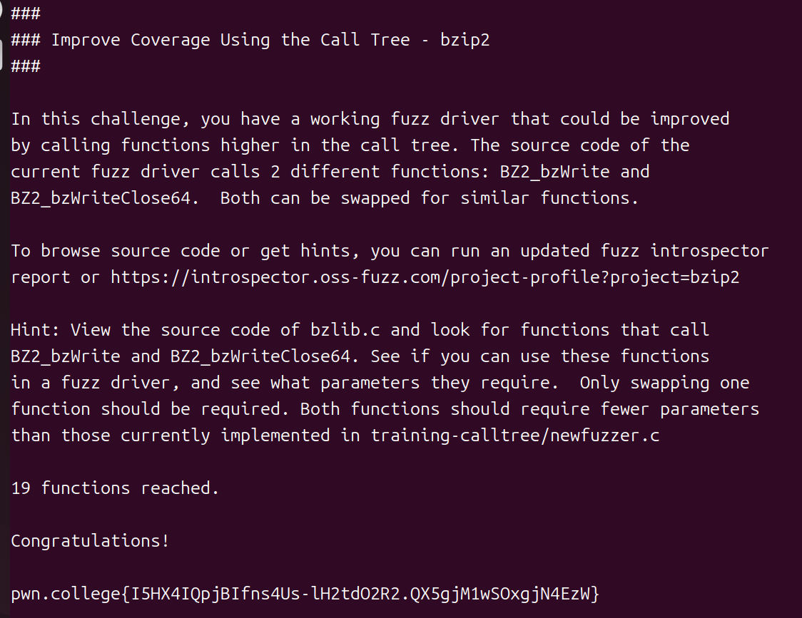
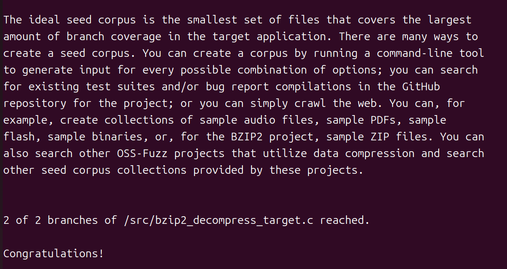
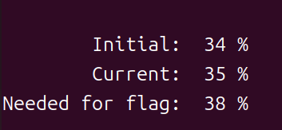
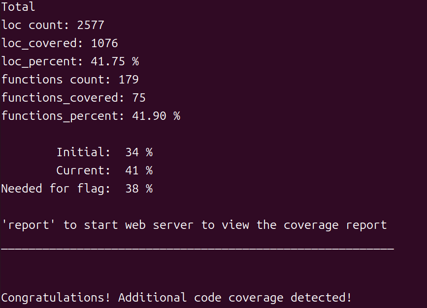

继续 [pwn.college Fuzz Dojo](https://pwn.college/fuzz~c7f7b8c2/training/) 的挑战（第二部分，挑战 5-7，[第一部分见此](/posts/pwn-college-fuzz-dojo-intro-to-fuzzing/)）。

## 挑战五：使用调用树来改善覆盖率

需要通过**用调用树中更高层级的函数替代当前的函数**来改进模糊测试驱动（fuzz driver）。

```shell
hacker@training~improve-coverage-using-the-call-tree:~$ /challenge/training 
###
### Improve Coverage Using the Call Tree - bzip2
###

In this challenge, you have a working fuzz driver that could be improved
by calling functions higher in the call tree. The source code of the
current fuzz driver calls 2 different functions: BZ2_bzWrite and
BZ2_bzWriteClose64.  Both can be swapped for similar functions.

To browse source code or get hints, you can run an updated fuzz introspector
report or https://introspector.oss-fuzz.com/project-profile?project=bzip2

Hint: View the source code of bzlib.c and look for functions that call
BZ2_bzWrite and BZ2_bzWriteClose64. See if you can use these functions
in a fuzz driver, and see what parameters they require.  Only swapping one
function should be required. Both functions should require fewer parameters
than those currently implemented in training-calltree/newfuzzer.c

Missing /out/fuzzer_stats/newfuzzer.json

Please run /challenge/loc first


Additional functions could be called higher in the calltree.  Try again.
```

根据提示，需要：查看 bzlib.c 的源代码，找出那些调用 `BZ2_bzWrite` 和 `BZ2_bzWriteClose64` 的函数。试着在这些函数的基础上来改进现有的模糊测试驱动程序，同时了解这些函数需要哪些参数。只需要替换其中一个函数即可。这两个函数所需的参数数量应该少于 training-calltree/newfuzzer.c 中实现的那些函数。

先跑一下 loc，然后再 training 一次，发现这次说达到了 18 个函数。

先 Build 一下，然后找到 newfuzzer.c：

```c
/*
# Copyright 2022 Google LLC
#
# Licensed under the Apache License, Version 2.0 (the "License");
# you may not use this file except in compliance with the License.
# You may obtain a copy of the License at
#
#      http://www.apache.org/licenses/LICENSE-2.0
#
# Unless required by applicable law or agreed to in writing, software
# distributed under the License is distributed on an "AS IS" BASIS,
# WITHOUT WARRANTIES OR CONDITIONS OF ANY KIND, either express or implied.
# See the License for the specific language governing permissions and
# limitations under the License.
#
###############################################################################
*/

#include "bzlib.h"
#include <stdint.h>
#include <stdlib.h>
#include <assert.h>
#include <string.h>
#include <stddef.h>
#include <unistd.h>
#include <stdio.h>
#include <stdbool.h>

int
LLVMFuzzerTestOneInput(const uint8_t *data, size_t size)
{
    int    bzerr         = 0;
    int    blockSize100k = 9;
    int    verbosity     = 0;
    int    workFactor    = 30;
    uint   nbytes_in_lo32, nbytes_in_hi32;
    uint   nbytes_out_lo32, nbytes_out_hi32;

    char* filename = strdup("/tmp/generate_temporary_file.XXXXXX");
    const int file_descriptor = mkstemp(filename);
    if (file_descriptor < 0) {
    perror("Failed to make temporary file.");
    abort();
    }
    FILE* file = fdopen(file_descriptor, "wb");
    if (!file) {
    perror("Failed to open file descriptor.");
    close(file_descriptor);
    abort();
    }

    BZFILE* bzfile = BZ2_bzWriteOpen (&bzerr, file,
                           blockSize100k, verbosity, workFactor );

    BZ2_bzWrite (&bzerr, bzfile, (void*)data, size);

    BZ2_bzWriteClose64 (&bzerr, bzfile, 0,
                        &nbytes_in_lo32, &nbytes_in_hi32,
                        &nbytes_out_lo32, &nbytes_out_hi32 );

    BZ2_bzflush(file);
    fclose(file);

    if (unlink(filename) != 0) {
    perror("WARNING: Failed to delete temporary file.");
    }
    free(filename);
    return 0;
}
```

当前的 `newfuzzer.c` 显式调用了：

- `BZ2_bzWrite`
- `BZ2_bzWriteClose64`

目标是找到一个**上层封装函数**，它在内部包含了对这两个（或其中之一）函数的调用，并且**需要的参数比原函数更少**。

可以查看 `/src-orig/bzip2/bzlib.c`。

源码有点长，输入 `grep -n "BZ2_bzWrite" /src-orig/bzip2/bzlib.c`，然后发现 1420-1535 处有调用，所以 `sed -n '1420,1535p' /src-orig/bzip2/bzlib.c`：

```c
   if (open_mode==0) {
      if (path==NULL || strcmp(path,"")==0) {
        fp = (writing ? stdout : stdin);
        SET_BINARY_MODE(fp);
      } else {
        fp = fopen(path,mode2);
      }
   } else {
#ifdef BZ_STRICT_ANSI
      fp = NULL;
#else
      fp = fdopen(fd,mode2);
#endif
   }
   if (fp == NULL) return NULL;

   if (writing) {
      /* Guard against total chaos and anarchy -- JRS */
      if (blockSize100k < 1) blockSize100k = 1;
      if (blockSize100k > 9) blockSize100k = 9; 
      bzfp = BZ2_bzWriteOpen(&bzerr,fp,blockSize100k,
                             verbosity,workFactor);
   } else {
      bzfp = BZ2_bzReadOpen(&bzerr,fp,verbosity,smallMode,
                            unused,nUnused);
   }
   if (bzfp == NULL) {
      if (fp != stdin && fp != stdout) fclose(fp);
      return NULL;
   }
   return bzfp;
}


/*---------------------------------------------------*/
/*--
   open file for read or write.
      ex) bzopen("file","w9")
      case path="" or NULL => use stdin or stdout.
--*/
BZFILE * BZ_API(BZ2_bzopen)
               ( const char *path,
                 const char *mode )
{
   return bzopen_or_bzdopen(path,-1,mode,/*bzopen*/0);
}


/*---------------------------------------------------*/
BZFILE * BZ_API(BZ2_bzdopen)
               ( int fd,
                 const char *mode )
{
   return bzopen_or_bzdopen(NULL,fd,mode,/*bzdopen*/1);
}


/*---------------------------------------------------*/
int BZ_API(BZ2_bzread) (BZFILE* b, void* buf, int len )
{
   int bzerr, nread;
   if (((bzFile*)b)->lastErr == BZ_STREAM_END) return 0;
   nread = BZ2_bzRead(&bzerr,b,buf,len);
   if (bzerr == BZ_OK || bzerr == BZ_STREAM_END) {
      return nread;
   } else {
      return -1;
   }
}


/*---------------------------------------------------*/
int BZ_API(BZ2_bzwrite) (BZFILE* b, void* buf, int len )
{
   int bzerr;

   BZ2_bzWrite(&bzerr,b,buf,len);
   if(bzerr == BZ_OK){
      return len;
   }else{
      return -1;
   }
}


/*---------------------------------------------------*/
int BZ_API(BZ2_bzflush) (BZFILE *b)
{
   /* do nothing now... */
   return 0;
}


/*---------------------------------------------------*/
void BZ_API(BZ2_bzclose) (BZFILE* b)
{
   int bzerr;
   FILE *fp;
   
   if (b==NULL) {return;}
   fp = ((bzFile *)b)->handle;
   if(((bzFile*)b)->writing){
      BZ2_bzWriteClose(&bzerr,b,0,NULL,NULL);
      if(bzerr != BZ_OK){
         BZ2_bzWriteClose(NULL,b,1,NULL,NULL);
      }
   }else{
      BZ2_bzReadClose(&bzerr,b);
   }
   if(fp!=stdin && fp!=stdout){
      fclose(fp);
   }
}


/*---------------------------------------------------*/
```

可以发现在 bzip2 的标准库 `bzlib.c` 中，调用关系是：

```
BZ2_bzwrite
    │
    └── BZ2_bzWrite


BZ2_bzclose
    │
    └── BZ2_bzWriteClose
             │
             └── BZ2_bzWriteClose64
```

所以我们应该把 `BZ2_bzWrite` 换成 `BZ2_bzwrite`。实际上是把 fuzz driver 的入口**往调用树上移动了一层**。而且参数从：

```
BZ2_bzWrite(
    &bzerr,
    bzfile,
    data,
    size
);
```

变成：

```
BZ2_bzwrite(
    bzfile,
    data,
    size
);
```

少了一个 `bzerr` 参数。

所以唯一的修改是 newfuzzer.c 的：

```c
- BZ2_bzWrite(&bzerr, bzfile, (void*)data, size);
+ BZ2_bzwrite(bzfile, (void*)data, size);
```

修改后 loc 一下，再 training 一次就可以了：



## 挑战六：实现种子语料库

```shell
hacker@training~improve-coverage-using-the-call-tree:~/fuzz-dojo/training-improve-coverage$ 
Connected!                                                                        
hacker@training~implement-seed-corpus:~$ /challenge/training 
###
### Implement Seed Corpus - bzip
###

Mutational fuzzing takes starting data and makes a series of random
mutations (such as bit flipping, reordering, removing, and inserting) before
having the target application attempt to parse the data. This data can start
with nothing, and the fuzzing application will still generate random input
through trial and error through increasingly complex feedback loops that
measure and notice when certain inputs reach deeper into the code. The
result is truly impressive, and you can watch the fuzzer 'grow' highly
structured inputs that include file signatures, data structure fields,
strings, and even checksums that the target application is expecting. 

Growing interesting inputs from scratch is computationally expensive, and
many types of data structure interdependencies cannot be solved in a timely
manner through random trial and error. Starting seed corpus data is
important to deal with these issues. If you provide input data close to what
the application expects, especially input data that generates useful or
unusual behavior, this allows fuzzing applications to grow their code
coverage exploration at a faster rate and potentially solve previously
unsolvable cliffs in code coverage.

See this article for more details about how seed selection affects fuzzing:
https://dl.acm.org/doi/pdf/10.1145/3460319.3464795 

You can provide a corpus for 'my_fuzzer' by adding
'my_fuzzer_seed_corpus.zip' in the /out folder during the build process.
This is typically done within the build.sh script provided with each
project.

If you execute /challenge/build and look in the /out directory, you will
notice that the BZIP2 project does not utilize any seed corpus for any of
its fuzz drivers. Your goal is to provide a seed corpus that is capable of
increasing the code coverage of bzip2_decompress_target. Run /challenge/loc
followed by this training challenge to verify the increase.

Be aware that there is some randomness in LOC reports.  If you implement a
solution and don't get a flag, you may need to run '/challenge/loc &&
/challenge/training' more than once before the script successfully detects a
notable change in coverage.

The ideal seed corpus is the smallest set of files that covers the largest
amount of branch coverage in the target application. There are many ways to
create a seed corpus. You can create a corpus by running a command-line tool
to generate input for every possible combination of options; you can search
for existing test suites and/or bug report compilations in the GitHub
repository for the project; or you can simply crawl the web. You can, for
example, create collections of sample audio files, sample PDFs, sample
flash, sample binaries, or, for the BZIP2 project, sample ZIP files. You can
also search other OSS-Fuzz projects that utilize data compression and search
other seed corpus collections provided by these projects.


Missing /out/fuzzer_stats/bzip2_decompress_target.json

Please run /challenge/loc first


No fuzz driver seed corpus detected.
```

**这次不改 fuzz driver，而是给 `bzip2_decompress_target` 准备 seed corpus（种子语料库）**。

loc 之后再次 training 会提醒我们：

```
1 of 2 branches of /src/bzip2_decompress_target.c reached.
```

分析一下，当前是：

```
            空/随机输入
                 ↓
             bzip2 fuzz
                 ↓
        尝试逐渐"长成"bzip2文件
```

问题是 bzip2 文件有结构，例如：

```
┌──────────────────────┐
│ bzip2 文件头         │
│ 压缩块信息            │
│ Huffman / RLE 数据   │
│ CRC 等                │
└──────────────────────┘
```

随机 mutation 从 0 开始，很难快速构造出一个真正有效的 `.bz2` 文件。

所以这关要求你提供几个**已经合法的 `.bz2` 文件作为起点**：

```
seed corpus
    │
    ├── sample1.bz2
    ├── sample2.bz2
    └── sample3.bz2
          ↓
      fuzzing
          ↓
 bzip2_decompress_target
```

这些 seed 会让 fuzzer 一开始就进入 bzip2 解压器的深层代码。

我们可以创建一些种子：

```shell
hacker@training~implement-seed-corpus:~$ mkdir bzip2-seeds
hacker@training~implement-seed-corpus:~$ cd bzip2-seeds/
hacker@training~implement-seed-corpus:~/bzip2-seeds$ ls
hacker@training~implement-seed-corpus:~/bzip2-seeds$ echo "hello world" > ./hello.txt
hacker@training~implement-seed-corpus:~/bzip2-seeds$ bzip2 -c ./hello.txt  > ./hello.bz2
hacker@training~implement-seed-corpus:~/bzip2-seeds$ file ./hello.bz2 
./hello.bz2: bzip2 compressed data, block size = 900k
hacker@training~implement-seed-corpus:~/bzip2-seeds$ printf 'AAAAAAAAAAAAAAAAAAAAAAAAAAAAAAAAAAAAAAAAAAAAAAAAAAAA\n'  > ./1.txt
hacker@training~implement-seed-corpus:~/bzip2-seeds$ bzip2 -c ./1.txt  > ./1.bz2
hacker@training~implement-seed-corpus:~/bzip2-seeds$ printf 'abcdefghijklmnopqrstuvwxyzABCDEFGHIJKLMNOPQRSTUVWXYZ0123456789\n' > ./2.txt
hacker@training~implement-seed-corpus:~/bzip2-seeds$ bzip2 -c ./2.txt  > ./2.bz2
hacker@training~implement-seed-corpus:~/bzip2-seeds$ ls
1.bz2  1.txt  2.bz2  2.txt  hello.bz2  hello.txt

hacker@training~implement-seed-corpus:~/bzip2-seeds$ zip /out/bzip2_decompress_target_seed_corpus.zip *.bz2
  adding: 1.bz2 (stored 0%)
  adding: 2.bz2 (deflated 2%)
  adding: hello.bz2 (stored 0%)
```

然后就可以重新 loc 和 training 了：



## 挑战七：编写 Fuzz Driver

```c
###
### Create New Fuzz Driver - avahi
###

Every included OSS-Fuzz project has an extra fuzz driver named newdriver or
something similar. This is a duplicate of one of the other fuzz drivers
designed to allow you to experiment with new fuzz driver code without
reducing the total code coverage of the project through modifications of an
existing driver.

Your task is to increase the total code coverage of the entire project by
adding a new fuzz driver to cover code that is not currently addressed. 
Look at the function 'avahi_dns_packet_new_reply' within avahi-core/dns.c.

You will need to modify fuzz-newfuzzer.c, remove
avahi_dns_packet_consume_record and add the new function while figuring out
what parameters to send. Searching the source code of avahi for calls to
this function might help.

Useful
links:
https://storage.googleapis.com/oss-fuzz-introspector/avahi/inspector-report/20230821/fuzz_report.html

https://storage.googleapis.com/oss-fuzz-coverage/avahi/reports/20230821/linux/src/avahi/avahi-core/report.html

https://github.com/lathiat/avahi 

/challenge/loc will provide you the flag when the total project sees an
increase in code coverage.
```

每个包含在 OSS-Fuzz 项目中的软件都包含一个名为"newdriver"或类似名称的额外模糊测试驱动程序。这个驱动程序实际上是现有驱动程序的副本，其作用是让开发者能够尝试使用新的模糊测试驱动程序代码，而不会因为修改现有驱动程序而降低整个项目的代码覆盖率。

这次的任务是通过添加新的模糊测试驱动程序来提高整个项目的代码覆盖率，从而覆盖那些目前尚未被测试的代码。

查看 avahi-core/dns.c 文件中的 `avahi_dns_packet_new_reply` 函数。需要修改 fuzz-newfuzzer.c 文件，删除 `avahi_dns_packet_consume_record` 函数，然后添加新的函数。同时，还需要确定应该向该函数传递哪些参数。

一般的逻辑是：

```
复制已有 fuzz driver → 找到 avahi_dns_packet_new_reply() 的正确调用方式 → 用它替换原来的 avahi_dns_packet_consume_record() → 让新 driver 覆盖一块原来没被覆盖的代码。
```

先查看一下 fuzz-newfuzzer.c：

```c
/***
  This file is part of avahi.

  avahi is free software; you can redistribute it and/or modify it
  under the terms of the GNU Lesser General Public License as
  published by the Free Software Foundation; either version 2.1 of the
  License, or (at your option) any later version.

  avahi is distributed in the hope that it will be useful, but WITHOUT
  ANY WARRANTY; without even the implied warranty of MERCHANTABILITY
  or FITNESS FOR A PARTICULAR PURPOSE. See the GNU Lesser General
  Public License for more details.

  You should have received a copy of the GNU Lesser General Public
  License along with avahi; if not, write to the Free Software
  Foundation, Inc., 59 Temple Place, Suite 330, Boston, MA 02111-1307
  USA.
***/

#include <stdint.h>
#include <string.h>

#include "avahi-common/malloc.h"
#include "avahi-core/dns.h"
#include "avahi-core/log.h"

void log_function(AvahiLogLevel level, const char *txt) {}

int LLVMFuzzerTestOneInput(const uint8_t *data, size_t size) {
    avahi_set_log_function(log_function);
    AvahiDnsPacket* packet = avahi_dns_packet_new(size + AVAHI_DNS_PACKET_EXTRA_SIZE);
    memcpy(AVAHI_DNS_PACKET_DATA(packet), data, size);
    packet->size = size;
    AvahiRecord* rec = avahi_dns_packet_consume_record(packet, NULL);
    if (rec) {
        avahi_record_is_valid(rec);
        char *s = avahi_record_to_string(rec);
        avahi_free(s);
        avahi_record_unref(rec);
    }
    avahi_dns_packet_free(packet);

    return 0;
}
```

当前 driver 的核心流程是：

```
data / size
   │
   ▼
avahi_dns_packet_new()
   │
   ▼
把 fuzz input 写进 AvahiDnsPacket
   │
   ▼
avahi_dns_packet_consume_record()
   │
   ▼
得到 AvahiRecord
   │
   ├── avahi_record_is_valid()
   ├── avahi_record_to_string()
   └── avahi_record_unref()
```

题目要求的变化就是把中间这一层：

```
avahi_dns_packet_consume_record(packet, NULL);
```

换成：

```
avahi_dns_packet_new_reply(...)
```

我们先去找一下函数的调用者：

```shell
grep -R -n "avahi_dns_packet_new_reply" /src-orig/avahi 2>/dev/null
grep -R -n "avahi_dns_packet_new_reply(" /src-orig/avahi 2>/dev/null
```

函数签名是：

```
AvahiDnsPacket* avahi_dns_packet_new_reply(
    AvahiDnsPacket* p,
    unsigned mtu,
    int copy_queries,
    int aa
);
```

而源码中已经给了三个非常好的调用范例：

```
avahi_dns_packet_new_reply(
    p,
    512 + AVAHI_DNS_PACKET_EXTRA_SIZE,
    1,
    1
)
```

以及：

```
avahi_dns_packet_new_reply(
    p,
    i->hardware->mtu,
    0,
    0
)
```

和：

```
avahi_dns_packet_new_reply(
    p,
    size + AVAHI_DNS_PACKET_EXTRA_SIZE,
    0,
    1
)
```

对于 fuzz driver，**最值得我们研究的是 server.c:373 和 server.c:452**。

我们的 fuzz input 已经被包装成 `AvahiDnsPacket* packet`，所以第一个参数显然就是 `packet`。

剩下三个参数：

```
p
mtu
copy_queries
aa
│
│       │
│       └── 是否设置 Authoritative Answer
│
└────────── 是否复制 DNS Query
```

具体来说，`aa` 就是 DNS response header 中的 **AA（Authoritative Answer）标志**。而 `copy_queries` 控制生成 reply 时是否把 request 中的 query 部分复制过去。

所以对于 fuzzing 来说，我们其实可以直接采用项目自己的参数组合。

针对这一点，把 fuzz driver 改成：

```c
/***
  This file is part of avahi.

  avahi is free software; you can redistribute it and/or modify it
  under the terms of the GNU Lesser General Public License as
  published by the Free Software Foundation; either version 2.1 of the
  License, or (at your option) any later version.

  avahi is distributed in the hope that it will be useful, but WITHOUT
  ANY WARRANTY; without even the implied warranty of MERCHANTABILITY
  or FITNESS FOR A PARTICULAR PURPOSE. See the GNU Lesser General
  Public License for more details.

  You should have received a copy of the GNU Lesser General Public
  License along with avahi; if not, write to the Free Software
  Foundation, Inc., 59 Temple Place, Suite 330, Boston, MA 02111-1307
  USA.
***/

#include <stdint.h>
#include <string.h>

#include "avahi-common/malloc.h"
#include "avahi-core/dns.h"
#include "avahi-core/log.h"

void log_function(AvahiLogLevel level, const char *txt) {}

int LLVMFuzzerTestOneInput(const uint8_t *data, size_t size) {
    avahi_set_log_function(log_function);

    AvahiDnsPacket* packet =
        avahi_dns_packet_new(size + AVAHI_DNS_PACKET_EXTRA_SIZE);

    memcpy(AVAHI_DNS_PACKET_DATA(packet), data, size);
    packet->size = size;

    AvahiDnsPacket* reply =
        avahi_dns_packet_new_reply(
            packet,
            size + AVAHI_DNS_PACKET_EXTRA_SIZE,
            0,
            1
        );

    if (reply)
        avahi_dns_packet_free(reply);

    avahi_dns_packet_free(packet);

    return 0;
}
```

这里最核心的修改实际上只有：

```c
-    AvahiRecord* rec = avahi_dns_packet_consume_record(packet, NULL);
-    if (rec) {
-        avahi_record_is_valid(rec);
-        char *s = avahi_record_to_string(rec);
-        avahi_free(s);
-        avahi_record_unref(rec);
-    }
+    AvahiDnsPacket* reply =
+        avahi_dns_packet_new_reply(
+            packet,
+            size + AVAHI_DNS_PACKET_EXTRA_SIZE,
+            0,
+            1
+        );
+
+    if (reply)
+        avahi_dns_packet_free(reply);
```

然后就可以 loc 了，结果发现没这么顺利：



现在的覆盖率从 34% 提高到 35% 了，但是要求是 38% 才行。

那输入 `sed -n '60,130p' /src-orig/avahi/avahi-core/dns.c` 看一下：

```c

    p->data = NULL;

    memset(AVAHI_DNS_PACKET_DATA(p), 0, p->size);
    return p;
}

AvahiDnsPacket* avahi_dns_packet_new_query(unsigned mtu) {
    AvahiDnsPacket *p;

    if (!(p = avahi_dns_packet_new(mtu)))
        return NULL;

    avahi_dns_packet_set_field(p, AVAHI_DNS_FIELD_FLAGS, AVAHI_DNS_FLAGS(0, 0, 0, 0, 0, 0, 0, 0, 0, 0));
    return p;
}

AvahiDnsPacket* avahi_dns_packet_new_response(unsigned mtu, int aa) {
    AvahiDnsPacket *p;

    if (!(p = avahi_dns_packet_new(mtu)))
        return NULL;

    avahi_dns_packet_set_field(p, AVAHI_DNS_FIELD_FLAGS, AVAHI_DNS_FLAGS(1, 0, aa, 0, 0, 0, 0, 0, 0, 0));
    return p;
}

AvahiDnsPacket* avahi_dns_packet_new_reply(AvahiDnsPacket* p, unsigned mtu, int copy_queries, int aa) {
    AvahiDnsPacket *r;
    assert(p);

    if (!(r = avahi_dns_packet_new_response(mtu, aa)))
        return NULL;

    if (copy_queries) {
        unsigned saved_rindex;
        uint32_t n;

        saved_rindex = p->rindex;
        p->rindex = AVAHI_DNS_PACKET_HEADER_SIZE;

        for (n = avahi_dns_packet_get_field(p, AVAHI_DNS_FIELD_QDCOUNT); n > 0; n--) {
            AvahiKey *k;
            int unicast_response;

            if ((k = avahi_dns_packet_consume_key(p, &unicast_response))) {
                avahi_dns_packet_append_key(r, k, unicast_response);
                avahi_key_unref(k);
            }
        }

        p->rindex = saved_rindex;

        avahi_dns_packet_set_field(r, AVAHI_DNS_FIELD_QDCOUNT, avahi_dns_packet_get_field(p, AVAHI_DNS_FIELD_QDCOUNT));
    }

    avahi_dns_packet_set_field(r, AVAHI_DNS_FIELD_ID, avahi_dns_packet_get_field(p, AVAHI_DNS_FIELD_ID));

    avahi_dns_packet_set_field(r, AVAHI_DNS_FIELD_FLAGS,
                               (avahi_dns_packet_get_field(r, AVAHI_DNS_FIELD_FLAGS) & ~AVAHI_DNS_FLAG_OPCODE) |
                               (avahi_dns_packet_get_field(p, AVAHI_DNS_FIELD_FLAGS) & AVAHI_DNS_FLAG_OPCODE));

    return r;
}


void avahi_dns_packet_free(AvahiDnsPacket *p) {
    assert(p);

    if (p->name_table)
        avahi_hashmap_free(p->name_table);
```

现在整个函数实际上是：

```
avahi_dns_packet_new_reply(packet, mtu, copy_queries, aa)
                    │
                    ├── 创建 response
                    │
                    ├── copy_queries == 1 ?
                    │        │
                    │        ├── 读取 QDCOUNT
                    │        │
                    │        ├── consume_key()
                    │        │
                    │        ├── append_key()
                    │        │
                    │        └── 设置 QDCOUNT
                    │
                    ├── 设置 ID
                    │
                    └── 复制 OPCODE
```

你目前的 `0, 1` 只走：

```
创建 response
     ↓
设置 ID
     ↓
复制 OPCODE
```

而没有走：

```
copy_queries = 1
     ↓
解析 Question
     ↓
生成 response Question
```

改一下：

```c
AvahiDnsPacket* reply =
    avahi_dns_packet_new_reply(
        packet,
        size + AVAHI_DNS_PACKET_EXTRA_SIZE,
        1,
        1
    );
```



为什么仅仅 `0 → 1` 就提升这么多？

原来：

```
avahi_dns_packet_new_reply(packet, mtu, 0, 1);
```

意味着 `copy_queries = 0`，所以 `dns.c` 里面：

```
if (copy_queries) {
    ...
}
```

整个代码块**永远不会执行**。

改成 `copy_queries = 1` 之后，执行路径变成：

```
avahi_dns_packet_new_reply()
        │
        ├── 创建 response
        │
        ├── copy_queries == 1
        │       │
        │       ├── 获取 QDCOUNT
        │       │
        │       ├── consume_key()
        │       │
        │       ├── append_key()
        │       │
        │       ├── key_unref()
        │       │
        │       └── 设置 QDCOUNT
        │
        ├── 设置 ID
        │
        └── 复制 OPCODE
```

所以一次简单的参数变化，就把一整块以前完全没有进入的代码加入了 coverage。

刚才实际上完成了一个非常典型的 **coverage-guided fuzz driver 调优**：

```
① 看目标函数
        ↓
② 看函数参数
        ↓
③ 搜索项目中的真实调用
        ↓
④ 比较不同调用点的参数
        ↓
⑤ 选择能够进入额外代码路径的参数
        ↓
⑥ /challenge/loc
        ↓
   Coverage 35% → 41%
```

（本篇完，剩余挑战待续）
