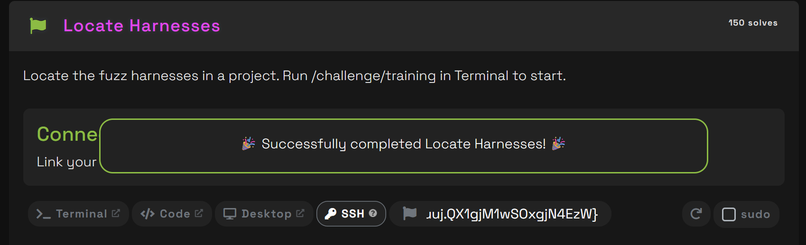
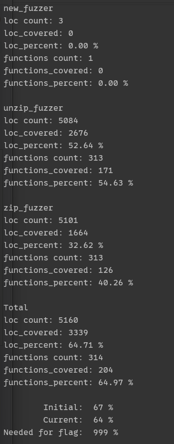
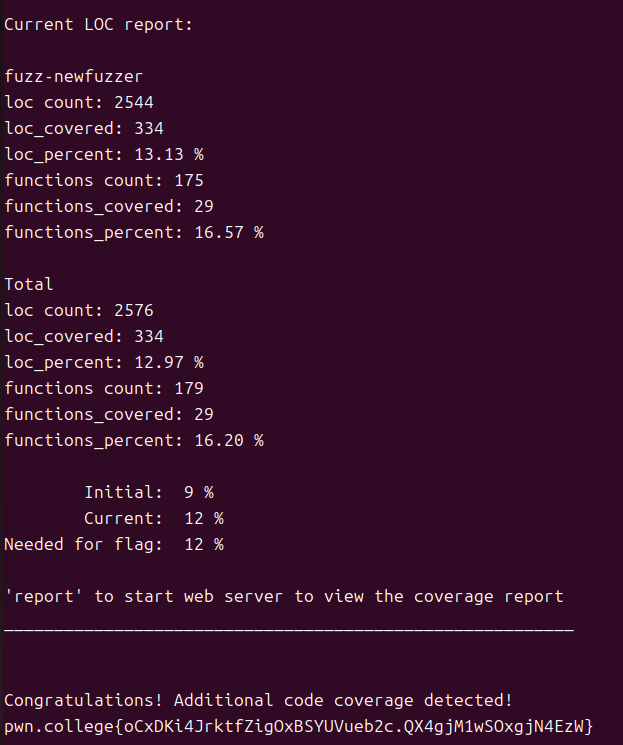

[pwn.college](https://pwn.college/fuzz~c7f7b8c2/training/) 的 **Introduction to Fuzzing** 部分，主要有十一个挑战和 11 个网课视频。

fuzzer 的基础定义这里不再重复，这几个挑战只要知道定义就可以接着往下做。整个题目环境是 OSS-Fuzz 和 libFuzzer。

本篇为第一部分，先记录挑战 1-4，剩余挑战待后续更新。

## 挑战一：定位 Harnesses

直接看挑战一，用 SSH 连接服务器后，提示让我们去查看 `/challenge`。

运行 training，发现指引：

```shell
hacker@training~locate-harnesses:/challenge$ ./training
###
### Locate Harnesses - minizip
###

Fuzzing is a software testing method designed to detect bugs. Streams of
random input are sent to an application to cause crashes, resource links, or
simply unexpected behavior. The key implementation to reach sections of code
with this random input is the fuzz driver. A fuzz driver, alternately called
a fuzzer, fuzzing harness, or test driver is simply a test case generator
that directs input from the fuzzer into the target program in a targeted
way. Small projects may only require a single fuzz driver, but for large
codebases, there could be hundreds of locations in the code that could
benefit from testing harnesses.

Writing efficient fuzz drivers is a time-consuming task that requires deep
knowledge of the target codebase, in particular the interface of the target
program, how the program functions, and what type of crashes are useful to
generate. The effectiveness of fuzz drivers is usually measured in code
coverage achieved, but there are alternative methods such as the code
complexity of the tested code, and the number of bugs discovered. These
training exercises will show you how existing OSS-FUZZ fuzz drivers work,
teach you techniques to improve existing drivers and how to write new ones
to best augment the drivers already running for a project.

Every challenge is associated with exactly one open source project.

Commands:
_________________________
/challenge/build - compiles this project and places fuzz drivers in /out

/challenge/rebuild - quick re-compile of only the 'new' fuzz driver

/challenge/loc - compiles the project, runs the fuzz driver for 30  seconds,
and then generates a coverage report and coverage summary.  Type 'report' to
start a Web server to view the coverage reports generated by this command.

/challenge/fuzz-introspector - generates a detailed, web-based coverage
report that can be viewed in a web browser under Desktop.
_________________________

Additional commands are listed in the slides under 'Fuzz Dojo Only: Building
and Running Reports'

In addition, when any of these commands are run, fuzz drivers will be placed
within persistent folders in your home directory under ~/fuzz-dojo. You can
also try 'find-drv' to locate fuzz drivers in the source folder.

Run ./training <filename> when you have located a file containing a fuzz driver.

Syntax: ./training filename
```

根据指引，输入 `./build`：

```shell
hacker@training~locate-harnesses:/challenge$ ./build
patching file /src/minizip/CMakeLists.txt
Hunk #1 succeeded at 994 (offset 41 lines).

Please wait, creating /src-orig
Please wait, creating /src-none
  adding: home/hacker/fuzz-dojo/training-locate/ (stored 0%)
  adding: home/hacker/fuzz-dojo/training-locate/new_fuzzer.c (deflated 68%)
  adding: home/hacker/fuzz-dojo/training-locate/standalone.c (deflated 64%)
  adding: home/hacker/fuzz-dojo/training-locate/unzip_fuzzer.c (deflated 68%)
  adding: home/hacker/fuzz-dojo/training-locate/zip_fuzzer.c (deflated 73%)
  adding: home/hacker/fuzz-dojo/training-locate/build.sh (deflated 51%)
---------------------------------------------------------------
Compiling libFuzzer to /usr/lib/libFuzzingEngine.a...  done.
---------------------------------------------------------------
CC=clang
CXX=clang++
CFLAGS=-O1 -fno-omit-frame-pointer -gline-tables-only -DFUZZING_BUILD_MODE_UNSAFE_FOR_PRODUCTION  -fsanitize=fuzzer-no-link
CXXFLAGS=-O1 -fno-omit-frame-pointer -gline-tables-only -DFUZZING_BUILD_MODE_UNSAFE_FOR_PRODUCTION  -fsanitize=fuzzer-no-link -stdlib=libc++
RUSTFLAGS=--cfg fuzzing -Cdebuginfo=1 -Cforce-frame-pointers
---------------------------------------------------------------
+ '[' x86_64 = i386 ']'
+ cmake . '-DCMAKE_C_FLAGS=-O1 -fno-omit-frame-pointer -gline-tables-only -DFUZZING_BUILD_MODE_UNSAFE_FOR_PRODUCTION  -fsanitize=fuzzer-no-link' '-DCMAKE_CXX_FLAGS=-O1 -fno-omit-frame-pointer -gline-tables-only -DFUZZING_BUILD_MODE_UNSAFE_FOR_PRODUCTION  -fsanitize=fuzzer-no-link -stdlib=libc++' -DMZ_BUILD_FUZZ_TESTS=ON
-- The C compiler identification is Clang 18.1.8
-- Detecting C compiler ABI info - done
-- Check for working C compiler: /usr/local/bin/clang - skipped
-- Detecting C compile features
-- Detecting C compile features - done
-- Using CMake version 3.29.2
-- Looking for stdint.h - found
-- Looking for inttypes.h - found
-- Check size of off64_t - failed
-- Looking for fseeko - found
-- Using ZLIB 1.2.11
-- Checking for module 'liblzma'
--   Found liblzma, version 5.2.4
-- Using LZMA 5.2.4
-- Checking for module 'libzstd'
--   Found libzstd, version 1.4.4
-- Using ZSTD 1.4.4
-- Found PkgConfig: /usr/bin/pkg-config (found version "0.29.1")
-- Checking for module 'openssl'
--   Found openssl, version 1.1.1f
-- Using OpenSSL 1.1.1f
-- Performing Test Iconv_IS_BUILT_IN
-- Performing Test Iconv_IS_BUILT_IN - Success
-- The CXX compiler identification is Clang 18.1.8
-- Detecting CXX compile features
-- Detecting CXX compile features - done
-- The following features have been enabled:

 * MZ_COMPAT, Enables compatibility layer
 * MZ_ZLIB, Enables ZLIB compression
 * MZ_BZIP2, Enables BZIP2 compression
 * MZ_LZMA, Enables LZMA & XZ compression
 * MZ_ZSTD, Enables ZSTD compression
 * MZ_PKCRYPT, Enables PKWARE traditional encryption
 * MZ_WZAES, Enables WinZIP AES encryption
 * MZ_OPENSSL, Enables OpenSSL for encryption
 * MZ_LIBBSD, Builds with libbsd crypto random
 * MZ_ICONV, Enables iconv string encoding conversion library
 * MZ_BUILD_FUZZ_TESTS, Builds minizip fuzzer executables

-- The following features have been disabled:

 * MZ_LIBCOMP, Enables Apple compression
 * MZ_FETCH_LIBS, Enables fetching third-party libraries if not found
 * MZ_FORCE_FETCH_LIBS, Enables fetching third-party libraries always
 * MZ_COMPRESS_ONLY, Only support compression
 * MZ_DECOMPRESS_ONLY, Only support decompression
 * MZ_FILE32_API, Builds using posix 32-bit file api
 * MZ_BUILD_TESTS, Builds minizip test executable
 * MZ_BUILD_UNIT_TESTS, Builds minizip unit test project
 * MZ_CODE_COVERAGE, Builds with code coverage flags

-- Configuring done (4.0s)
-- Generating done (0.0s)
-- Build files have been written to: /src/minizip
+ make clean
++ nproc
+ make -j40
[  3%] Building C object CMakeFiles/minizip.dir/mz_crypt.c.o
[ 14%] Building C object CMakeFiles/minizip.dir/mz_strm_buf.c.o
[ 14%] Building C object CMakeFiles/minizip.dir/mz_strm_mem.c.o
[ 22%] Building C object CMakeFiles/minizip.dir/mz_strm.c.o
[ 22%] Building C object CMakeFiles/minizip.dir/mz_os.c.o
[ 25%] Building C object CMakeFiles/minizip.dir/mz_zip_rw.c.o
[ 33%] Building C object CMakeFiles/minizip.dir/mz_zip.c.o
[ 37%] Building C object CMakeFiles/minizip.dir/mz_strm_bzip.c.o
[ 44%] Building C object CMakeFiles/minizip.dir/mz_strm_zlib.c.o
[ 44%] Building C object CMakeFiles/minizip.dir/mz_strm_lzma.c.o
[ 48%] Building C object CMakeFiles/minizip.dir/mz_strm_zstd.c.o
[ 48%] Building C object CMakeFiles/minizip.dir/mz_crypt_openssl.c.o
[ 59%] Building C object CMakeFiles/minizip.dir/mz_strm_os_posix.c.o
[ 59%] Building C object CMakeFiles/minizip.dir/mz_strm_pkcrypt.c.o
[ 66%] Building C object CMakeFiles/minizip.dir/compat/ioapi.c.o
[ 66%] Building C object CMakeFiles/minizip.dir/mz_os_posix.c.o
[ 74%] Building C object CMakeFiles/minizip.dir/mz_strm_wzaes.c.o
[ 74%] Building C object CMakeFiles/minizip.dir/compat/zip.c.o
[ 74%] Building C object CMakeFiles/minizip.dir/compat/unzip.c.o
[ 77%] Linking C static library libminizip.a
[ 77%] Built target minizip
[ 81%] Building C object CMakeFiles/zip_fuzzer.dir/test/fuzz/zip_fuzzer.c.o
[ 85%] Building C object CMakeFiles/unzip_fuzzer.dir/test/fuzz/unzip_fuzzer.c.o
[ 88%] Building C object CMakeFiles/new_fuzzer.dir/test/fuzz/new_fuzzer.c.o
[ 96%] Linking CXX executable unzip_fuzzer
[ 96%] Linking CXX executable new_fuzzer
[100%] Linking CXX executable zip_fuzzer
[100%] Built target new_fuzzer
[100%] Built target zip_fuzzer
[100%] Built target unzip_fuzzer
+ zip -j /out/unzip_fuzzer_seed_corpus.zip test/fuzz/unzip_fuzzer_seed_corpus/as.zip test/fuzz/unzip_fuzzer_seed_corpus/bzip2.zip test/fuzz/unzip_fuzzer_seed_corpus/comments.zip test/fuzz/unzip_fuzzer_seed_corpus/corpus.zip test/fuzz/unzip_fuzzer_seed_corpus/dot_dot_backslash_name.zip test/fuzz/unzip_fuzzer_seed_corpus/encrypted_pkcrypt.zip test/fuzz/unzip_fuzzer_seed_corpus/encrypted_wzaes.zip test/fuzz/unzip_fuzzer_seed_corpus/gh.zip test/fuzz/unzip_fuzzer_seed_corpus/gh_739.zip test/fuzz/unzip_fuzzer_seed_corpus/gh_740.zip test/fuzz/unzip_fuzzer_seed_corpus/incorrect_number_entries.zip test/fuzz/unzip_fuzzer_seed_corpus/infozip_symlinks.zip test/fuzz/unzip_fuzzer_seed_corpus/large_cd_comment.zip test/fuzz/unzip_fuzzer_seed_corpus/license_zstd.zip test/fuzz/unzip_fuzzer_seed_corpus/lzma.zip test/fuzz/unzip_fuzzer_seed_corpus/permissions.zip test/fuzz/unzip_fuzzer_seed_corpus/signed.zip test/fuzz/unzip_fuzzer_seed_corpus/storeonly.zip test/fuzz/unzip_fuzzer_seed_corpus/tiny.zip test/fuzz/unzip_fuzzer_seed_corpus/unsupported_permissions.zip test/fuzz/unzip_fuzzer_seed_corpus/xz.zip test/fuzz/unzip_fuzzer_seed_corpus/zip64.zip
  adding: as.zip (stored 0%)
  adding: bzip2.zip (stored 0%)
  adding: comments.zip (stored 0%)
  adding: corpus.zip (stored 0%)
  adding: dot_dot_backslash_name.zip (stored 0%)
  adding: encrypted_pkcrypt.zip (stored 0%)
  adding: encrypted_wzaes.zip (stored 0%)
  adding: gh.zip (stored 0%)
  adding: gh_739.zip (stored 0%)
  adding: gh_740.zip (stored 0%)
  adding: incorrect_number_entries.zip (stored 0%)
  adding: infozip_symlinks.zip (stored 0%)
  adding: large_cd_comment.zip (stored 0%)
  adding: license_zstd.zip (stored 0%)
  adding: lzma.zip (stored 0%)
  adding: permissions.zip (stored 0%)
  adding: signed.zip (stored 0%)
  adding: storeonly.zip (stored 0%)
  adding: tiny.zip (stored 0%)
  adding: unsupported_permissions.zip (stored 0%)
  adding: xz.zip (stored 0%)
  adding: zip64.zip (stored 0%)
+ find . -name '*_fuzzer' -exec cp -v '{}' /out ';'
'./zip_fuzzer' -> '/out/zip_fuzzer'
'./unzip_fuzzer' -> '/out/unzip_fuzzer'
'./new_fuzzer' -> '/out/new_fuzzer'
+ find . -name '*_fuzzer.dict' -exec cp -v '{}' /out ';'
'./test/fuzz/unzip_fuzzer.dict' -> '/out/unzip_fuzzer.dict'
+ find . -name '*_fuzzer_seed_corpus.zip' -exec cp -v '{}' /out ';'

First set environment with . e
Test with: /out/<driver>

new_fuzzer unzip_fuzzer zip_fuzzer

hacker@training~locate-harnesses:/challenge$
```

分析一下这个 build 脚本干了什么。

题目的要求是让我们先去找到或者说分辨谁是 harnesses（即测试组件）。给的项目是 minizip 项目。我们需要先把 OSS-Fuzz 的 minizip 项目完整构建起来，然后找到项目中已经存在的 Fuzz Driver。

Fuzz driver 就是把 Fuzzer 的输入定向传递给目标程序的代码，大型项目可能有**几十甚至几百个不同的 Fuzz Driver**。

刚刚执行的 build，就是编译这个项目，并把 Fuzz Driver 放到 `/out`。它首先修改了 minizip 的 CMakeLists.txt，然后它准备了一个 OSS-Fuzz 风格的编译环境，然后真正开始编译 minizip，接下来编译出了三个 Fuzz Driver：

```shell
Building C object ... zip_fuzzer.c.o
Building C object ... unzip_fuzzer.c.o
Building C object ... new_fuzzer.c.o
```

三个 fuzz driver 被复制到了 out 文件夹。

下面我们可以执行 `find-drv` 指令来直接找到 fuzz driver。

这个指令的本质是寻找 `LLVMFuzzerTestOneInput` 这个函数：

```shell
hacker@training~locate-harnesses:/challenge$ find-drv

/src-orig/minizip/test/fuzz/new_fuzzer.c:30:int LLVMFuzzerTestOneInput(const uint8_t *data, size_t size) {
/src-orig/minizip/test/fuzz/unzip_fuzzer.c:30:int LLVMFuzzerTestOneInput(const uint8_t *data, size_t size) {
/src-orig/minizip/test/fuzz/standalone.c:25:extern int LLVMFuzzerTestOneInput(const unsigned char *data, size_t size);
/src-orig/minizip/test/fuzz/standalone.c:70:                    LLVMFuzzerTestOneInput(buf, buf_length);
/src-orig/minizip/test/fuzz/zip_fuzzer.c:29:int LLVMFuzzerTestOneInput(const uint8_t *data, size_t size) {
```

总结一下：

> 我们在 pwn.college 提供的 OSS-Fuzz 模拟环境中，对 minizip 项目执行了构建流程。训练脚本修改了 CMake 构建配置，启用 Fuzz Test，并使用 Clang + LibFuzzer 编译出了 `zip_fuzzer`、`unzip_fuzzer` 和 `new_fuzzer` 三个 Fuzz Driver，同时准备了 `unzip_fuzzer` 的 Seed Corpus，最终将这些 Fuzzing 组件放入 `/out`，为后续的 Harness 分析、Coverage 和 Fuzzing 做准备。

我们刚刚找到了三个 fuzz driver，他们的分工是：

```shell
zip_fuzzer
    ↓
测试 ZIP 创建 / 写入相关功能

unzip_fuzzer
    ↓
测试 ZIP 解压 / 读取相关功能

new_fuzzer
    ↓
课程中让你进一步研究/扩展的 Fuzz Driver
```

先看 zip_fuzzer.c：

```c
/* zip_fuzzer.c - Zip fuzzer for libFuzzer
   part of the minizip-ng project

   Copyright (C) 2018 The Chromium Authors
   Copyright (C) 2018 Anand K. Mistry
   Copyright (C) Nathan Moinvaziri
     https://github.com/zlib-ng/minizip-ng

   This program is distributed under the terms of the same license as zlib.
   See the accompanying LICENSE file for the full text of the license.
*/

#include "mz.h"
#include "mz_strm.h"
#include "mz_strm_mem.h"
#include "mz_zip.h"

#ifdef __cplusplus
extern "C" {
#endif

/***************************************************************************/

#define MZ_FUZZ_TEST_FILENAME "foo"
#define MZ_FUZZ_TEST_PWD      "test123"

/***************************************************************************/

int LLVMFuzzerTestOneInput(const uint8_t *data, size_t size) {
    mz_zip_file file_info;
    void *fuzz_stream = NULL;
    void *stream = NULL;
    void *handle = NULL;
    int32_t err = MZ_OK;
    uint16_t value16 = 0;
    uint8_t value8 = 0;
    int16_t compress_level = 0;
    int64_t fuzz_pos = 0;
    int32_t fuzz_length = 0;
    uint8_t *fuzz_buf = NULL;
    const char *password = NULL;

    fuzz_stream = mz_stream_mem_create();
    if (!fuzz_stream)
        return 1;
    mz_stream_mem_set_buffer(fuzz_stream, (void *)data, (int32_t)size);

    memset(&file_info, 0, sizeof(file_info));

    file_info.flag = MZ_ZIP_FLAG_UTF8;
    if ((mz_stream_read_uint8(fuzz_stream, &value8) == MZ_OK) && (value8 < 0x08)) {
        if (mz_stream_read_uint16(fuzz_stream, &value16) == MZ_OK)
            file_info.flag = value16;
    }
    file_info.compression_method = MZ_COMPRESS_METHOD_DEFLATE;
    if ((mz_stream_read_uint8(fuzz_stream, &value8) == MZ_OK) && (value8 < 0x08)) {
        file_info.compression_method = MZ_COMPRESS_METHOD_STORE;
    } else if ((mz_stream_read_uint8(fuzz_stream, &value8) == MZ_OK) && (value8 < 0x08)) {
        if (mz_stream_read_uint16(fuzz_stream, &value16) == MZ_OK)
            file_info.compression_method = value16;
    }

    if ((mz_stream_read_uint8(fuzz_stream, &value8) == MZ_OK) && (value8 < 0x08)) {
        if (mz_stream_read_uint16(fuzz_stream, &value16) == MZ_OK)
            file_info.zip64 = value16;
    }

    file_info.filename = MZ_FUZZ_TEST_FILENAME;
    file_info.filename_size = (uint16_t)strlen(MZ_FUZZ_TEST_FILENAME);

    compress_level = MZ_COMPRESS_LEVEL_DEFAULT;
    if ((mz_stream_read_uint8(fuzz_stream, &value8) == MZ_OK) && (value8 < 0x08)) {
        if (mz_stream_read_uint16(fuzz_stream, &value16) == MZ_OK)
            compress_level = value16;
    }

    stream = mz_stream_mem_create();
    if (!stream) {
        mz_stream_mem_delete(&fuzz_stream);
        return 1;
    }

    err = mz_stream_mem_open(stream, MZ_FUZZ_TEST_FILENAME, MZ_OPEN_MODE_CREATE | MZ_OPEN_MODE_WRITE);
    if (err != MZ_OK) {
        mz_stream_mem_delete(&stream);
        mz_stream_mem_delete(&fuzz_stream);
        return 1;
    }

    handle = mz_zip_create();
    if (!handle) {
        mz_stream_mem_delete(&stream);
        mz_stream_mem_delete(&fuzz_stream);
        return 1;
    }

    err = mz_zip_open(handle, stream, MZ_OPEN_MODE_CREATE | MZ_OPEN_MODE_WRITE);
    if (err == MZ_OK) {
        password = file_info.flag & MZ_ZIP_FLAG_ENCRYPTED ? MZ_FUZZ_TEST_PWD : NULL;
        err = mz_zip_entry_write_open(handle, &file_info, compress_level, 0, password);
        if (err == MZ_OK) {
            mz_stream_mem_get_buffer_at_current(fuzz_stream, (const void **)&fuzz_buf);
            fuzz_pos = mz_stream_tell(fuzz_stream);
            mz_stream_mem_get_buffer_length(fuzz_stream, &fuzz_length);

            err = mz_zip_entry_write(handle, fuzz_buf, (fuzz_length - (int32_t)fuzz_pos));

            mz_zip_entry_close(handle);
        }

        mz_zip_close(handle);
    }

    mz_zip_delete(&handle);
    mz_stream_mem_delete(&stream);

    mz_stream_mem_delete(&fuzz_stream);

    return 0;
}

/***************************************************************************/

#ifdef __cplusplus
}
#endif
```

随机变异出来的 `data`，到底是怎么进入 minizip 的核心代码的？

我们看这个 driver 的逻辑：

```shell
LibFuzzer
   │
   │ 生成/变异一段 data[]
   ▼
LLVMFuzzerTestOneInput(data, size)
   │
   ▼
创建内存输入流 fuzz_stream
   │
   │ 前几个字节
   ├── flag
   ├── compression_method
   ├── zip64
   └── compress_level
   │
   ▼
剩余 data
   │
   ▼
mz_zip_entry_write()
   │
   ▼
minizip ZIP 创建/压缩代码
   │
   ▼
大量内部函数
   │
   └── ← 这里就是 Fuzzer 真正想覆盖的代码
```

利用 fuzzing 输入动态构造一个 ZIP 文件写入过程，让 `data` 控制 ZIP 文件的各种参数以及文件内容，然后让 minizip 的 ZIP 创建/压缩逻辑处理这些数据。`int LLVMFuzzerTestOneInput(const uint8_t *data, size_t size)` 是入口。data = 一段二进制数据、size = 数据长度。

实际上 fuzz driver 经常会采用**固定一部分环境 + fuzz 一部分关键参数**的形式。

整个 driver 的输入结构是：

```shell
LibFuzzer data
│
├── 第1部分 → flag
│
├── 第2部分 → compression_method
│
├── 第3部分 → zip64
│
├── 第4部分 → compress_level
│
└── 剩余部分 → 文件内容
```

注意这里并不是一个严格固定的字节布局，因为前面的 `if` 会影响到底消耗多少输入，这也是 fuzzing 输入能够产生不同解释方式的一部分。

回到 LibFuzzer 上，假设：

```
LibFuzzer 产生：
data = [随机字节]
```

Driver 把它变成：

```
ZIP 参数
+
ZIP 文件内容
```

然后调用：

```
mz_zip_entry_write()
```

minizip 内部可能继续调用：

```
mz_zip_entry_write
      │
      ├── ZIP header 处理
      ├── compression
      ├── encryption
      ├── CRC
      ├── stream
      ├── ZIP64
      └── 各种边界处理
```

于是 LibFuzzer 的 coverage instrumentation 就可以观察：

```
输入 A → 覆盖路径 1
输入 B → 覆盖路径 2
输入 C → 覆盖路径 3
...
```

如果某个输入让程序走到了以前没有走过的基本块：

```
new coverage!
```

LibFuzzer 就会保留这个输入，并继续对它进行变异。

所以完整的关系是：

```
             OSS-Fuzz
                │
                ▼
            LibFuzzer
                │
          mutation engine
                │
                ▼
             data[]
                │
                ▼
        ┌─────────────────┐
        │  zip_fuzzer.c   │
        │   Fuzz Driver   │
        └─────────────────┘
                │
        ┌───────┴────────┐
        ▼                ▼
   ZIP metadata       file data
        │                │
        └───────┬────────┘
                ▼
         minizip API
                │
                ▼
          minizip code
                │
                ▼
          coverage
                │
                └──────→ LibFuzzer
                            │
                            ▼
                         下一轮
```

理解了这个结构，我们第一个题目就可以提交了。可以输入：

```
./training /src-orig/minizip/test/fuzz/zip_fuzzer.c
```



这里其他的几个 driver 不再重复介绍。

## 挑战二：修改一个 Harness

再次运行 `/challenge/training`：

```shell
hacker@training~modify-a-fuzzing-harness:/challenge$ ./training
###
### Erase the contents of a sample function - minizip
###

Every time you build a project on this platform, the fuzz drivers will be
copied to a folder in your home directory, but only if that folder does not
exist. If you wish to rebuild this folder from scratch, simply delete the
folder and compile the project again. In addition, one of the fuzz drivers
will be duplicated and renamed to 'new_fuzzer'. This allows you to
contribute a new fuzz driver while maintaining the existing fuzz drivers in
the project. The source code for the single current top-performing fuzz
driver will be duplicated and provided as sample code for 'new_fuzzer'.

In this challenge, you will practice editing a fuzz driver. You will need to
build the project and modify the fuzz driver 'new_fuzzer'.

To beat this challenge:  Erase the contents of the sample function provided
in this code and then check to verify that the code coverage for the new
function is 0. You will need to run /challenge/build and /challenge/loc in
the challenge directory to first copy the source code into your home
directory and then check code coverage.

Current code coverage:

Missing /out/report_target/new_fuzzer/linux/summary.json

Please compile a project first


No fuzz driver modifications detected.
```

这次是让我们修改已有的 fuzz harness：把 `new_fuzzer.c` 里面指定的 sample function 函数体清空，然后重新编译并检查 coverage 是否变成 0。

依旧先编译，执行 `/build`，这次只看关键信息：

```shell
First set environment with . e
Test with: /out/<driver>

new_fuzzer unzip_fuzzer zip_fuzzer
```

依旧是三个 driver。查看 new_fuzzer.c：

```c
/* unzip_fuzzer.c - Unzip fuzzer for libFuzzer
   part of the minizip-ng project

   Copyright (C) 2018 The Chromium Authors
   Copyright (C) 2018 Anand K. Mistry
   Copyright (C) Nathan Moinvaziri
     https://github.com/zlib-ng/minizip-ng

   This program is distributed under the terms of the same license as zlib.
   See the accompanying LICENSE file for the full text of the license.
*/

#include "mz.h"
#include "mz_strm.h"
#include "mz_strm_mem.h"
#include "mz_zip.h"

#ifdef __cplusplus
extern "C" {
#endif

/***************************************************************************/

#define MZ_FUZZ_TEST_PWD        "test123"
#define MZ_FUZZ_TEST_FILENAME   "foo"
#define MZ_FUZZ_TEST_FILENAMEUC "FOO"

/***************************************************************************/

int LLVMFuzzerTestOneInput(const uint8_t *data, size_t size) {
    mz_zip_file *file_info = NULL;
    void *stream = NULL;
    void *handle = NULL;
    const char *archive_comment = NULL;
    char buffer[1024];
    uint16_t version_madeby = 0;
    uint64_t num_entries = 0;
    int64_t entry_pos = 0;
    int32_t err = MZ_OK;
    uint8_t encrypted = 0;

    stream = mz_stream_mem_create();
    if (!stream)
        return 1;

    mz_stream_mem_set_buffer(stream, (void *)data, (int32_t)size);

    handle = mz_zip_create();
    if (!handle)
        return 1;

    mz_zip_set_recover(handle, (size & 0xE0) == 0xE0);
    err = mz_zip_open(handle, stream, MZ_OPEN_MODE_READ);

    if (err == MZ_OK) {
        /* Some archive properties that are non-fatal for reading the archive. */
        mz_zip_get_comment(handle, &archive_comment);
        mz_zip_get_version_madeby(handle, &version_madeby);
        mz_zip_get_number_entry(handle, &num_entries);

        err = mz_zip_goto_first_entry(handle);
        while (err == MZ_OK) {
            err = mz_zip_entry_get_info(handle, &file_info);
            if (err != MZ_OK)
                break;

            encrypted = (file_info->flag & MZ_ZIP_FLAG_ENCRYPTED);

            err = mz_zip_entry_read_open(handle, 0, encrypted ? MZ_FUZZ_TEST_PWD : NULL);
            if (err != MZ_OK)
                break;

            err = mz_zip_entry_is_open(handle);
            if (err != MZ_OK)
                break;

            /* Return value isn't checked here because we can't predict
               what the value will be. */

            mz_zip_entry_is_dir(handle);
            entry_pos = mz_zip_get_entry(handle);
            if (entry_pos < 0)
                break;

            err = mz_zip_entry_read(handle, buffer, sizeof(buffer));
            if (err < 0)
                break;

            err = mz_zip_entry_close(handle);
            if (err != MZ_OK)
                break;

            err = mz_zip_goto_next_entry(handle);
        }

        mz_zip_entry_close(handle);

        /* Return value isn't checked here because we can't predict what the value
           will be. */

        mz_zip_locate_entry(handle, MZ_FUZZ_TEST_FILENAME, 0);
        mz_zip_locate_entry(handle, MZ_FUZZ_TEST_FILENAMEUC, 0);
        mz_zip_locate_entry(handle, MZ_FUZZ_TEST_FILENAME, 1);
        mz_zip_locate_entry(handle, MZ_FUZZ_TEST_FILENAMEUC, 1);

        mz_zip_close(handle);
    }

    mz_zip_delete(&handle);
    mz_stream_mem_delete(&stream);

    return 0;
}

/***************************************************************************/

#ifdef __cplusplus
}
#endif
```

找到 `int LLVMFuzzerTestOneInput(const uint8_t *data, size_t size)`，**要把 sample function 的函数体内容清空**，变成：

```c
int LLVMFuzzerTestOneInput(const uint8_t *data, size_t size) {
    return 0;
}
```

然后执行 `./loc` 跑一下：



发现 new_fuzzer 的结果是 0%。重新跑一次 training 指令就可以拿到 flag。

## 挑战三：修复 Harness

先看这次的指引：

```shell
###
### Fix Broken Fuzzing Harnesses - example
###

Existing OSS-FUZZ projects may have subtle flaws that limit a fuzz driver's
operation. It is very unlikely that you will run into code with compile
errors since all submitted code is checked for obvious flaws, but this does
not mean that fuzz drivers written by others are operating correctly. In
this challenge, you have a very simple C++ fuzz driver that has code
coverage limited by a simple bug.  Search through the fuzz driver code to
find and fix that bug.

You will need to build the project and modify the project code to fix this
bug to obtain greater code coverage. To help you understand what lines of
code are not being executed, you may find it useful to run fuzz introspector
and then pull up the results in a web browser under the virtual desktop.
Spend your time familiarizing yourself with a fuzz introspector report and
the many tools and suggestions it provides for increasing code coverage.
You may want to view the 'Per-fuzzer coverage' report for new-fuzzer.

Run the fuzz introspector report in one terminal, load the virtual desktop
and load 'http://0.0.0.0:8008/fuzz_report.html' in a Firefox web browser
window.

/challenge/loc will provide you the flag once code coverage is increased.
```

第三关的意思是 `new_fuzzer` 中存在一个逻辑 Bug，导致 Fuzzer 无法覆盖到后面的代码。需要先定位源码中的这个 Bug 并修好它，提升覆盖率后再运行 `/challenge/loc` 即可拿到 Flag。代码覆盖率提高后，`/challenge/loc` 会出现 flag。

先 build 一下，然后发现这次的 driver 是 `do_stuff_fuzzer`：

```c
// Copyright 2020 Google LLC
//
// Licensed under the Apache License, Version 2.0 (the "License");
// you may not use this file except in compliance with the License.
// You may obtain a copy of the License at
//
//      http://www.apache.org/licenses/LICENSE-2.0
//
// Unless required by applicable law or agreed to in writing, software
// distributed under the License is distributed on an "AS IS" BASIS,
// WITHOUT WARRANTIES OR CONDITIONS OF ANY KIND, either express or implied.
// See the License for the specific language governing permissions and
// limitations under the License.
#include "my_api.h"

#include <string>

// Simple fuzz target for DoStuff().
// See https://llvm.org/docs/LibFuzzer.html for details.
extern "C" int LLVMFuzzerTestOneInput(const uint8_t *data, size_t size) {
  std::string str(reinterpret_cast<const char *>(data), size);
  DoStuff(str);  // Disregard the output.
  return 0;
}
```

发现这个 driver 本质上是引用了 `my_api.cpp`，路径在 `~/fuzz-dojo/training-fix-broken/` 里面。

这里 bug 很明显：传给 `hashFunction` 的参数是**硬编码字符串** `"str"`，而不是入参变量 `str`。

```cpp
// my_api.cpp
// Copyright 2017 Google Inc. All Rights Reserved.
// Licensed under the Apache License, Version 2.0 (the "License");

// Implementation of "my_api".
#include "my_api.h"

unsigned int hashFunction(const std::string& str)
{
    unsigned int b    = 378551;
    unsigned int a    = 63689;
    unsigned int hash = 0;
    for(std::size_t i = 0; i < str.length(); i++)
    {
        hash = hash * a + str[i];
        a    = a * b;
    }
    return hash;
 }

size_t DoStuff(const std::string &str) {
  int Idx = hashFunction("str") % 3;
  if (Idx == 0)
      return 0;
    if (Idx == 1)
      return 1;
    if (Idx == 2)
      return 2;
  return Idx;
}
```

改正：

```cpp
// 修改前：
int Idx = hashFunction("str") % 3;

// 修改后：
int Idx = hashFunction(str) % 3;
```

然后还需要修改 DoStuff 函数，这里有个无效分支，会影响行覆盖率的指标。改成：

```cpp
size_t DoStuff(const std::string &str) {
  int Idx = hashFunction(str) % 3;
  return Idx;
}
```

现在运行 loc 跑一下，发现达到了 100%：

```shell
Current LOC report:

do_stuff_fuzzer
loc count: 20
loc_covered: 20
loc_percent: 100.00 %
functions count: 3
functions_covered: 3
functions_percent: 100.00 %

Total
loc count: 20
loc_covered: 20
loc_percent: 100.00 %
functions count: 3
functions_covered: 3
functions_percent: 100.00 %

        Initial:  76 %
        Current:  100 %
Needed for flag:  95 %

'report' to start web server to view the coverage report
_________________________________________________________
```

## 挑战四：参数修复

```shell
###
### Parameter Repair - avahi
###

LibFuzzer is an in-process, coverage-guided, evolutionary fuzzing engine
used for the majority of OSS-FUZZ projects.  Google provides a tutorial for
libFuzzer here: 

https://github.com/google/fuzzing/blob/master/tutorial/libFuzzerTutorial.md 

Understanding the 'Hello World' fuzzer is essential for completing this
level  Notice the structure of this simplified fuzz driver:

int LLVMFuzzerTestOneInput(const uint8_t *Data, size_t Size) {
  DoSomethingWithData(Data, Size);
  return 0;
}

Examine the source code of fuzz-newfuzzer.c. The purpose of this fuzz driver
is to fuzz the function 'avahi_dns_packet_append_name' however the arguments
sent to the function have a major flaw.  Every fuzz driver must do
'something interesting' with its arguments, and this fuzz driver currently
does nothing useful.  Check the fuzz introspector report and review the
guide above to determine why code coverage is not being tested.

/challenge/loc will provide you the flag when fuzz-newfuzzer sees an
increase in code coverage.
```

正式介绍一下 LibFuzzer：LibFuzzer 是一种基于流程内测试、以覆盖率为指导的模糊测试工具，被广泛应用于大多数开源模糊测试项目中。Google 在以下地址提供了 LibFuzzer 的使用教程：<https://github.com/google/fuzzing/blob/master/tutorial/libFuzzerTutorial.md>。

指引里面说：

```c
int LLVMFuzzerTestOneInput(const uint8_t *Data, size_t Size) { DoSomethingWithData(Data, Size); return 0; }
```

查看 fuzz-newfuzzer.c 的源代码。该模糊测试驱动程序的目的是对函数 `avahi_dns_packet_append_name` 进行测试，但实际上，传递给该函数的参数存在严重缺陷。每个模糊测试驱动程序都应对其接收到的参数进行有效的处理，而这个驱动程序则没有任何实际作用。

照例先 build 一下，然后查看 fuzz-newfuzzer.c 的代码：

```cpp
#include <stdint.h>
#include <string.h>

#include "avahi-common/malloc.h"
#include "avahi-core/dns.h"
#include "avahi-core/log.h"

void log_function(AvahiLogLevel level, const char *txt) {}

int LLVMFuzzerTestOneInput(const uint8_t *data, size_t size) {
    const char *str = "string";

    avahi_set_log_function(log_function);
    AvahiDnsPacket* packet = avahi_dns_packet_new(size + AVAHI_DNS_PACKET_EXTRA_SIZE);
    memcpy(AVAHI_DNS_PACKET_DATA(packet), data, size);
    packet->size = size;
    
    avahi_dns_packet_append_name(packet,str);
    
    avahi_dns_packet_free(packet);
    return 0;
}
```

开发者把第二个参数硬编码成了固定的 `"string"`，导致 Fuzzer 生成的所有变异数据（`data`）虽然拷进了 `packet` 里，但核心调用的 `avahi_dns_packet_append_name` 永远只去解析 `"string"` 这个固定字符串，完全浪费了变异输入。

需要把变异数据 `data` 转换为一个以 `\0` 结尾的字符串作为 `name` 传给 `avahi_dns_packet_append_name`。

修改 `~/fuzz-dojo/training-initial-parameters/fuzz-newfuzzer.c`：

```cpp
#include <stdint.h>
#include <stdlib.h>
#include <string.h>

#include "avahi-common/malloc.h"
#include "avahi-core/dns.h"
#include "avahi-core/log.h"

void log_function(AvahiLogLevel level, const char *txt) {}

int LLVMFuzzerTestOneInput(const uint8_t *data, size_t size) {
    if (size == 0) return 0;

    // 动态分配内存并保证以 \0 结尾
    char *str = malloc(size + 1);
    if (!str) return 0;
    memcpy(str, data, size);
    str[size] = '\0';

    avahi_set_log_function(log_function);
    AvahiDnsPacket* packet = avahi_dns_packet_new(size + AVAHI_DNS_PACKET_EXTRA_SIZE);
    
    if (packet) {
        memcpy(AVAHI_DNS_PACKET_DATA(packet), data, size);
        packet->size = size;
        
        // 传入由 Fuzzer 输入构造的字符串
        avahi_dns_packet_append_name(packet, str);
        
        avahi_dns_packet_free(packet);
    }

    free(str);
    return 0;
}
```

然后 loc 执行测试查看报告，发现覆盖率达标，获得 flag：



（本篇完，剩余挑战待续）
